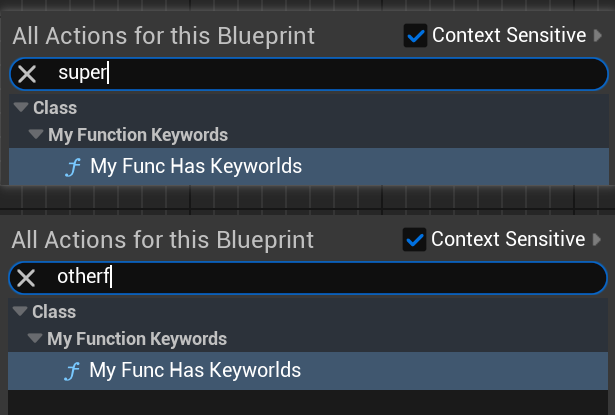

# Keywords

- **Function Description:** Specifies a set of keywords to locate the function within the blueprint via a right-click search
- **Usage Location:** UFUNCTION
- **Engine Module:** Blueprint
- **Metadata Type:** string="abc"
- **Commonality:** ★★★★★

Keywords may be separated by spaces or commas. The text within will be subject to string matching search.

## Test Code:

```cpp
UCLASS(Blueprintable, BlueprintType)
class INSIDER_API UMyFunction_Keywords :public UBlueprintFunctionLibrary
{
public:
	GENERATED_BODY()
public:
	UFUNCTION(BlueprintCallable,meta=(Keywords="This is a SuperFunc,OtherFunc"))
	static void MyFunc_HasKeyworlds();
};
```

## Blueprint Effect:



## Principle:

The content of the Keywords will ultimately be utilized by FEdGraphSchemaAction for text search in the blueprint's right-click menu.

In addition, each K2Node is capable of returning a Keywords entry. The effect should be identical to that of Keywords on a function.

```cpp
FText UEdGraphNode::GetKeywords() const
{
	return GetClass()->GetMetaDataText(TEXT("Keywords"), TEXT("UObjectKeywords"), GetClass()->GetFullGroupName(false));
}
```