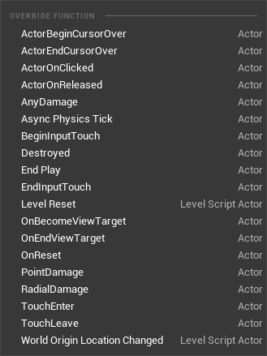

# KismetHideOverrides

- **Function description:** List of blueprint events that must not be overridden.
- **Usage location:** UCLASS
- **Engine module:** Blueprint
- **Metadata type:** strings = "a, b, c"

In the source code, many definitions are found on ALevelScriptActor to prevent them from being overridden.

## Example:

```cpp
UCLASS(notplaceable, meta=(ChildCanTick, KismetHideOverrides = "ReceiveAnyDamage,ReceivePointDamage,ReceiveRadialDamage,ReceiveActorBeginOverlap,ReceiveActorEndOverlap,ReceiveHit,ReceiveDestroyed,ReceiveActorBeginCursorOver,ReceiveActorEndCursorOver,ReceiveActorOnClicked,ReceiveActorOnReleased,ReceiveActorOnInputTouchBegin,ReceiveActorOnInputTouchEnd,ReceiveActorOnInputTouchEnter,ReceiveActorOnInputTouchLeave"), HideCategories=(Collision,Rendering,Transformation), MinimalAPI)
class ALevelScriptActor : public AActor
{}
```

However, these events can still be overridden in subclasses of LevelScriptActor. Some hidden events are actually concealed using HideCategories. Thus, this Meta is not actually implemented. To achieve the intended effect, one must still use HideFunctions or HideCategories.



## Principle:

It can be observed that the judgment here does not make use of this Meta

```cpp
void SMyBlueprint::CollectAllActions(FGraphActionListBuilderBase& OutAllActions)
{
// Cache potentially overridable functions
UClass* ParentClass = BlueprintObj->SkeletonGeneratedClass ? BlueprintObj->SkeletonGeneratedClass->GetSuperClass() : *BlueprintObj->ParentClass;
for ( TFieldIterator<UFunction> FunctionIt(ParentClass, EFieldIteratorFlags::IncludeSuper); FunctionIt; ++FunctionIt )
{
	const UFunction* Function = *FunctionIt;
	const FName FunctionName = Function->GetFName();

	UClass *OuterClass = CastChecked<UClass>(Function->GetOuter());
	// ignore skeleton classes and convert them into their "authoritative" types so they
	// can be found in the graph
	if(UBlueprintGeneratedClass *GeneratedOuterClass = Cast<UBlueprintGeneratedClass>(OuterClass))
	{
		OuterClass = GeneratedOuterClass->GetAuthoritativeClass();
	}

	if (    UEdGraphSchema_K2::CanKismetOverrideFunction(Function)
		 && !OverridableFunctionNames.Contains(FunctionName)
		 && !ImplementedFunctionCache.Contains(FunctionName)
		 && !FObjectEditorUtils::IsFunctionHiddenFromClass(Function, ParentClass)
		 && !FBlueprintEditorUtils::FindOverrideForFunction(BlueprintObj, OuterClass, Function->GetFName())
		 && Blueprint->AllowFunctionOverride(Function)
	   )
	{
		FText FunctionTooltip = FText::FromString(UK2Node_CallFunction::GetDefaultTooltipForFunction(Function));
		FText FunctionDesc = K2Schema->GetFriendlySignatureName(Function);
		if ( FunctionDesc.IsEmpty() )
		{
			FunctionDesc = FText::FromString(Function->GetName());
		}

		if (Function->HasMetaData(FBlueprintMetadata::MD_DeprecatedFunction))
		{
			FunctionDesc = FBlueprintEditorUtils::GetDeprecatedMemberMenuItemName(FunctionDesc);
		}

		FText FunctionCategory = FObjectEditorUtils::GetCategoryText(Function);

		TSharedPtr<FEdGraphSchemaAction_K2Graph> NewFuncAction = MakeShareable(new FEdGraphSchemaAction_K2Graph(EEdGraphSchemaAction_K2Graph::Function, FunctionCategory, FunctionDesc, FunctionTooltip, 1, NodeSectionID::FUNCTION_OVERRIDABLE));
		NewFuncAction->FuncName = FunctionName;

		OverridableFunctionActions.Add(NewFuncAction);
		OverridableFunctionNames.Add(FunctionName);
	}
}
}
```