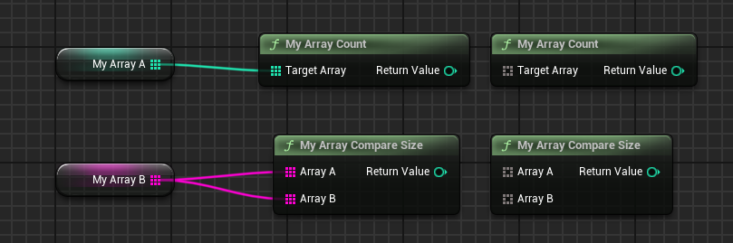

# ArrayParm

- **Function description:** Specifies a function to use an Array<*> with the array element type being a wildcard generic.
- **Use location:** UFUNCTION
- **Engine module:** Blueprint
- **Metadata type:** strings="a, b, c"
- **Associated items:** [ArrayTypeDependentParams](../ArrayTypeDependentParams/ArrayTypeDependentParams.md)
- **Commonly used:** ★★★

Specifies a function to use an Array<*> with the array element type being a wildcard generic.

The internal logic processing difference is that functions with ArrayParm will use UK2Node_CallArrayFunction to generate nodes instead of UK2Node_CallFunction.

Multiple ArrayParams can be specified, separated by commas.

In the source code, it is only used in UKismetArrayLibrary, but if you wish to perform array operations, you can also add ArrayParam.

Because the array element type is a wildcard generic, when implementing in C++, it is necessary to use CustomThunk and write some custom blueprint logic glue code to handle different array types correctly. This can be emulated by referring to the example in the UKismetArrayLibrary source code.

## Test code:

```cpp
UCLASS(Blueprintable, BlueprintType)
class INSIDER_API UMyFunction_Param :public UBlueprintFunctionLibrary
{
public:
	GENERATED_BODY()
public:
//Array
	UFUNCTION(BlueprintPure, CustomThunk, meta = (ArrayParm = "TargetArray"))
	static int32 MyArray_Count(const TArray<int32>& TargetArray);
	static int32 GenericMyArray_Count(const void* TargetArray, const FArrayProperty* ArrayProp);
	DECLARE_FUNCTION(execMyArray_Count);

	UFUNCTION(BlueprintPure, CustomThunk, meta = (ArrayParm = "ArrayA,ArrayB", ArrayTypeDependentParams = "ArrayB"))
	static int32 MyArray_CompareSize(const TArray<int32>& ArrayA, const TArray<int32>& ArrayB);
	static int32 GenericMyArray_CompareSize(void* ArrayA, const FArrayProperty* ArrayAProp, void* ArrayB, const FArrayProperty* ArrayBProp);
	DECLARE_FUNCTION(execMyArray_CompareSize);
};
```

## Blueprint effect:



As seen, when no specific array type is connected, the Array is displayed as a gray wildcard type. When different array types are connected, the Array parameter pins will automatically change to the corresponding types. This logic is implemented within UK2Node_CallArrayFunction. Those interested can refer to it by reviewing the code.