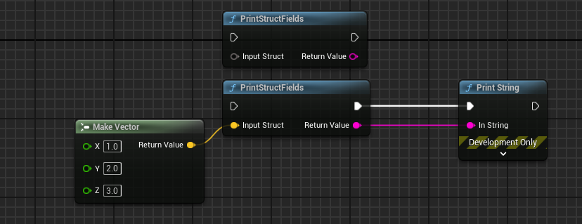

# CustomStructureParam

- **Function Description:** Parameters marked with CustomStructureParam will be transformed into wildcard parameters, with their pin types matching the type of the connected variables.
- **Usage Location:** UFUNCTION
- **Engine Module:** Blueprint
- **Metadata Type:** strings="a, b, c"
- **Commonly Used:** ★★★★★

Multiple function parameters marked with CustomStructureParam will be converted into wildcard parameters, with their pin types corresponding to the type of the connected variables.

CustomStructureParam is always used in conjunction with CustomThunk to enable the handling of generic parameter types within the function body.

```cpp
UFUNCTION(BlueprintCallable, CustomThunk, meta = (DisplayName = "PrintStructFields", CustomStructureParam = "inputStruct"))
static FString PrintStructFields(const int32& inputStruct) { return TEXT(""); }

DECLARE_FUNCTION(execPrintStructFields);
static FString Generic_PrintStructFields(const UScriptStruct* ScriptStruct, const void* StructData);

DEFINE_FUNCTION(UMyFunction_Custom::execPrintStructFields)
{
	FString result;
	Stack.MostRecentPropertyAddress = nullptr;
	Stack.StepCompiledIn<FStructProperty>(nullptr);

	void* StructData = Stack.MostRecentPropertyAddress;
	FStructProperty* StructProperty = CastField<FStructProperty>(Stack.MostRecentProperty);
	UScriptStruct* ScriptStruct = StructProperty->Struct;
	P_FINISH;
	P_NATIVE_BEGIN;

	result = Generic_PrintStructFields(ScriptStruct, StructData);

	P_NATIVE_END;
	*(FString*)RESULT_PARAM = result;
}

FString UMyFunction_Custom::Generic_PrintStructFields(const UScriptStruct* ScriptStruct, const void* StructData)
{
	FString str;
	for (TFieldIterator<FProperty> i(ScriptStruct); i; ++i)
	{
		FString propertyValueString;
		const void* propertyValuePtr = i->ContainerPtrToValuePtr<const void*>(StructData);
		i->ExportTextItem_Direct(propertyValueString, propertyValuePtr, nullptr, (UObject*)ScriptStruct, PPF_None);

		str += FString::Printf(TEXT("%s:%s\n"), *i->GetFName().ToString(), *propertyValueString);
	}

	return str;
}

```

## Effect in Blueprint:



You can observe a node that accepts generic structure parameters, which then prints out all its internal attributes. CustomStructureParam designates that the function parameters are of custom types.

An illustrative example in the source code can be found here:

```cpp
UFUNCTION(BlueprintCallable, CustomThunk, Category = "DataTable", meta=(CustomStructureParam = "OutRow", BlueprintInternalUseOnly="true"))
static ENGINE_API bool GetDataTableRowFromName(UDataTable* Table, FName RowName, FTableRowBase& OutRow);
```

## Principle:

First, parameters with CustomStructureParam are recognized as wildcard attributes. Then, FCustomStructureParamHelper is used to control Pin->PinType = LinkedTo->PinType; thereby changing the actual type of the pin.

```cpp
bool UEdGraphSchema_K2::IsWildcardProperty(const FProperty* Property)
{
	UFunction* Function = Property->GetOwner<UFunction>();

	return Function && ( UK2Node_CallArrayFunction::IsWildcardProperty(Function, Property)
		|| UK2Node_CallFunction::IsStructureWildcardProperty(Function, Property->GetFName())
		|| UK2Node_CallFunction::IsWildcardProperty(Function, Property)
		|| FEdGraphUtilities::IsArrayDependentParam(Function, Property->GetFName()) );
}

static void FCustomStructureParamHelper::HandleSinglePin(UEdGraphPin* Pin)
{
	if (Pin)
	{
		if (Pin->LinkedTo.Num() > 0)
		{
			UEdGraphPin* LinkedTo = Pin->LinkedTo[0];
			check(LinkedTo);

			if (UK2Node* Node = Cast<UK2Node>(Pin->GetOwningNode()))
			{
				ensure(
					!LinkedTo->PinType.IsContainer() ||
					Node->DoesWildcardPinAcceptContainer(Pin)
				);
			}
			else
			{
				ensure( !LinkedTo->PinType.IsContainer() );
			}

			Pin->PinType = LinkedTo->PinType;
		}
		else
		{
			// constness and refness are controlled by our declaration
			// but everything else needs to be reset to default wildcard:
			const bool bWasRef = Pin->PinType.bIsReference;
			const bool bWasConst = Pin->PinType.bIsConst;

			Pin->PinType = FEdGraphPinType();
			Pin->PinType.bIsReference = bWasRef;
			Pin->PinType.bIsConst = bWasConst;
			Pin->PinType.PinCategory = UEdGraphSchema_K2::PC_Wildcard;
			Pin->PinType.PinSubCategory = NAME_None;
			Pin->PinType.PinSubCategoryObject = nullptr;
		}
	}
}
```