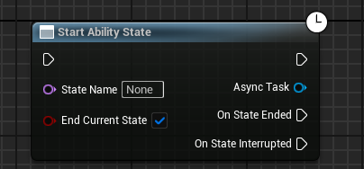

# HideSpawnParms

- **Function Description:** Hides certain properties within the inheritance chain of a UGameplayTask subclass on the blueprint asynchronous node it generates.
- **Usage Location:** UFUNCTION
- **Metadata Type:** strings="a, b, c"
- **Associated Items:** [ExposedAsyncProxy](../../ExposedAsyncProxy/ExposedAsyncProxy.md)

hides certain properties in the inheritance chain of a UGameplayTask subclass on the blueprint asynchronous node generated by the subclass.

HideSpawnParms is only evaluated in UK2Node_LatentGameplayTaskCall, thus it only affects subclasses of UGameplayTask. The sole usage found in the source code is HideSpawnParms = "Instigator", but this attribute does not exist in the inheritance chain of the UGameplayTask subclass, rendering it ineffective.

```cpp
	UFUNCTION(BlueprintCallable, Meta = (HidePin = "OwningAbility", DefaultToSelf = "OwningAbility", BlueprintInternalUseOnly = "true", HideSpawnParms = "Instigator"), Category = "Ability|Tasks")
	static UAbilityTask_StartAbilityState* StartAbilityState(UGameplayAbility* OwningAbility, FName StateName, bool bEndCurrentState = true);
```

Both the blueprint nodes that retain and remove HideSpawnParms are:



## Location in the source code:

```cpp
void UK2Node_LatentGameplayTaskCall::CreatePinsForClass(UClass* InClass)
{
	// Tasks can hide spawn parameters by doing meta = (HideSpawnParms="PropertyA,PropertyB")
	// (For example, hide Instigator in situations where instigator is not relevant to your task)

	TArray<FString> IgnorePropertyList;
	{
		UFunction* ProxyFunction = ProxyFactoryClass->FindFunctionByName(ProxyFactoryFunctionName);

		const FString& IgnorePropertyListStr = ProxyFunction->GetMetaData(FName(TEXT("HideSpawnParms")));

		if (!IgnorePropertyListStr.IsEmpty())
		{
			IgnorePropertyListStr.ParseIntoArray(IgnorePropertyList, TEXT(","), true);
		}
	}
}
```