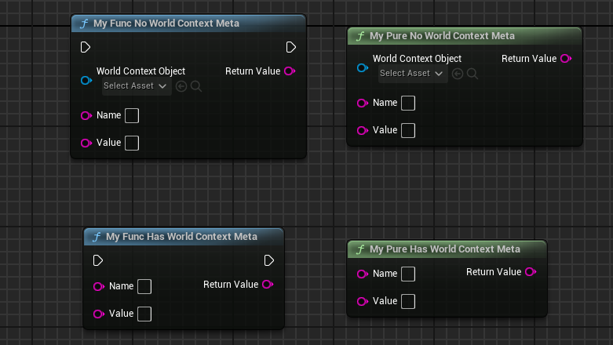

# WorldContext

- **Function Description:** Automatically assigns a parameter of the specified function to receive the WorldContext object to determine the current World of execution
- **Usage Location:** UFUNCTION
- **Engine Module:** Blueprint
- **Metadata Type:** string="abc"
- **Related Items:** [CallableWithoutWorldContext](../CallableWithoutWorldContext/CallableWithoutWorldContext.md), [ShowWorldContextPin](../ShowWorldContextPin/ShowWorldContextPin.md)
- **Commonly Used:** ★★★★★

Automatically assigns a parameter of the specified function to receive the WorldContext object to determine the current World. The function can be either BlueprintCallable or BlueprintPure, and it can be either a static function or a member function. Typically, this is used for static functions in function libraries, such as the numerous static functions in UGameplayStatics.

```cpp
UFUNCTION(BlueprintPure, Category="Game", meta=(WorldContext="WorldContextObject"))
static ENGINE_API class UGameInstance* GetGameInstance(const UObject* WorldContextObject)
{
		UWorld* World = GEngine->GetWorldFromContextObject(WorldContextObject, EGetWorldErrorMode::LogAndReturnNull);
		return World ? World->GetGameInstance() : nullptr;
}

//The general method to obtain the World in Runtime is:
UWorld* World = GEngine->GetWorldFromContextObject(WorldContextObject, EGetWorldErrorMode::ReturnNull);
//The general method to obtain the World in the Editor (e.g., in CallInEditor functions) is:
UObject* WorldContextObject = EditorEngine->GetEditorWorldContext().World();
```

## Test Code:

```cpp
UCLASS(Blueprintable, BlueprintType)
class INSIDER_API UMyFunctionLibrary_WorldContextTest :public UBlueprintFunctionLibrary
{
public:
	GENERATED_BODY()
public:
	UFUNCTION(BlueprintCallable)
	static FString MyFunc_NoWorldContextMeta(const UObject* WorldContextObject, FString name, FString value);

	UFUNCTION(BlueprintCallable, meta = (WorldContext = "WorldContextObject"))
	static FString MyFunc_HasWorldContextMeta(const UObject* WorldContextObject, FString name, FString value);

	UFUNCTION(BlueprintPure)
	static FString MyPure_NoWorldContextMeta(const UObject* WorldContextObject, FString name, FString value);

	UFUNCTION(BlueprintPure, meta = (WorldContext = "WorldContextObject"))
	static FString MyPure_HasWorldContextMeta(const UObject* WorldContextObject, FString name, FString value);
};

UCLASS(Blueprintable, BlueprintType)
class INSIDER_API UMyObject_NoGetWorld :public UObject
{
	GENERATED_BODY()
};

UCLASS(Blueprintable, BlueprintType)
class INSIDER_API UMyObject_HasGetWorld :public UObject
{
	GENERATED_BODY()

	UWorld* WorldPrivate = nullptr;
public:
	UFUNCTION(BlueprintCallable)
	void RegisterWithOuter()
	{
		if (UObject* outer = GetOuter())
		{
			WorldPrivate = outer->GetWorld();
		}
	}

	virtual UWorld* GetWorld() const override final { return WorldPrivate; }
};

//.cpp

FString UMyFunctionLibrary_WorldContextTest::MyFunc_HasWorldContextMeta(const UObject* WorldContextObject, FString name, FString value)
{
	UWorld* World = GEngine->GetWorldFromContextObject(WorldContextObject, EGetWorldErrorMode::LogAndReturnNull);
	if (World != nullptr)
	{
		return WorldContextObject->GetName();
	}
	return TEXT("None");
}

FString UMyFunctionLibrary_WorldContextTest::MyFunc_NoWorldContextMeta(const UObject* WorldContextObject, FString name, FString value)
{
	return MyFunc_HasWorldContextMeta(WorldContextObject, name, value);
}

FString UMyFunctionLibrary_WorldContextTest::MyPure_NoWorldContextMeta(const UObject* WorldContextObject, FString name, FString value)
{
	return MyFunc_HasWorldContextMeta(WorldContextObject, name, value);
}

FString UMyFunctionLibrary_WorldContextTest::MyPure_HasWorldContextMeta(const UObject* WorldContextObject, FString name, FString value)
{
	return MyFunc_HasWorldContextMeta(WorldContextObject, name, value);
}
```

## Test Results in Blueprint:

When called within an Actor, you can see that functions without a specified WorldContext will expose the Object parameter, requiring manual specification. Functions with WorldContext, however, hide the WorldContextObject parameter by default, as the WorldContextObject can be automatically assigned in the Actor (its value being the current Actor).



In the subclass of UMyObject_NoGetWorld, since GetWorld is not implemented, the World cannot be obtained, thus preventing the automatic assignment of the WorldContextObject and the invocation of MyFunc_HasWorldContextMeta.


In the subclass of UMyObject_HasGetWorld, because UMyObject_HasGetWorld implements GetWorld, it allows the calling of MyFunc_HasWorldContextMeta, with the WorldContextObject value being the UMyObject_HasGetWorld subclass object, which calls GetWorld() on itself to obtain the previously registered WorldPrivate object.


## Principle:

When a function needs to interact with the World and cannot directly find the World object (usually a static function), an additional parameter must be manually passed from the outside to the function's parameters to trace back to the OuterWorld. This parameter is called WorldContextObject and is typically of type UObject*, facilitating the passing of various types of objects.

This WorldContextObject can be manually passed. It can also be automatically assigned if the Object class implements the virtual GetWorld() interface and does not return nullptr, allowing for normal acquisition of the World object and interaction with the runtime game world.

In everyday use, most Blueprint objects are already aware of the World they are in, such as Actors, which definitely know which World they belong to.

```cpp
UWorld* AActor::GetWorld() const
{
	// CDO objects do not belong to a world
	// If the actors outer is destroyed or unreachable we are shutting down and the world should be nullptr
	if (!HasAnyFlags(RF_ClassDefaultObject) && ensureMsgf(GetOuter(), TEXT("Actor: %s has a null OuterPrivate in AActor::GetWorld()"), *GetFullName())
		&& !GetOuter()->HasAnyFlags(RF_BeginDestroyed) && !GetOuter()->IsUnreachable())
	{
		if (ULevel* Level = GetLevel())
		{
			return Level->OwningWorld;
		}
	}
	return nullptr;
}
```

Within an Actor, calling a static function would require manually setting the WorldContextObject each time, which is cumbersome and redundant. Therefore, the WorldContext meta instructs the Blueprint system to automatically assign the value of our WorldContextObject, which is the Actor itself, eliminating the need for manual parameter passing and hiding this functionally irrelevant glue parameter, resulting in a cleaner and more elegant appearance.

And if you call a function inside an ordinary Object object, you don't know which World it belongs to. At this time, the Object class needs to implement GetWorld(). Use the bGetWorldOverridden variable in the editor to determine whether a UObject subclass has overridden GetWorld. If the subclass has overriding, during detection, just call ImplementsGetWorld on CDO to get the result of bGetWorldOverridden==true, which allows the function version of WorldContextObject to be automatically specified to be called. To mention a little more, bGetWorldOverridden is not a UObject member variable. It is only a temporary variable used when ImplementsGetWorld() is called, so it does not need to be saved.

```cpp
#if DO_CHECK || WITH_EDITOR
// Used to check to see if a derived class actually implemented GetWorld() or not
thread_local bool bGetWorldOverridden = false;
#endif // #if DO_CHECK || WITH_EDITOR

class UWorld* UObject::GetWorld() const
{
	if (UObject* Outer = GetOuter())
	{
		return Outer->GetWorld();
	}

#if DO_CHECK || WITH_EDITOR
	bGetWorldOverridden = false;
#endif
	return nullptr;
}

#if WITH_EDITOR

bool UObject::ImplementsGetWorld() const
{
	bGetWorldOverridden = true;
	GetWorld();
	return bGetWorldOverridden;
}

#endif // #if WITH_EDITOR
```

Furthermore, static Blueprint functions (functions in BPTYPE_FunctionLibrary or marked as FUNC_Static) have a hidden parameter "__WorldContext". When UK2Node_CallFunction is expanded, the value on "__WorldContext" is assigned to the parameters specified by the DefaultToSelf or WorldContext meta tags, thus automatically assigning Self to DefaultToSelf and WorldContext.

```cpp
void UK2Node_CallFunction::ExpandNode(class FKismetCompilerContext& CompilerContext, UEdGraph* SourceGraph)

else if (UEdGraphPin* BetterSelfPin = EntryPoints[0]->GetAutoWorldContextPin())
{
	const FString& DefaultToSelfMetaValue = Function->GetMetaData(FBlueprintMetadata::MD_DefaultToSelf);
	const FString& WorldContextMetaValue = Function->GetMetaData(FBlueprintMetadata::MD_WorldContext);

	struct FStructConnectHelper
	{
		static void Connect(const FString& PinName, UK2Node* Node, UEdGraphPin* BetterSelf, const UEdGraphSchema_K2* InSchema, FCompilerResultsLog& MessageLog)
		{
			UEdGraphPin* Pin = Node->FindPin(PinName);
			if (!PinName.IsEmpty() && Pin && !Pin->LinkedTo.Num())
			{
				const bool bConnected = InSchema->TryCreateConnection(Pin, BetterSelf);
				if (!bConnected)
				{
					MessageLog.Warning(*LOCTEXT("DefaultToSelfNotConnected", "DefaultToSelf pin @@ from node @@ cannot be connected to @@").ToString(), Pin, Node, BetterSelf);
				}
			}
		}
	};
	FStructConnectHelper::Connect(DefaultToSelfMetaValue, this, BetterSelfPin, Schema, CompilerContext.MessageLog);
	if (!Function->HasMetaData(FBlueprintMetadata::MD_CallableWithoutWorldContext))
	{
		FStructConnectHelper::Connect(WorldContextMetaValue, this, BetterSelfPin, Schema, CompilerContext.MessageLog);
	}
}
```