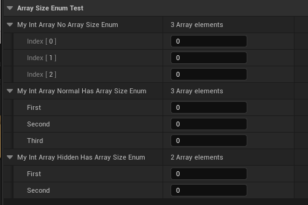

# ArraySizeEnum

- **Function Description:** Provides an enumeration for a fixed array, allowing array elements to be indexed and displayed according to the enumeration values.
- **Usage Location:** UPROPERTY
- **Engine Module:** Container Property
- **Metadata Type:** string="abc"
- **Restriction Type:** T Array[Size]
- **Commonality:** ★★★

Provides an enumeration for a fixed array, allowing array elements to be indexed and displayed according to the enumeration values.

- The term "fixed array" refers to an array that is distinct from a TArray, which can dynamically change in size. Instead, it is a simple array defined directly with [size]. This type of fixed array (static array), which does not undergo additions or deletions, is sometimes suitable for using all the values in the enumeration as indices, thereby offering greater convenience.
- Within enumerations, the last enumeration item (typically named Max, Size, count, etc.) is generally used as the value indicating the data size.
- Enumeration values that should not be displayed can be hidden using Hidden. However, because the array index corresponds to the index of the enumeration item (i.e., the position of the enumeration value) rather than the value of the enumeration item itself, it may be noticed that the actual number of items displayed in the array is less than the defined Size.

## Test Code:

```cpp
UENUM(BlueprintType)
enum class EMyArrayEnumNormal :uint8
{
	First,
	Second,
	Third,
	Max,
};

UENUM(BlueprintType)
enum class EMyArrayEnumHidden :uint8
{
	First,
	Second,
	Cat = 5 UMETA(Hidden),
	Third = 2,
	Max = 3,
};

UPROPERTY(EditAnywhere, Category = ArraySizeEnumTest)
int32 MyIntArray_NoArraySizeEnum[3];

UPROPERTY(EditAnywhere, Category = ArraySizeEnumTest, meta = (ArraySizeEnum = "MyArrayEnumNormal"))
int32 MyIntArray_Normal_HasArraySizeEnum[(int)EMyArrayEnumNormal::Max];

UPROPERTY(EditAnywhere, Category = ArraySizeEnumTest, meta = (ArraySizeEnum = "MyArrayEnumHidden"))
int32 MyIntArray_Hidden_HasArraySizeEnum[(int)EMyArrayEnumHidden::Max];
```

## Test Effects:

Both are fixed arrays with a size of 3.

- MyIntArray_NoArraySizeEnum is the most common array format.
- MyIntArray_Normal_HasArraySizeEnum is a standard example of using enumeration items as array indices. Notice that the index names are not 012 but the names of the enumeration items.
- MyIntArray_Hidden_HasArraySizeEnum uses an enumeration with a hidden item called Cat, but its index is 2 (due to the order of definition), so the third item in the array is hidden.



## Principle:

It can be observed that initially, it is determined whether it is a fixed array (ArrayDim>1 actually signifies a fixed array), then the enumeration is located by name, and for each item in the array, the corresponding enumeration item is found to generate sub-rows in the details panel.

```cpp
void FItemPropertyNode::InitChildNodes()
{
		if( MyProperty->ArrayDim > 1 && ArrayIndex == -1 )
		{
			// Do not add array children which are defined by an enum but the enum at the array index is hidden
			// This only applies to static arrays
			static const FName NAME_ArraySizeEnum("ArraySizeEnum");
			UEnum* ArraySizeEnum = NULL;
			if (MyProperty->HasMetaData(NAME_ArraySizeEnum))
			{
				ArraySizeEnum	= FindObject<UEnum>(NULL, *MyProperty->GetMetaData(NAME_ArraySizeEnum));
			}

			// Expand array.
			for( int32 Index = 0 ; Index < MyProperty->ArrayDim ; Index++ )
			{
				bool bShouldBeHidden = false;
				if( ArraySizeEnum )
				{
					// The enum at this array index is hidden
					bShouldBeHidden = ArraySizeEnum->HasMetaData(TEXT("Hidden"), Index );
				}

				if( !bShouldBeHidden )
				{
					TSharedPtr<FItemPropertyNode> NewItemNode( new FItemPropertyNode);
					FPropertyNodeInitParams InitParams;
					InitParams.ParentNode = SharedThis(this);
					InitParams.Property = MyProperty;
					InitParams.ArrayOffset = Index*MyProperty->ElementSize;
					InitParams.ArrayIndex = Index;
					InitParams.bAllowChildren = true;
					InitParams.bForceHiddenPropertyVisibility = bShouldShowHiddenProperties;
					InitParams.bCreateDisableEditOnInstanceNodes = bShouldShowDisableEditOnInstance;

					NewItemNode->InitNode( InitParams );
					AddChildNode(NewItemNode);
				}
			}
		}
}
```