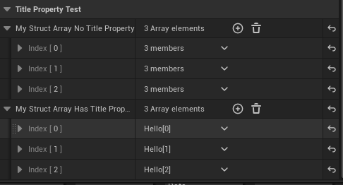

# TitleProperty

- **Function description:** Specifies the content of a structure member attribute within a structure array to serve as the display title for the array's elements.
- **Use location:** UPROPERTY
- **Engine module:** Container Property
- **Metadata type:** string = "abc"
- **Restriction type:** TArray<FStruct>
- **Commonly used:** ★★

Specifies the content of a structure member attribute within a structure array to serve as the display title for the array's elements.

## The Point Is:

- The target is a structure array TArray<FStruct> , other TSet , TMap are not supported.
- TitleProperty, as the name suggests, is the property used as a title. To be more specific, the title refers to the title displayed for each element in the structure array within the details panel.  "Property" refers to the properties within the individual structures contained in the array.
- Then the next step is how to write the format of TitleProperty. According to the engine source code, TitleProperty finally uses FTitleMetadataFormatter to parse the calculation content. By looking at its internal code, we can see that its TitleProperty format can be:
    - If TitleProperty contains "{", the string inside will be treated as an FTextFormat (a format string organized with "{ArgName}..."). The final format is to use a string organized by "{PropertyName}..." to find multiple corresponding properties.
    - Otherwise, the entire TitleProperty will be treated as PropertyName, and the corresponding property name will be found directly.

## Test Code:

```cpp
USTRUCT(BlueprintType)
struct INSIDER_API FMyArrayTitleStruct
{
	GENERATED_BODY()
public:
	FMyArrayTitleStruct() = default;
	FMyArrayTitleStruct(int32 id) :MyInt(id) {}
	UPROPERTY(BlueprintReadWrite, EditAnywhere)
	int32 MyInt = 123;
	UPROPERTY(BlueprintReadWrite, EditAnywhere)
	FString MyString=TEXT("Hello");
	UPROPERTY(BlueprintReadWrite, EditAnywhere)
	float MyFloat=456.f;
};

UPROPERTY(EditAnywhere, BlueprintReadWrite, Category = TitlePropertyTest)
TArray<FMyArrayTitleStruct> MyStructArray_NoTitleProperty;

UPROPERTY(EditAnywhere, BlueprintReadWrite, Category = TitlePropertyTest, meta = (TitleProperty="{MyString}[{MyInt}]"))
TArray<FMyArrayTitleStruct> MyStructArray_HasTitleProperty;
```

## Test Results:

It can be observed that the title of the array elements has changed to "Hello[x]" instead of the default "3 members".



## Principle:

If a TitleProperty is found in the attribute node in the attribute editor, a TitlePropertyFormatter of FTitleMetadataFormatter will be generated to parse the string format and output the result content. In fact, what is actually used internally is FTextFormat, so that the contents of multiple attributes can be spliced into a target string.

Of course, SPropertyEditorTitle also noticed that if there is a TitleProperty, it may change in real time, so a function is bound to perform Tick update.

```cpp
//Bind a function to retrieve the name every tick
void SPropertyEditorTitle::Construct( const FArguments& InArgs, const TSharedRef<FPropertyEditor>& InPropertyEditor )
{
	// If our property has title support we want to fetch the value every tick, otherwise we can just use a static value
	static const FName NAME_TitleProperty = FName(TEXT("TitleProperty"));
	const bool bHasTitleProperty = InPropertyEditor->GetProperty() && InPropertyEditor->GetProperty()->HasMetaData(NAME_TitleProperty);
	if (bHasTitleProperty)
	{
		NameTextBlock =
			SNew(STextBlock)
			.Text(InPropertyEditor, &FPropertyEditor::GetDisplayName)
			.Font(NameFont);
	}
	else
	{
		NameTextBlock =
			SNew(STextBlock)
			.Text(InPropertyEditor->GetDisplayName())
			.Font(NameFont);
	}
}

FText FPropertyEditor::GetDisplayName() const
{
	FItemPropertyNode* ItemPropertyNode = PropertyNode->AsItemPropertyNode();

	if ( ItemPropertyNode != NULL )
	{
		return ItemPropertyNode->GetDisplayName();
	}

	if (const FComplexPropertyNode* ComplexPropertyNode = PropertyNode->AsComplexNode())
	{
		const FText DisplayName = ComplexPropertyNode->GetDisplayName();

		// Does this property define its own name?
		if (!DisplayName.IsEmpty())
		{
			return DisplayName;
		}
	}

	FString DisplayName;
	PropertyNode->GetQualifiedName( DisplayName, true );
	return FText::FromString(DisplayName);
}

//Generate TitleFormatter to parse the content in TitleProperty and finally get the text. It was found that Map and Set are not supported, so only array is supported. The signature also has a branch that determines ArrayIndex()==1 and goes into the ordinary attributes
FText FItemPropertyNode::GetDisplayName() const
{
	if (CastField<FSetProperty>(ParentProperty) == nullptr &&  CastField<FMapProperty>(ParentProperty) == nullptr)
	{
		// Check if this property has Title Property Meta
			static const FName NAME_TitleProperty = FName(TEXT("TitleProperty"));
			FString TitleProperty = PropertyPtr->GetMetaData(NAME_TitleProperty);
			if (!TitleProperty.IsEmpty())
			{
				// Find the property and get the right property handle
				if (PropertyStruct != nullptr)
				{
					const TSharedPtr<IPropertyHandle> ThisAsHandle = PropertyEditorHelpers::GetPropertyHandle(NonConstThis->AsShared(), nullptr, nullptr);
					TSharedPtr<FTitleMetadataFormatter> TitleFormatter = FTitleMetadataFormatter::TryParse(ThisAsHandle, TitleProperty);
					if (TitleFormatter)
					{
						TitleFormatter->GetDisplayText(FinalDisplayName);
					}
				}
			}
		}
}

//Generate a TitlePropertyFormatter
void SPropertyEditorArrayItem::Construct( const FArguments& InArgs, const TSharedRef< class FPropertyEditor>& InPropertyEditor )
{
		static const FName TitlePropertyFName = FName(TEXT("TitleProperty"));

	// if this is a struct property, try to find a representative element to use as our stand in
		if (PropertyEditor->PropertyIsA( FStructProperty::StaticClass() ))
		{
			const FProperty* MainProperty = PropertyEditor->GetProperty();
			const FProperty* ArrayProperty = MainProperty ? MainProperty->GetOwner<const FProperty>() : nullptr;
			if (ArrayProperty) // should always be true
			{
				TitlePropertyFormatter = FTitleMetadataFormatter::TryParse(PropertyEditor->GetPropertyHandle(), ArrayProperty->GetMetaData(TitlePropertyFName));
			}
		}
}
```

Example in source code:

Readers can also find application examples in UPropertyEditorTestObject. You can open it with the testprops command line.

```cpp
	UPROPERTY(EditAnywhere, Category=ArraysOfProperties, meta=(TitleProperty=IntPropertyInsideAStruct))
	TArray<FPropertyEditorTestBasicStruct> StructPropertyArrayWithTitle;

	UPROPERTY(EditAnywhere, Category=ArraysOfProperties, meta=(TitleProperty="{IntPropertyInsideAStruct} + {FloatPropertyInsideAStruct}"))
	TArray<FPropertyEditorTestBasicStruct> StructPropertyArrayWithFormattedTitle;

	UPROPERTY(EditAnywhere, Category=ArraysOfProperties, meta=(TitleProperty=ErrorProperty))
	TArray<FPropertyEditorTestBasicStruct> StructPropertyArrayWithTitleError;

	UPROPERTY(EditAnywhere, Category=ArraysOfProperties, meta=(TitleProperty="{ErrorProperty}"))
	TArray<FPropertyEditorTestBasicStruct> StructPropertyArrayWithFormattedTitleError;
```