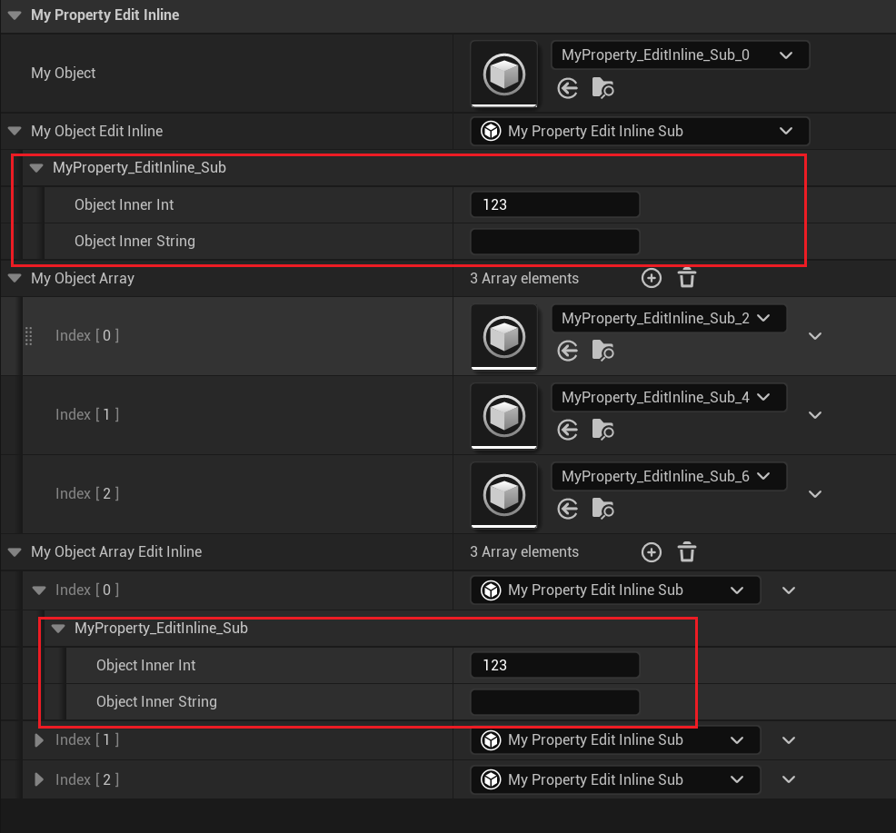

# EditInline

- **Function Description:** Instantiate an object for the property and treat it as a child object.

- **Usage Location:** UPROPERTY

- **Engine Module:** DetailsPanel

- **Metadata Type:** bool

- **Associated Items:** [NoEditInline](../NoEditInline.md), [AllowEditInlineCustomization](../AllowEditInlineCustomization/AllowEditInlineCustomization.md), [ForceInlineRow](../ForceInlineRow/ForceInlineRow.md)

  1	@UProperty:[Instanced](../../../Specifier/UPROPERTY/Instance/Instanced/Instanced.md)

- **Commonality:** ★★★

Create an instance for the object property and treat it as a child object.

2	It can also be manually configured. If the UClass has EditInlineNew but the attribute lacks Instanced, one can manually set EditInline and then manually assign the object reference attribute to enable direct editing of the object.

3	Is it equivalent to ShowInnerProperties? EditInline can be applied to object containers (Array, Map, Set), whereas ShowInnerProperties is effective only on individual object properties.

4	Can it be set on a Struct? The source code indicates that this setting is available, but it actually has no effect.

## Example Code:

```cpp
	UPROPERTY(EditAnywhere, BlueprintReadWrite)
	UMyProperty_EditInline_Sub* MyObject;
	UPROPERTY(EditAnywhere, BlueprintReadWrite, meta = (EditInline))
	UMyProperty_EditInline_Sub* MyObject_EditInline;
	UPROPERTY(EditAnywhere, BlueprintReadWrite, meta = (NoEditInline))
	UMyProperty_EditInline_Sub* MyObject_NoEditInline;

	UPROPERTY(EditAnywhere, BlueprintReadWrite)
	TArray<UMyProperty_EditInline_Sub*> MyObjectArray;

	UPROPERTY(EditAnywhere, BlueprintReadWrite, meta = (EditInline))
	TArray<UMyProperty_EditInline_Sub*> MyObjectArray_EditInline;

	UPROPERTY(EditAnywhere, BlueprintReadWrite, meta = (NoEditInline))
	TArray<UMyProperty_EditInline_Sub*> MyObjectArray_NoEditInline;
```

## Blueprint Effect:



## Principle:

5	It will correspondingly set EPropertyNodeFlags::EditInlineNew.

```cpp
void FPropertyNode::InitNode(const FPropertyNodeInitParams& InitParams)
{
		// we are EditInlineNew if this property has the flag, or if inside a container that has the flag.
		bIsEditInlineNew = GotReadAddresses && bIsObjectOrInterface && !MyProperty->HasMetaData(Name_NoEditInline) &&
			(MyProperty->HasMetaData(Name_EditInline) || (bIsInsideContainer && OwnerProperty->HasMetaData(Name_EditInline)));
		bShowInnerObjectProperties = bIsObjectOrInterface && MyProperty->HasMetaData(Name_ShowInnerProperties);

		if (bIsEditInlineNew)
		{
			SetNodeFlags(EPropertyNodeFlags::EditInlineNew, true);
		}
		else if (bShowInnerObjectProperties)
		{
			SetNodeFlags(EPropertyNodeFlags::ShowInnerObjectProperties, true);
		}
}

bool SPropertyEditorEditInline::Supports( const FPropertyNode* InTreeNode, int32 InArrayIdx )
{
	return InTreeNode
		&& InTreeNode->HasNodeFlags(EPropertyNodeFlags::EditInlineNew)
		&& InTreeNode->FindObjectItemParent()
		&& !InTreeNode->IsPropertyConst();
}

void FItemPropertyNode::InitExpansionFlags(void)
{
	FProperty* MyProperty = GetProperty();

	if (TSharedPtr<FPropertyNode>& ValueNode = GetOrCreateOptionalValueNode())
	{
		// This is a set optional, so check its SetValue instead.
		MyProperty = ValueNode->GetProperty();
	}

	bool bExpandableType = CastField<FStructProperty>(MyProperty)
		|| (CastField<FArrayProperty>(MyProperty) || CastField<FSetProperty>(MyProperty) || CastField<FMapProperty>(MyProperty));

	if (bExpandableType
		|| HasNodeFlags(EPropertyNodeFlags::EditInlineNew)
		|| HasNodeFlags(EPropertyNodeFlags::ShowInnerObjectProperties)
		|| (MyProperty->ArrayDim > 1 && ArrayIndex == -1))
	{
		SetNodeFlags(EPropertyNodeFlags::CanBeExpanded, true);
	}
}
```