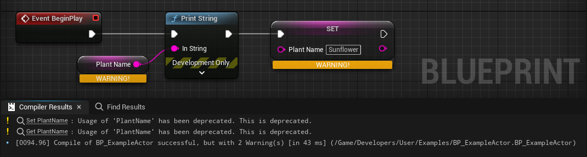

# DeprecatedProperty

- **Function Description:** Indicates that the property is deprecated; referencing this property in blueprints will generate a warning

- **Usage Location:** UPROPERTY

- **Engine Module:** Development

- **Metadata Type:** bool

- **Associated Items:**

  UCLASS: [Deprecated](../../../Specifier/UCLASS/Development/Deprecated/Deprecated.md)

- **Commonality:** ★

Indicates that the property is deprecated; referencing this property in blueprints will generate a warning

## Sample Code:

```cpp
// Simple
UPROPERTY(BlueprintReadWrite, meta=(DeprecatedProperty, DeprecationMessage="This is deprecated"))
FString PlantName;

// Better
UPROPERTY(BlueprintReadWrite, meta=(DisplayName="PlantName", DeprecatedProperty, DeprecationMessage="PlantName is deprecated, instead use PlantDisplayName."))
FString DEPRECATED_PlantName;
```



