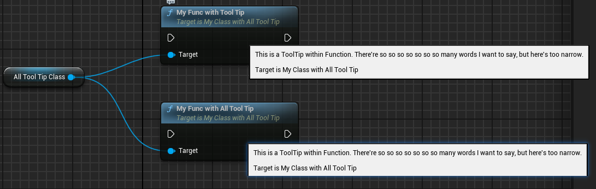

# Tooltip

- **Function Description:** Provides a tooltip text in Meta, which overrides the text in the code comments
- **Usage Location:** Anywhere
- **Engine Module:** Development
- **Metadata Type:** string="abc"
- **Associated Items:** [ShortTooltip](../ShortTooltip.md)
- **Commonly Used:** ★★★

## Test Code:

```cpp
// This is a ToolTip out of Class.There're so so so so so so so many words I want to say, but here's too narrow.
UCLASS(BlueprintType, Blueprintable, meta = (ToolTip = "This is a ToolTip within Class. There're so so so so so so so many words I want to say, but here's too narrow."))
class INSIDER_API UMyClass_ToolTip :public UObject
{
	GENERATED_BODY()
public:
	UPROPERTY(BlueprintReadWrite, EditAnywhere, meta = (ToolTip = "This is a ToolTip within Property.There're so so so so so so so many words I want to say, but here's too narrow."))
	float MyFloat_WithToolTip;

	UPROPERTY(BlueprintReadWrite, EditAnywhere)
	FString MyString;

	UFUNCTION(BlueprintCallable, meta = (ToolTip = "This is a ToolTip within Function.There're so so so so so so so many words I want to say, but here's too narrow."))
	void MyFunc_WithToolTip() {}

	UFUNCTION(BlueprintCallable)
	void MyFunc() {}
};

// This is a ToolTip out of Class.There're so so so so so so so many words I want to say, but here's too narrow.
UCLASS(BlueprintType, Blueprintable, meta = (ToolTip = "This is a ToolTip within Class. There're so so so so so so so many words I want to say, but here's too narrow.", ShortToolTip = "This is a ShortToolTip within Class."))
class INSIDER_API UMyClass_WithAllToolTip :public UObject
{
	GENERATED_BODY()
public:
	UPROPERTY(BlueprintReadWrite, EditAnywhere, meta = (ToolTip = "This is a ToolTip within Property."))
	float MyFloat_WithToolTip;

UPROPERTY(BlueprintReadWrite, EditAnywhere, meta = (ToolTip = "This is a ToolTip within Property. There're so so so so so so so many words I want to say, but here's too narrow.\nThis is a new line.",ShortToolTip = "This is a ShortToolTip within Property."))
	float MyFloat_WithAllToolTip;

	UPROPERTY(BlueprintReadWrite, EditAnywhere)
	FString MyString;

	UFUNCTION(BlueprintCallable, meta = (ToolTip = "This is a ToolTip within Function. There're so so so so so so so many words I want to say, but here's too narrow.",ShortToolTip = "This is a ShortToolTip within Function."))
	void MyFunc_WithAllToolTip() {}

	UFUNCTION(BlueprintCallable, meta = (ToolTip = "This is a ToolTip within Function."))
	void MyFunc_WithToolTip() {}
};

// This is a ToolTip out of Class.There're so so so so so so so many words I want to say, but here's too narrow.
UCLASS(BlueprintType, Blueprintable)
class INSIDER_API UMyClass_ToolTip_TypeA :public UObject
{
	GENERATED_BODY()
};

/**
*	This is a ToolTip out of Class.
*	There're so so so so so so so many words I want to say, but here's too narrow.
*	Please read this tooltip before you use this class.
*/
UCLASS(BlueprintType, Blueprintable)
class INSIDER_API UMyClass_ToolTip_TypeB :public UObject
{
	GENERATED_BODY()
};
```

## Test Effects:

Tooltip when selecting a parent class:

It can be observed that when a ToolTip is provided, it overrides the comments within the code annotations. Additionally, as illustrated in the following image, the prompt text is excessively long, extending beyond the bounds of the option box. In such cases, if a ShortToolTip is supplied, the text from the ShortToolTip will be displayed within the parent class selector, offering a more concise presentation. This principle is also applied in numerous other contexts, such as providing hints for variables (of the specified type) or during the selection of a variable type.


## Principle Code:

In the source code, there are FField and UField. Regular attributes are FField, while UClass inherits from UField. Therefore, it is important to note that FField::GetToolTipText's bShortTooltip is always false, whereas UField::GetToolTipText will pass true.

```cpp
FText FField::GetToolTipText(bool bShortTooltip) const
{
	bool bFoundShortTooltip = false;
	static const FName NAME_Tooltip(TEXT("Tooltip"));
	static const FName NAME_ShortTooltip(TEXT("ShortTooltip"));
	FText LocalizedToolTip;
	FString NativeToolTip;

	if (bShortTooltip)
	{
		NativeToolTip = GetMetaData(NAME_ShortTooltip);
		if (NativeToolTip.IsEmpty())
		{
			NativeToolTip = GetMetaData(NAME_Tooltip);
		}
		else
		{
			bFoundShortTooltip = true;
		}
	}
	else
	{
		NativeToolTip = GetMetaData(NAME_Tooltip);
	}

	const FString Namespace = bFoundShortTooltip ? TEXT("UObjectShortTooltips") : TEXT("UObjectToolTips");
	const FString Key = GetFullGroupName(false);
	if (!FText::FindText(Namespace, Key, /*OUT*/LocalizedToolTip, &NativeToolTip))
	{
		if (!NativeToolTip.IsEmpty())
		{
			static const FString DoxygenSee(TEXT("@see"));
			static const FString TooltipSee(TEXT("See:"));
			if (NativeToolTip.ReplaceInline(*DoxygenSee, *TooltipSee) > 0)
			{
				NativeToolTip.TrimEndInline();
			}
		}
		LocalizedToolTip = FText::FromString(NativeToolTip);
	}

	return LocalizedToolTip;
}

FText UField::GetToolTipText(bool bShortTooltip) const
{
	bool bFoundShortTooltip = false;
	static const FName NAME_Tooltip(TEXT("Tooltip"));
	static const FName NAME_ShortTooltip(TEXT("ShortTooltip"));
	FText LocalizedToolTip;
	FString NativeToolTip;

	if (bShortTooltip)
	{
		NativeToolTip = GetMetaData(NAME_ShortTooltip);
		if (NativeToolTip.IsEmpty())
		{
			NativeToolTip = GetMetaData(NAME_Tooltip);
		}
		else
		{
			bFoundShortTooltip = true;
		}
	}
	else
	{
		NativeToolTip = GetMetaData(NAME_Tooltip);
	}

	const FString Namespace = bFoundShortTooltip ? TEXT("UObjectShortTooltips") : TEXT("UObjectToolTips");
	const FString Key = GetFullGroupName(false);
	if ( !FText::FindText( Namespace, Key, /*OUT*/LocalizedToolTip, &NativeToolTip ) )
	{
		if (NativeToolTip.IsEmpty())
		{
			NativeToolTip = FName::NameToDisplayString(FDisplayNameHelper::Get(*this), false);
		}
		else if (!bShortTooltip && IsNative())
		{
			FormatNativeToolTip(NativeToolTip, true);
		}
		LocalizedToolTip = FText::FromString(NativeToolTip);
	}

	return LocalizedToolTip;
}

//In the type selector, ShortTooltip is given priority
FText FClassPickerDefaults::GetDescription() const
{
	FText Result = LOCTEXT("NullClass", "(null class)");

	if (UClass* ItemClass = LoadClass<UObject>(NULL, *ClassName, NULL, LOAD_None, NULL))
	{
		Result = ItemClass->GetToolTipText(/*bShortTooltip=*/ true);
	}

	return Result;
}
```

However, for Properties and Functions, only the Tooltip will be displayed when shown, and ShortTooltip will not be applied

Variables and Functions:




Another point to note is that the text within comments in the code is also considered as a Tooltip. Both // and /**/ formats are supported. If you want to insert a line break in the Tooltip, you can simply add /n.

```cpp
/*
(BlueprintType = true, Comment = // This is a ToolTip out of Class.There're so so so so so so so many words I want to say, but here's too narrow.
, IncludePath = Any/ToolTip_Test.h, IsBlueprintBase = true, ModuleRelativePath = Any/ToolTip_Test.h, ToolTip = This is a ToolTip out of Class.There're so so so so so so so many words I want to say, but here's too narrow.)
*/

// This is a ToolTip out of Class.There're so so so so so so so many words I want to say, but here's too narrow.
UCLASS(BlueprintType, Blueprintable)
class INSIDER_API UMyClass_ToolTip_TypeA :public UObject
{
	GENERATED_BODY()
};

//[MyClass_ToolTip_TypeB	Class->Struct->Field->Object	/Script/Insider.MyClass_ToolTip_TypeB]
//(BlueprintType = true, Comment = /**
//*	This is a ToolTip out of Class.
//*	There're so so so so so so so many words I want to say, but here's too narrow.
//*	Please read this tooltip before you use this class.
//*/, IncludePath = Any/ToolTip_Test.h, IsBlueprintBase = true, ModuleRelativePath = Any/ToolTip_Test.h, ToolTip = This is a ToolTip out of Class.
//There're so so so so so so so many words I want to say, but here's too narrow.
//Please read this tooltip before you use this class.)

/**
*	This is a ToolTip out of Class.
*	There're so so so so so so so many words I want to say, but here's too narrow.
*	Please read this tooltip before you use this class.
*/
UCLASS(BlueprintType, Blueprintable)
class INSIDER_API UMyClass_ToolTip_TypeB :public UObject
{
	GENERATED_BODY()
};

UCLASS(BlueprintType, Blueprintable, meta = (ToolTip = "This is a ToolTip within Class. There're so so so so so so so many words I want to say, but here's too narrow.\nThis is a new line.", ShortToolTip = "This is a ShortToolTip within Class."))
```