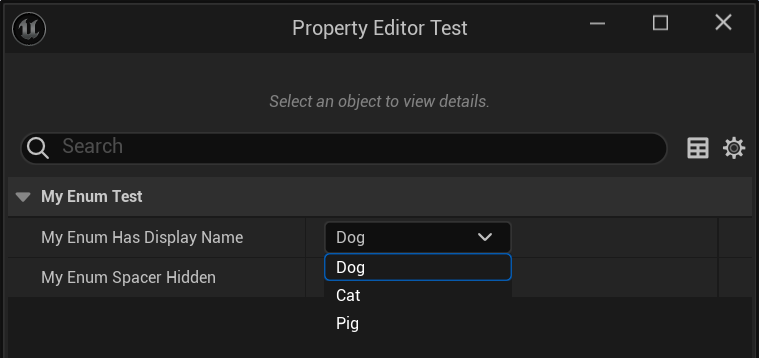

# DisplayName

- **Function Description:** Modify the display name of an enumeration value
- **Usage Location:** UENUM::UMETA
- **Engine Module:** Enum Property
- **Metadata Type:** string="abc"
- **Commonly Used:** ★★★★★

Modify the display name of enumeration values

## Sample Code:

```cpp
/*
[enum 602d0d4e680 EMyEnum_HasDisplayName	Enum->Field->Object	/Script/Insider.EMyEnum_HasDisplayName]
(BlueprintType = true, First.DisplayName = Dog, First.Name = EMyEnum_HasDisplayName::First, IsBlueprintBase = true, ModuleRelativePath = Enum/MyEnum_Test.h, Second.DisplayName = Cat, Second.Name = EMyEnum_HasDisplayName::Second, Third.DisplayName = Pig, Third.Name = EMyEnum_HasDisplayName::Third)
	ObjectFlags:	RF_Public | RF_Transient
	Outer:	Package /Script/Insider
	EnumFlags:	None
	EnumDisplayNameFn:	0
	CppType:	EMyEnum_HasDisplayName
	CppForm:	EnumClass
{
	First = 0,
	Second = 1,
	Third = 2,
	EMyEnum_MAX = 3
};
*/
UENUM(Blueprintable)
enum class EMyEnum_HasDisplayName :uint8
{
	First UMETA(DisplayName="Dog"),
	Second UMETA(DisplayName="Cat"),
	Third UMETA(DisplayName="Pig"),
};

UCLASS(BlueprintType)
class INSIDER_API UMyEnum_Test :public UObject
{
	GENERATED_BODY()
public:
	UPROPERTY(EditAnywhere,BlueprintReadWrite)
	EMyEnum_HasDisplayName MyEnum_HasDisplayName;
}
```

## Example Effect:

It is evident that the name has been changed.

