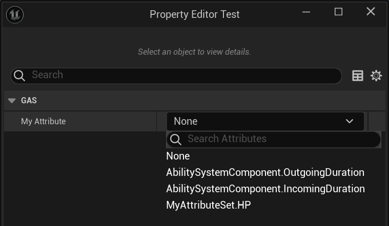

# HideInDetailsView

- **Function Description:** Hide the properties of the UAttributeSet subclass within the FGameplayAttribute option list.
- **Usage Locations:** UCLASS, UPROPERTY
- **Engine Module:** GAS
- **Metadata Type:** bool
- **Restriction Type:** UAttributeSet
- **Related Items:** [HideFromModifiers](../HideFromModifiers/HideFromModifiers.md), [SystemGameplayAttribute](../SystemGameplayAttribute/SystemGameplayAttribute.md)
- **Commonliness:** ★★★

Hide the properties of the UAttributeSet subclass within the FGameplayAttribute option list.

Can be applied to UCLASS to hide all properties within an entire class, or to a specific property to hide only that property.

An example used in the source code is UAbilitySystemTestAttributeSet, as it is specifically designed for testing purposes and is intended not to interfere with the standard option list.

## Test Code:

```cpp
UCLASS()
class UMyAttributeSet : public UAttributeSet
{
	GENERATED_BODY()
public:
	UPROPERTY(EditAnywhere, BlueprintReadWrite, Category = "Core")
	float HP = 100.f;

	UPROPERTY(EditAnywhere, BlueprintReadWrite, Category = "Core", meta = (HideInDetailsView))
	float HP_HideInDetailsView = 100.f;
};

UCLASS(meta = (HideInDetailsView))
class UMyAttributeSet_Hide : public UAttributeSet
{
	GENERATED_BODY()
public:
	UPROPERTY(EditAnywhere, BlueprintReadWrite, Category = "Core")
	float HP = 100.f;
};

UCLASS()
class UMyAttributeSetTest : public UObject
{
	GENERATED_BODY()
public:
	UPROPERTY(BlueprintReadWrite, EditAnywhere, Category = "GAS")
	FGameplayAttribute MyAttribute;
};
```

## Test Effects:

Only the UMyAttributeSet.HP property is selectable, with options in UMyAttributeSet_Hide being inaccessible.



## Principle:

```cpp
PropertyModule.RegisterCustomPropertyTypeLayout( "GameplayAttribute", FOnGetPropertyTypeCustomizationInstance::CreateStatic( &FAttributePropertyDetails::MakeInstance ) );

void FGameplayAttribute::GetAllAttributeProperties(TArray<FProperty*>& OutProperties, FString FilterMetaStr, bool UseEditorOnlyData)
{
	for (TObjectIterator<UClass> ClassIt; ClassIt; ++ClassIt)
	{
		if (UseEditorOnlyData)
		{
			#if WITH_EDITOR
			// Allow entire classes to be filtered globally
			if (Class->HasMetaData(TEXT("HideInDetailsView")))
			{
				continue;
			}
			#endif
		}


			for (TFieldIterator<FProperty> PropertyIt(Class, EFieldIteratorFlags::ExcludeSuper); PropertyIt; ++PropertyIt)
			{
				FProperty* Property = *PropertyIt;

				if (UseEditorOnlyData)
				{
					// Allow properties to be filtered globally (never show up)
					if (Property->HasMetaData(TEXT("HideInDetailsView")))
					{
						continue;
					}
					#endif
				}

				OutProperties.Add(Property);
			}
	}
}
```