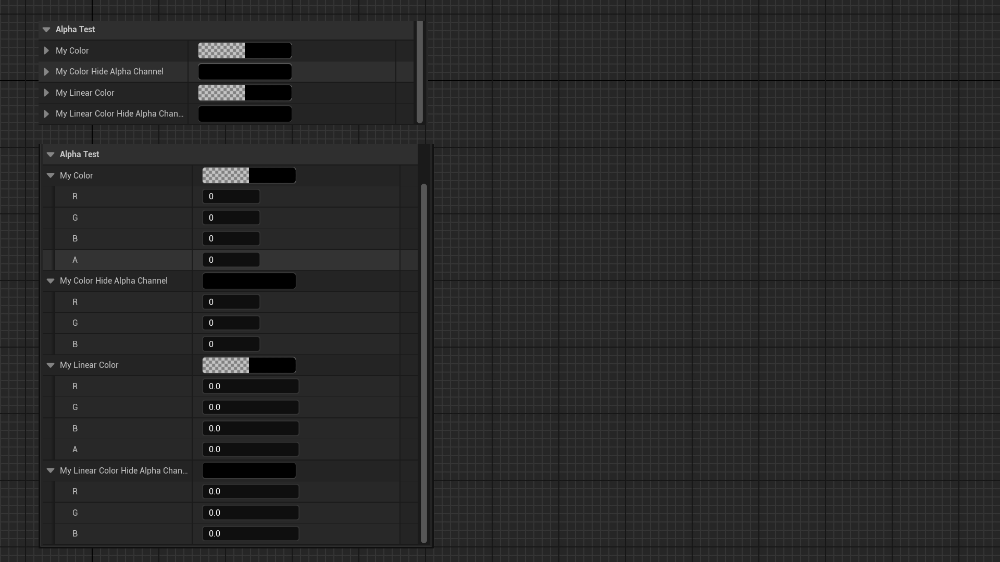

# Hide Alpha Channel

- **Function Description:** Hides the Alpha channel of FColor or FLinearColor properties during editing.
- **Usage Location:** UPROPERTY
- **Engine Module:** Numeric Property
- **Metadata Type:** bool
- **Restricted Types:** FColor, FLinearColor
- **Commonality:** ★★★

Makes the FColor or FLinearColor property hide the alpha channel when editing.

## Test Code:

```cpp
public:
	UPROPERTY(EditAnywhere, Category = AlphaTest)
	FColor MyColor;

	UPROPERTY(EditAnywhere, Category = AlphaTest, meta = (HideAlphaChannel))
	FColor MyColor_HideAlphaChannel;

	UPROPERTY(EditAnywhere, Category = AlphaTest)
	FLinearColor MyLinearColor;

	UPROPERTY(EditAnywhere, Category = AlphaTest, meta = (HideAlphaChannel))
	FLinearColor MyLinearColor_HideAlphaChannel;
```

## Test Results:

It is evident that properties with HideAlphaChannel do not display an Alpha channel.



## Principle:

```cpp
void FColorStructCustomization::CustomizeHeader(TSharedRef<class IPropertyHandle> InStructPropertyHandle, class FDetailWidgetRow& InHeaderRow, IPropertyTypeCustomizationUtils& StructCustomizationUtils)
{
	bIgnoreAlpha = TypeSupportsAlpha() == false || StructPropertyHandle->GetProperty()->HasMetaData(TEXT("HideAlphaChannel"));
}

.AlphaDisplayMode(bIgnoreAlpha ? EColorBlockAlphaDisplayMode::Ignore : EColorBlockAlphaDisplayMode::Separate)

```