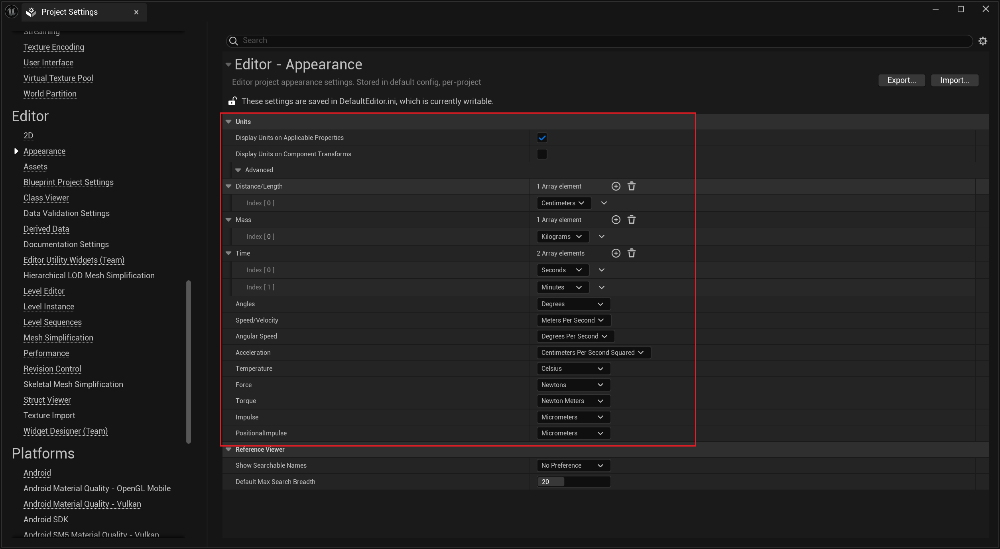
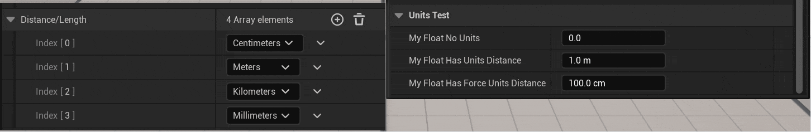

# Units

- **Function description:** Defines the unit for attribute values, supporting dynamic adjustment of the display unit based on the numerical input.
- **Use location:** UPROPERTY
- **Engine module:** Numeric Property
- **Metadata type:** string = "abc"
- **Restriction type:** float, int32
- **Related items:** [ForceUnits](../ForceUnits.md)
- **Commonly used:** ★★★

Units set the unit for attribute values. A unit can have multiple aliases, such as Kilograms and kg, Centimeters and cm.

The role of Units is not only to define the unit but also implies that the display unit string can be automatically adjusted to adapt to the user's input value. For instance, 100cm is equivalent to 1m, and 0.5km is 500m.

Moreover, after setting the unit, the system can accept a combination of numbers and units directly entered into the numeric field. For example, typing 1km sets the value to 1 with the unit km. Or 1ft equals 1 foot, which is 30.84cm.

To implement the feature of automatically adjusting the display unit, you first need to set up a series of units in the project settings. For example, the image below sets units for distance in centimeters, meters, kilometers, and millimeters (the order is not important). Subsequently, the numeric field can convert between these four units when displaying the distance unit.



## Test Code:

```cpp
UPROPERTY(EditAnywhere, Category = UnitsTest)
float MyFloat_NoUnits = 0.0;

UPROPERTY(EditAnywhere, Category = UnitsTest, Meta = (Units = "cm"))
float MyFloat_HasUnits_Distance = 100.f;

UPROPERTY(EditAnywhere, Category = UnitsTest, Meta = (ForceUnits = "cm"))
float MyFloat_HasForceUnits_Distance = 100.f;
```

## Test Results:

- Enter four units in the project settings: cm, m, km, mm, and begin testing.
- It is observed that properties using Units automatically adjust the unit based on different values and also accept numeric inputs combined with units.
- It is noted that properties using ForceUnits also accept numeric inputs combined with units, but the display always remains in cm, without adjusting to other units.



## Principle:

- If ForceUnits is set, UnderlyingUnits (base units), UserDisplayUnits, and FixedDisplayUnits are also set.
- Otherwise, if Units is set, it is applied only to UnderlyingUnits and FixedDisplayUnits
- Finally, when displaying units, if UserDisplayUnits is present, it is given priority. Then FixedDisplayUnits are considered.
- When using ToString, the value is converted from UnderlyingUnits to UserDisplayUnits or FixedDisplayUnits.
- When the numeric input box is changed, SetupFixedDisplay is triggered, recalculating the appropriate unit value internally and assigning it to FixedDisplayUnits each time. Therefore, as previously stated, if UserDisplayUnits is not set (no ForceUnits), the display unit will be adjusted to the new appropriate unit every time. Otherwise, due to the highest priority of UserDisplayUnits, which always holds a value, the display will remain constant.

```cpp
void SPropertyEditorNumeric<NumericType>::Construct( const FArguments& InArgs, const TSharedRef<FPropertyEditor>& InPropertyEditor )
{
		// First off, check for ForceUnits= meta data. This meta tag tells us to interpret, and always display the value in these units. FUnitConversion::Settings().ShouldDisplayUnits does not apply to such properties
		const FString& ForcedUnits = MetaDataGetter.Execute("ForceUnits");
		TOptional<EUnit> PropertyUnits = FUnitConversion::UnitFromString(*ForcedUnits);
		if (PropertyUnits.IsSet())
		{
			// Create the type interface and set up the default input units if they are compatible
			TypeInterface = MakeShareable(new TNumericUnitTypeInterface<NumericType>(PropertyUnits.GetValue()));
			TypeInterface->UserDisplayUnits = TypeInterface->FixedDisplayUnits = PropertyUnits.GetValue();
		}
		// If that's not set, we fall back to Units=xxx which calculates the most appropriate unit to display in
		else
		{
			if (FUnitConversion::Settings().ShouldDisplayUnits())
			{
				const FString& DynamicUnits = PropertyHandle->GetMetaData(TEXT("Units"));
				if (!DynamicUnits.IsEmpty())
				{
					PropertyUnits = FUnitConversion::UnitFromString(*DynamicUnits);
				}
				else
				{
					PropertyUnits = FUnitConversion::UnitFromString(*MetaDataGetter.Execute("Units"));
				}
			}

			if (!PropertyUnits.IsSet())
			{
				PropertyUnits = EUnit::Unspecified;
			}
		}
}

void SPropertyEditorNumeric<NumericType>::OnValueCommitted( NumericType NewValue, ETextCommit::Type CommitInfo )
{

			if (TypeInterface.IsValid())
			{
				TypeInterface->SetupFixedDisplay(NewValue);
			}
}

template<typename NumericType>
void TNumericUnitTypeInterface<NumericType>::SetupFixedDisplay(const NumericType& InValue)
{
	// We calculate this regardless of whether FixedDisplayUnits is used, so that the moment it is used, it's correct
	EUnit DisplayUnit = FUnitConversion::CalculateDisplayUnit(InValue, UnderlyingUnits);
	if (DisplayUnit != EUnit::Unspecified)
	{
		FixedDisplayUnits = DisplayUnit;
	}
}

//During conversion,
FString TNumericUnitTypeInterface<NumericType>::ToString(const NumericType& Value) const
{
		if (UserDisplayUnits.IsSet())
		{
			auto Converted = FinalValue.ConvertTo(UserDisplayUnits.GetValue());
			if (Converted.IsSet())
			{
				return ToUnitString(Converted.GetValue());
			}
		}

		if (FixedDisplayUnits.IsSet())
		{
			auto Converted = FinalValue.ConvertTo(FixedDisplayUnits.GetValue());
			if (Converted.IsSet())
			{
				return ToUnitString(Converted.GetValue());
			}
		}
}


```