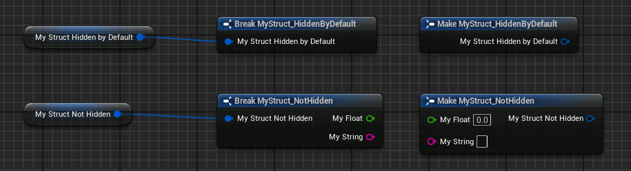

# HiddenByDefault

- **Function Description:** Pins within the "Make Struct" and "Break Struct" nodes of a Struct are set to a hidden state by default
- **Usage Location:** USTRUCT
- **Engine Module:** Pin
- **Metadata Type:** bool
- **Commonality:** ★

## Test Code:

```cpp
//(BlueprintType = true, HiddenByDefault = , ModuleRelativePath = Struct/MyStruct_HiddenByDefault.h)
USTRUCT(BlueprintType, meta = (HiddenByDefault))
struct INSIDER_API FMyStruct_HiddenByDefault
{
	GENERATED_BODY()

	UPROPERTY(BlueprintReadWrite, EditAnywhere)
	float MyFloat;
	UPROPERTY(BlueprintReadWrite, EditAnywhere)
	FString MyString;
};

USTRUCT(BlueprintType)
struct INSIDER_API FMyStruct_NotHidden
{
	GENERATED_BODY()

	UPROPERTY(BlueprintReadWrite, EditAnywhere)
	float MyFloat;
	UPROPERTY(BlueprintReadWrite, EditAnywhere)
	FString MyString;
};
```

## Blueprint Results:



What is meant by "hidden" is that certain properties need to be manually selected in the node's details panel, rather than being automatically displayed in full as with the default setting.

