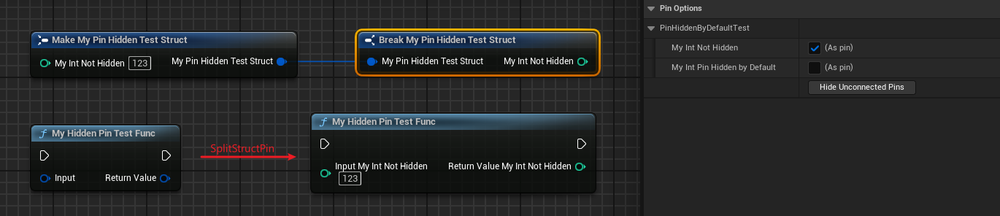

# PinHiddenByDefault

- **Function description:** Causes properties within this structure to be hidden by default when represented as pins in blueprints.
- **Use location:** UPROPERTY
- **Engine module:** Pin
- **Metadata type:** bool
- **Restriction type:** struct member property
- **Commonly used:** ★★

Makes the properties within this structure hidden by default when represented as pins in blueprints.

Please note that this metadata only affects the member properties of the structure and is only active within blueprint nodes. In some cases, a structure may contain multiple properties, but not all properties need to be exposed for user editing at once. Some properties might be advanced and should initially remain hidden.

This attribute can also be applied in Animation Blueprints to prevent certain properties of animation nodes from being exposed as pins.

## Test Code:

```cpp
USTRUCT(BlueprintType)
struct FMyPinHiddenTestStruct
{
	GENERATED_BODY()
public:
	UPROPERTY(EditAnywhere, BlueprintReadWrite,Category=PinHiddenByDefaultTest)
	int32 MyInt_NotHidden = 123;

	UPROPERTY(EditAnywhere, BlueprintReadWrite,Category=PinHiddenByDefaultTest, meta = (PinHiddenByDefault))
	int32 MyInt_PinHiddenByDefault = 123;
};

	UFUNCTION(BlueprintCallable)
	static FMyPinHiddenTestStruct MyHiddenPinTestFunc(FMyPinHiddenTestStruct Input);
```

## Test Results:

It can be observed that for the MakeStruct and BreakStruct nodes, only MyInt_NotHidden is displayed by default. When the blueprint node is selected, the MyInt_PinHiddenByDefault property appears unchecked in the details panel on the right, illustrating the difference.

The same applies when the structure is used as a function input and output parameter. When the SplitStructPin is used to expand the structure node, MyInt_PinHiddenByDefault is also hidden.



## Principle:

As revealed in the source code, FStructOperationOptionalPinManager utilizes this metadata, and both FMakeStructPinManager and FBreakStructPinManager inherit from it, ensuring that the PinHiddenByDefault pin is not displayed initially.

```cpp
struct FStructOperationOptionalPinManager : public FOptionalPinManager
{
	//~ Begin FOptionalPinsUpdater Interface
	virtual void GetRecordDefaults(FProperty* TestProperty, FOptionalPinFromProperty& Record) const override
	{
		Record.bCanToggleVisibility = true;
		Record.bShowPin = true;
		if (TestProperty)
		{
			Record.bShowPin = !TestProperty->HasMetaData(TEXT("PinHiddenByDefault"));
			if (Record.bShowPin)
			{
				if (UStruct* OwnerStruct = TestProperty->GetOwnerStruct())
				{
					Record.bShowPin = !OwnerStruct->HasMetaData(TEXT("HiddenByDefault"));
				}
			}
		}
	}

	virtual void CustomizePinData(UEdGraphPin* Pin, FName SourcePropertyName, int32 ArrayIndex, FProperty* Property) const override;
	// End of FOptionalPinsUpdater interfac
};

struct FMakeStructPinManager : public FStructOperationOptionalPinManager
{}
struct FBreakStructPinManager : public FStructOperationOptionalPinManager
{}

```