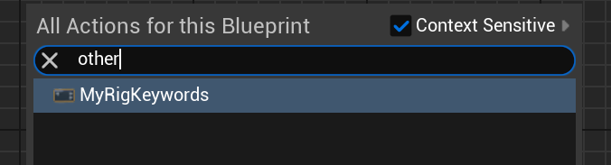

# Keywords

- **Function Description:** Defines keywords for FRigUnit blueprint nodes in the right-click menu to simplify search and input.
- **Usage Location:** USTRUCT
- **Engine Module:** RigVMStruct
- **Metadata Type:** strings = "a, b, c"
- **Restriction Type:** FRigUnit
- **Commonality:** ★★★

Settings the keywords for FRigUnit blueprint nodes in the right-click menu to make it easier to search and input.

Functions similarly to the Keywords on Functions.

## Test Code:

```cpp
USTRUCT(meta = (DisplayName = "MyRigKeywords",Keywords="MyKey,OtherWord"))
struct INSIDER_API FRigUnit_MyRigKeywords: public FRigUnit
{
	GENERATED_BODY()

	RIGVM_METHOD()
		virtual void Execute() override;
public:
	UPROPERTY(meta = (Input))
	float MyFloat_Input = 123.f;

	UPROPERTY(meta = (Output))
	float MyFloat_Output = 123.f;
};

```

## Test Effects:

Nodes can be located by entering the characters specified in the Keywords.



## Principle:

```cpp
URigVMEdGraphUnitNodeSpawner* URigVMEdGraphUnitNodeSpawner::CreateFromStruct(UScriptStruct* InStruct, const FName& InMethodName, const FText& InMenuDesc, const FText& InCategory, const FText& InTooltip)
{
	FString KeywordsMetadata, TemplateNameMetadata;
	InStruct->GetStringMetaDataHierarchical(FRigVMStruct::KeywordsMetaName, &KeywordsMetadata);
	if(!TemplateNameMetadata.IsEmpty())
	{
		if(KeywordsMetadata.IsEmpty())
		{
			KeywordsMetadata = TemplateNameMetadata;
		}
		else
		{
			KeywordsMetadata = KeywordsMetadata + TEXT(",") + TemplateNameMetadata;
		}
	}
	MenuSignature.Keywords = FText::FromString(KeywordsMetadata);

}
```