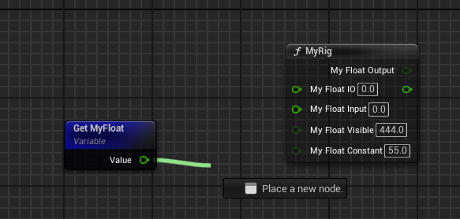

# Visible

- **Function Description:** The attribute within FRigUnit is designated as a constant pin, which cannot be linked to variables.
- **Use Location:** UPROPERTY
- **Engine Module:** RigVMStruct
- **Metadata Type:** Boolean
- **Restriction Type:** Attribute within FRigUnit
- **Associated Items:** [Input](../Input/Input.md)
- **Commonality:** ★★★

Designate the attribute under FRigUnit as a constant pin, disallowing connection to variables.

The "Visible" and "Input+Constant" settings yield identical effects.

## Test Code:

```cpp
USTRUCT(meta = (DisplayName = "MyRig"))
struct INSIDER_API FRigUnit_MyRig : public FRigUnit
{
	GENERATED_BODY()

	RIGVM_METHOD()
		virtual void Execute() override;

public:
	UPROPERTY()
	float MyFloat_Normal;

	UPROPERTY(meta = (Input))
	float MyFloat_Input;

	UPROPERTY(meta = (Output))
	float MyFloat_Output;

	UPROPERTY(meta = (Input, Output))
	float MyFloat_IO;

	UPROPERTY(meta = (Hidden))
	float MyFloat_Hidden;

	UPROPERTY(meta = (Visible))
	float MyFloat_Visible;

	UPROPERTY(meta = (Input, Constant))
	float MyFloat_Constant;
};
```

## Test Effects:

Both "Visible" and "Input+Constant" not only have the same effect but also establish the attribute as a constant.



## Principle:

```cpp
UENUM(BlueprintType)
enum class ERigVMPinDirection : uint8
{
	Input, // A const input value
	Output, // A mutable output value
	IO, // A mutable input and output value
	Visible, // A const value that cannot be connected to
	Hidden, // A mutable hidden value (used for interal state)
	Invalid // The max value for this enum - used for guarding.
};

FRigVMPinInfo::FRigVMPinInfo(FProperty* InProperty, ERigVMPinDirection InDirection, int32 InParentIndex, const uint8* InDefaultValueMemory)
{
	bIsConstant = InProperty->HasMetaData(TEXT("Constant"));
}

void URigVMController::ConfigurePinFromProperty(FProperty* InProperty, URigVMPin* InOutPin, ERigVMPinDirection InPinDirection) const
{
		InOutPin->bIsConstant = InProperty->HasMetaData(TEXT("Constant"));
}

bool URigVMPin::CanBeBoundToVariable(const FRigVMExternalVariable& InExternalVariable, const FString& InSegmentPath) const
{
	if (bIsConstant)
	{
		return false;
	}
}
```