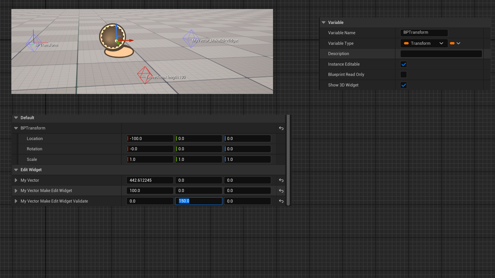

# ValidateWidgetUsing

- **Function Description:** Provides a function to validate the legitimacy of the current attribute value.
- **Usage Location:** UPROPERTY
- **Engine Module:** Scene
- **Metadata Type:** bool
- **Restriction Type:** FVector and FTransform with MakeEditWidget attribute
- **Associated Items:** [MakeEditWidget](../MakeEditWidget/MakeEditWidget.md)
- **Commonliness:** ★★★

ValidateWidgetUsing offers a function to validate the legitimacy of the current property value.

- The current property must be tagged with MakeEditWidget
- The function prototype is FString MyFunc(), which returns a non-empty string to indicate an error message.

## Test Code:

```cpp
	UFUNCTION()
	FString ValidateMyVector()
	{
		if (MyVector_MakeEditWidget_Validate.Length()>100.f)
		{
			return TEXT("Exceed max length:100");
		}
		return TEXT("");
	}

	UPROPERTY(EditAnywhere, BlueprintReadWrite, Category = "EditWidget", meta = (MakeEditWidget, ValidateWidgetUsing = "ValidateMyVector"))
	FVector MyVector_MakeEditWidget_Validate;
```

## Test Results:

Visible MyVector_MakeEditWidget_Validate changes the control color to red and displays an error message on the control when the length exceeds 100.



## Principle:

The logic is straightforward. If a validation function is detected, it is invoked to perform the validation. If an error message is present, the final output color and text are altered accordingly.

```cpp
	static FLegacyEdModeWidgetHelper::FPropertyWidgetInfo CreateWidgetInfo(const TArray<FPropertyWidgetInfoChainElement>& Chain, bool bIsTransform, FProperty* CurrentProp, int32 Index = INDEX_NONE)
	{
		check(CurrentProp);
		FEdMode::FPropertyWidgetInfo WidgetInfo;
		WidgetInfo.PropertyValidationName = FName(*CurrentProp->GetMetaData(FEdMode::MD_ValidateWidgetUsing));

		return WidgetInfo;
	}

void FLegacyEdModeWidgetHelper::FPropertyWidgetInfo::GetTransformAndColor(UObject* BestSelectedItem, bool bIsSelected, FTransform& OutLocalTransform, FString& OutValidationMessage, FColor& OutDrawColor) const
{
	// Determine the desired color
	if (PropertyValidationName != NAME_None)
	{
		if (UFunction* ValidateFunc = BestSelectedItem->FindFunction(PropertyValidationName))
		{
			BestSelectedItem->ProcessEvent(ValidateFunc, &OutValidationMessage);

			// if we have a negative result, the widget color is red.
			OutDrawColor = OutValidationMessage.IsEmpty() ? OutDrawColor : FColor::Red;
		}
	}
}

void FLegacyEdModeWidgetHelper::DrawHUD(FEditorViewportClient* ViewportClient, FViewport* Viewport, const FSceneView* View, FCanvas* Canvas)
{
	FTransform LocalWidgetTransform;
	FString ValidationMessage;
	FColor WidgetColor;
	WidgetInfo.GetTransformAndColor(BestSelectedItem, bSelected, /*out*/ LocalWidgetTransform, /*out*/ ValidationMessage, /*out*/ WidgetColor);

	Canvas->DrawItem(TextItem);
}
```