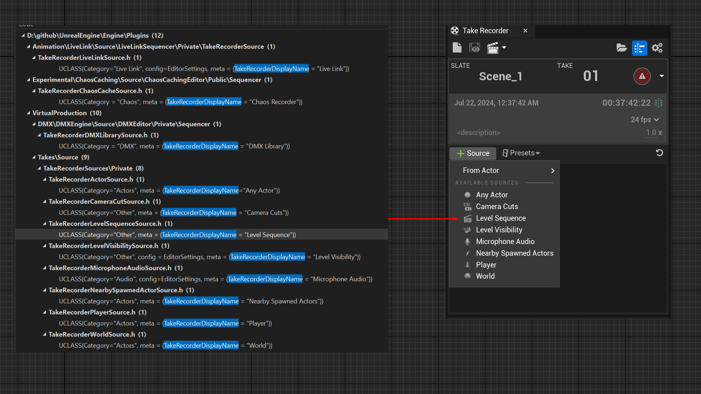

# TakeRecorderDisplayName

- **Function Description:** Specifies the display name for UTakeRecorderSource.
- **Usage Location:** UCLASS
- **Engine Module:** Sequencer
- **Metadata Type:** string="abc"
- **Restriction Type:** Applicable to subclasses of UTakeRecorderSource
- **Commonality:** ★★

Specifies the display name for UTakeRecorderSource.

Usually, this is used internally by the engine, and it only becomes relevant if you intend to customize UTakeRecorderSource. Given the simplicity of its concept and demonstration, there is no need to construct test code myself.

## Source Code Example:

```cpp
UCLASS(Category="Actors", meta = (TakeRecorderDisplayName = "Player"))
class UTakeRecorderPlayerSource : public UTakeRecorderSource
{}
```

## Test Effects:

You can see multiple instances of UTakeRecorderSource within the engine source code, all of which are labeled with names.



## Principle:

The name specified by TakeRecorderDisplayName is used as the name for the menu item.

```cpp
TSharedRef<SWidget> SLevelSequenceTakeEditor::OnGenerateSourcesMenu()
{
		for (UClass* Class : SourceClasses)
		{
			TSubclassOf<UTakeRecorderSource> SubclassOf = Class;

			MenuBuilder.AddMenuEntry(
				FText::FromString(Class->GetMetaData(TEXT("TakeRecorderDisplayName"))),
				Class->GetToolTipText(true),
				FSlateIconFinder::FindIconForClass(Class),
				FUIAction(
					FExecuteAction::CreateSP(this, &SLevelSequenceTakeEditor::AddSourceFromClass, SubclassOf),
					FCanExecuteAction::CreateSP(this, &SLevelSequenceTakeEditor::CanAddSourceFromClass, SubclassOf)
				)
			);
		}
}
```