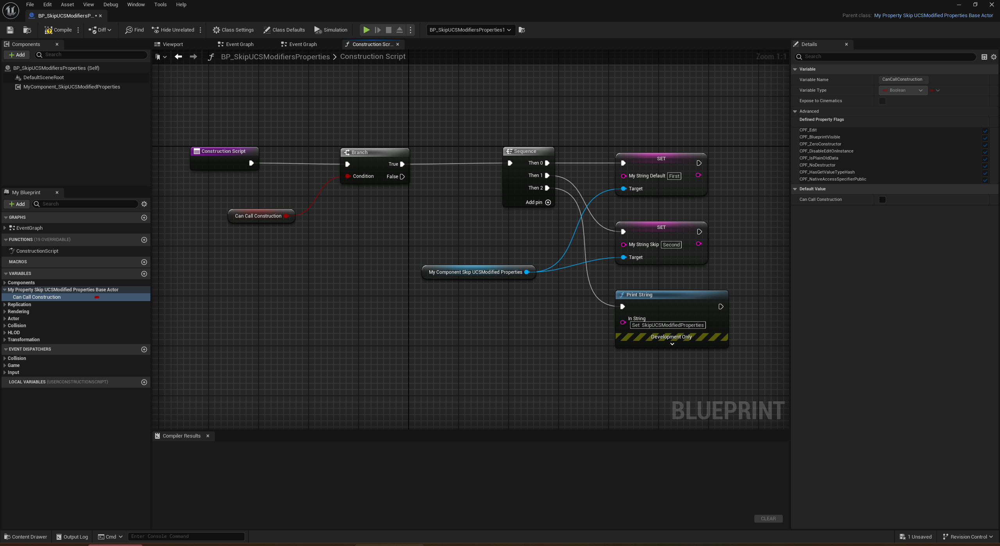

# SkipUCSModifiedProperties

- **Function description:** Allows properties within an ActorComponent to be retained after modification in the Actor's constructor.
- **Use location:** UPROPERTY
- **Engine module:** Serialization
- **Metadata type:** bool
- **Restriction type:** Properties under ActorComponent
- **Commonly used:** 1


Allows properties within an ActorComponent to be retained after modification in the Actor's constructor.

By default, these properties are not serialized and saved. It is presumed that the developers believed these properties would be reassigned in the Actor's constructor, rendering serialization unnecessary. However, in certain scenarios, such as when the constructor is executed only once, or when the Actor is dynamically created with component properties (e.g., PCG), it is desirable for these Component properties to be serialized and saved.

## Test Code:

```cpp
UCLASS(Blueprintable, BlueprintType,meta=(BlueprintSpawnableComponent))
class INSIDER_API UMyComponent_SkipUCSModifiedProperties :public UActorComponent
{
public:
	GENERATED_BODY()
public:
	UPROPERTY(EditAnywhere, BlueprintReadWrite)
	FString MyString_Default = TEXT("Hello");
	UPROPERTY(EditAnywhere, BlueprintReadWrite, meta = (SkipUCSModifiedProperties))
	FString MyString_Skip = TEXT("Hello");
};

UCLASS(Blueprintable, BlueprintType)
class INSIDER_API AMyProperty_SkipUCSModifiedProperties_BaseActor :public AActor
{
public:
	GENERATED_BODY()

	UPROPERTY(BlueprintReadWrite,EditDefaultsOnly)
	bool CanCallConstruction=false;
};

UCLASS(Blueprintable, BlueprintType)
class INSIDER_API AMyProperty_SkipUCSModifiedProperties_TestActor :public AActor
{
public:
	GENERATED_BODY()

	UPROPERTY(EditAnywhere)
	TSubclassOf<AMyProperty_SkipUCSModifiedProperties_BaseActor> ActorClass;

	UFUNCTION(CallInEditor)
	void CreateActor();

	UFUNCTION(CallInEditor)
	void CleanupActor();
};

void AMyProperty_SkipUCSModifiedProperties_TestActor::CreateActor()
{
	UWorld* editorWorld = this->GetWorld();
	FActorSpawnParameters params;
	params.Template = (AActor*)ActorClass->GetDefaultObject();
	params.OverrideLevel=GetLevel();
	params.SpawnCollisionHandlingOverride=ESpawnActorCollisionHandlingMethod::AlwaysSpawn;
	params.bDeferConstruction=true;
	FTransform t;

	AMyProperty_SkipUCSModifiedProperties_BaseActor* newActor =Cast<AMyProperty_SkipUCSModifiedProperties_BaseActor>(editorWorld->SpawnActor(ActorClass,&t, params));//cannot call user construction script in BP actor
	newActor->CanCallConstruction=true;
	newActor->FinishSpawning(t);
}

void AMyProperty_SkipUCSModifiedProperties_TestActor::CleanupActor()
{
	UWorld* editorWorld = this->GetWorld();

	for (TActorIterator<AActor> It(editorWorld, ActorClass); It; ++It)
	{
		AActor* Actor = *It;
		editorWorld->DestroyActor(Actor);
	}
}
```

## Test Results:



Operation steps:


It can be observed that at the beginning, both properties within the component of a dynamically created Actor in the scene are modified by the constructor to be First and Second. However, after saving the level Map, only the value of MyString_Default reverts to the default (not serialized), while the value of MyString_Skip is preserved.

In the sample code, I added a variable CanCallConstruction to the Actor with the modifier EditDefaultsOnly, which is crucial. If set to EditAnywhere, its value would be saved on the instance of the Actor in the scene. For variables with EditDefaultsOnly, their values are saved only on the CDO. Thus, I use this value to ensure that the Actor's constructor is executed only once after I manually create the Actor, and it does not trigger the assignment logic following the constructor upon subsequent Map reloads. This highlights the difference in the values of these two properties, as otherwise, the assignment logic after the constructor would always be executed first, and the serialized values in the map would be overwritten.

## Principle:

Under UActorComponent, there is an AllUCSModifiedProperties list that records all properties under UActorComponent modified in the constructor of the hosting Actor. The purpose is that the modified values of these properties do not need to be serialized into the level's Actor instance.

As seen in the code of FComponentPropertyReader and FComponentPropertyWriter, properties listed in AllUCSModifiedProperties do not participate in serialization. Therefore, SkipUCSModifiedProperties serves to allow certain properties under an ActorComponent to be serialized and saved even after modification in the Actor's constructor.

```cpp
class UActorComponent : public UObject, public IInterface_AssetUserData
{
	static ENGINE_API TMap<UActorComponent*, TArray<FSimpleMemberReference>> AllUCSModifiedProperties;
}

void UActorComponent::GetUCSModifiedProperties(TSet<const FProperty*>& ModifiedProperties) const
{
	FRWScopeLock Lock(AllUCSModifiedPropertiesLock, SLT_ReadOnly);
	if (TArray<FSimpleMemberReference>* UCSModifiedProperties = AllUCSModifiedProperties.Find(this))
	{
		for (const FSimpleMemberReference& MemberReference : *UCSModifiedProperties)
		{
			ModifiedProperties.Add(FMemberReference::ResolveSimpleMemberReference<FProperty>(MemberReference));
		}
	}
}

class FDataCachePropertyReader : public FObjectReader
{
public:
	FDataCachePropertyReader(FInstanceCacheDataBase& InInstanceData)
		: FObjectReader(InInstanceData.SavedProperties)
		, InstanceData(InInstanceData)
	{
		// Include properties that would normally skip tagged serialization (e.g. bulk serialization of array properties).
		ArPortFlags |= PPF_ForceTaggedSerialization;
	}

	virtual bool ShouldSkipProperty(const FProperty* InProperty) const override
	{
		return PropertiesToSkip.Contains(InProperty);
	}

};

class FComponentPropertyReader : public FDataCachePropertyReader
{
public:
	FComponentPropertyReader(UActorComponent* InComponent, FActorComponentInstanceData& InInstanceData)
		: FDataCachePropertyReader(InInstanceData)
	{
		InComponent->GetUCSModifiedProperties(PropertiesToSkip);

		UClass* Class = InComponent->GetClass();
		Class->SerializeTaggedProperties(*this, (uint8*)InComponent, Class, (uint8*)InComponent->GetArchetype());
	}
};

class FComponentPropertyWriter : public FDataCachePropertyWriter
{
public:

	FComponentPropertyWriter(const UActorComponent* Component, FActorComponentInstanceData& InInstanceData)
		: FDataCachePropertyWriter(Component, InInstanceData)
	{
		if (Component)
		{
			Component->GetUCSModifiedProperties(PropertiesToSkip);

			if (AActor* ComponentOwner = Component->GetOwner())
			{
				// If this is the owning Actor's root scene component, don't include relative transform properties. This is handled elsewhere.
				if (Component == ComponentOwner->GetRootComponent())
				{
					UClass* ComponentClass = Component->GetClass();
					PropertiesToSkip.Add(ComponentClass->FindPropertyByName(USceneComponent::GetRelativeLocationPropertyName()));
					PropertiesToSkip.Add(ComponentClass->FindPropertyByName(USceneComponent::GetRelativeRotationPropertyName()));
					PropertiesToSkip.Add(ComponentClass->FindPropertyByName(USceneComponent::GetRelativeScale3DPropertyName()));
				}
			}

			SerializeProperties();
		}
	}
};

void UActorComponent::DetermineUCSModifiedProperties()
{

	class FComponentPropertySkipper : public FArchive
	{
	public:
		FComponentPropertySkipper()
			: FArchive()
		{
			this->SetIsSaving(true);

			// Include properties that would normally skip tagged serialization (e.g. bulk serialization of array properties).
			ArPortFlags |= PPF_ForceTaggedSerialization;
		}

		virtual bool ShouldSkipProperty(const FProperty* InProperty) const override
		{
			static const FName MD_SkipUCSModifiedProperties(TEXT("SkipUCSModifiedProperties"));
			return (InProperty->HasAnyPropertyFlags(CPF_Transient)
				|| !InProperty->HasAnyPropertyFlags(CPF_Edit | CPF_Interp)
				|| InProperty->IsA<FMulticastDelegateProperty>()
	#if WITH_EDITOR
				|| InProperty->HasMetaData(MD_SkipUCSModifiedProperties)
	#endif
				);
		}
	} PropertySkipper;

	UClass* ComponentClass = GetClass();
	UObject* ComponentArchetype = GetArchetype();

	for (TFieldIterator<FProperty> It(ComponentClass); It; ++It)
	{
		FProperty* Property = *It;
		if( Property->ShouldSerializeValue(PropertySkipper) )
		{
			for( int32 Idx=0; Idx<Property->ArrayDim; Idx++ )
			{
				uint8* DataPtr      = Property->ContainerPtrToValuePtr           <uint8>((uint8*)this, Idx);
				uint8* DefaultValue = Property->ContainerPtrToValuePtrForDefaults<uint8>(ComponentClass, (uint8*)ComponentArchetype, Idx);
				if (!Property->Identical( DataPtr, DefaultValue, PPF_DeepCompareInstances))
				{
					UCSModifiedProperties.Add(FSimpleMemberReference());
					FMemberReference::FillSimpleMemberReference<FProperty>(Property, UCSModifiedProperties.Last());
					break;
				}
			}
		}
	}

	FRWScopeLock Lock(AllUCSModifiedPropertiesLock, SLT_Write);
	if (UCSModifiedProperties.Num() > 0)
	{
		AllUCSModifiedProperties.Add(this, MoveTemp(UCSModifiedProperties));
	}
	else
	{
		AllUCSModifiedProperties.Remove(this);
	}
}
```

In the source code, it is noted that this is only used in BodyInstance within UPrimitiveComponent.

```cpp
UCLASS(abstract, HideCategories=(Mobility, VirtualTexture), ShowCategories=(PhysicsVolume), MinimalAPI)
class UPrimitiveComponent : public USceneComponent, public INavRelevantInterface, public IInterface_AsyncCompilation, public IPhysicsComponent
{
	UPROPERTY(EditAnywhere, BlueprintReadOnly, Category=Collision, meta=(ShowOnlyInnerProperties, SkipUCSModifiedProperties))
	FBodyInstance BodyInstance;
}
```

## Acknowledgments:

Thanks to **Xu Ruoji** for the feedback, corrections, and example provision!