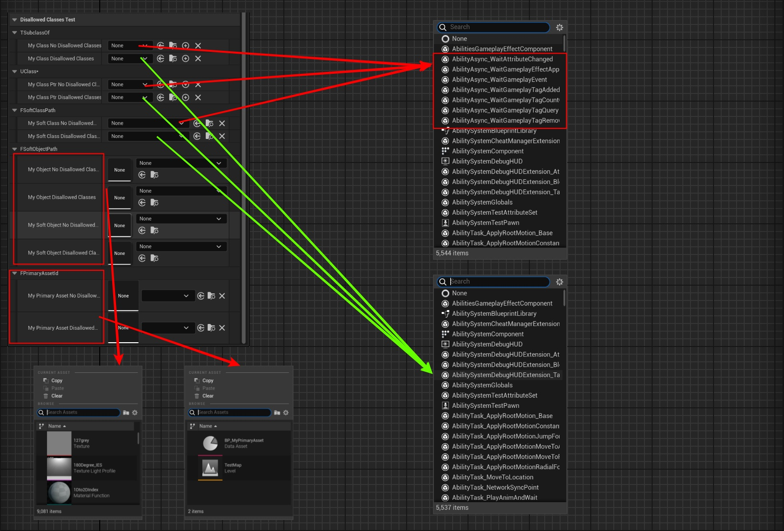

# DisallowedClasses

- **Function description:** Used on class or object selectors to specify the exclusion of certain base class types for the selected objects.
- **Use location:** UPROPERTY
- **Engine module:** TypePicker
- **Metadata type:** strings = "a, b, c"
- **Limit types:** TSubClassOf, UClass*, FSoftClassPath, FComponentReference
- **Related items:** [AllowedClasses](../AllowedClasses/AllowedClasses.md)
- **Frequency:** ★★★

Used on class or object selectors to specify the exclusion of certain base class types for the selected objects.

- The applicable attributes for class selectors are: TSubClassOf, UClass*, FSoftClassPath. Attributes that cannot be applied are: UScriptStruct*
- The applicable properties for the object selector are: FComponentReference. It will be noticed that compared to AllowedClasses, there are fewer "UObject*, FSoftObjectPath, FPrimaryAssetId". This is because the UI corresponding to these three is SAssetPicker, which does not implement the exclusion using FARFilter.RecursiveClassPathsExclusionSet.

## Test Code:

```cpp
public:
	UPROPERTY(EditAnywhere, BlueprintReadWrite, Category = "DisallowedClassesTest|TSubclassOf")
	TSubclassOf<UObject> MyClass_NoDisallowedClasses;

	UPROPERTY(EditAnywhere, BlueprintReadWrite, Category = "DisallowedClassesTest|TSubclassOf", meta = (DisallowedClasses = "/Script/GameplayAbilities.AbilityAsync"))
	TSubclassOf<UObject> MyClass_DisallowedClasses;

	UPROPERTY(EditAnywhere, BlueprintReadWrite, Category = "DisallowedClassesTest|UClass*")
	UClass* MyClassPtr_NoDisallowedClasses;

	UPROPERTY(EditAnywhere, BlueprintReadWrite, Category = "DisallowedClassesTest|UClass*", meta = (DisallowedClasses = "/Script/GameplayAbilities.AbilityAsync"))
	UClass* MyClassPtr_DisallowedClasses;

	UPROPERTY(EditAnywhere, BlueprintReadWrite, Category = "DisallowedClassesTest|FSoftClassPath")
	FSoftClassPath MySoftClass_NoDisallowedClasses;

	UPROPERTY(EditAnywhere, BlueprintReadWrite, Category = "DisallowedClassesTest|FSoftClassPath", meta = (DisallowedClasses = "/Script/GameplayAbilities.AbilityAsync"))
	FSoftClassPath MySoftClass_DisallowedClasses;
public://Not work
	UPROPERTY(EditAnywhere, BlueprintReadWrite, Category = "DisallowedClassesTest|FSoftObjectPath")
	UObject* MyObject_NoDisallowedClasses;

	UPROPERTY(EditAnywhere, BlueprintReadWrite, Category = "DisallowedClassesTest|FSoftObjectPath", meta = (DisallowedClasses = "/Script/Engine.Texture2D"))
	UObject* MyObject_DisallowedClasses;

	UPROPERTY(EditAnywhere, BlueprintReadWrite, Category = "DisallowedClassesTest|FSoftObjectPath")
	FSoftObjectPath MySoftObject_NoDisallowedClasses;

	UPROPERTY(EditAnywhere, BlueprintReadWrite, Category = "DisallowedClassesTest|FSoftObjectPath", meta = (DisallowedClasses = "/Script/Engine.Texture2D"))
	FSoftObjectPath MySoftObject_DisallowedClasses;

	UPROPERTY(EditAnywhere, BlueprintReadWrite, Category = "DisallowedClassesTest|FPrimaryAssetId")
	FPrimaryAssetId MyPrimaryAsset_NoDisallowedClasses;

	UPROPERTY(EditAnywhere, BlueprintReadWrite, Category = "DisallowedClassesTest|FPrimaryAssetId", meta = (DisallowedClasses = "MyPrimaryDataAsset"))
	FPrimaryAssetId MyPrimaryAsset_DisallowedClasses;

UCLASS(Blueprintable, BlueprintType)
class INSIDER_API AMyActor_Class :public AActor
{
	GENERATED_BODY()
public:
	UPROPERTY(EditInstanceOnly, BlueprintReadWrite, Category = "DisallowedClassesTest|FComponentReference", meta = (UseComponentPicker))
	FComponentReference MyComponentReference_NoDisallowedClasses;

	UPROPERTY(EditInstanceOnly, BlueprintReadWrite, Category = "DisallowedClassesTest|FComponentReference", meta = (UseComponentPicker, DisallowedClasses = "MyActorComponent"))
	FComponentReference MyComponentReference_DisallowedClasses;
};

```

## Test Results:

- In the class selector, it is evident that after adding DisallowedClasses, the AbilityAsync class is excluded.
- However, on the object selector, it does not necessarily take effect. The list of selectable objects remains the same for both. The reason is that SAssetPicker does not actually apply DisallowedClasses.



The test effect on FComponentReference is:

DisallowedClasses can exclude MyActorComponent.


## Principle:

The primary principles have already been demonstrated with AllowedClasses. The data for DisallowedClasses is mainly set in DisallowedClassFilters. Subsequently, when creating ClassViewer, it is set in ClassFilter, and ultimately, it still relies on the IsChildOf judgment. However, it is important to note that not all class and object selectors use DisallowedClasses, as it is not implemented in AssetPicker.

```cpp
	TSharedRef<FPropertyEditorClassFilter> PropEdClassFilter = MakeShared<FPropertyEditorClassFilter>();
	PropEdClassFilter->ClassPropertyMetaClass = MetaClass;
	PropEdClassFilter->InterfaceThatMustBeImplemented = RequiredInterface;
	PropEdClassFilter->bAllowAbstract = bAllowAbstract;
	PropEdClassFilter->AllowedClassFilters = AllowedClassFilters;
	PropEdClassFilter->DisallowedClassFilters = DisallowedClassFilters;

	ClassViewerOptions.ClassFilters.Add(PropEdClassFilter);

	ClassFilter = FModuleManager::LoadModuleChecked<FClassViewerModule>("ClassViewer").CreateClassFilter(ClassViewerOptions);


template <typename TClass>
bool FPropertyEditorClassFilter::IsClassAllowedHelper(TClass InClass)
{
	bool bMatchesFlags = !InClass->HasAnyClassFlags(CLASS_Hidden | CLASS_HideDropDown | CLASS_Deprecated) &&
		(bAllowAbstract || !InClass->HasAnyClassFlags(CLASS_Abstract));

	if (bMatchesFlags && InClass->IsChildOf(ClassPropertyMetaClass)
		&& (!InterfaceThatMustBeImplemented || InClass->ImplementsInterface(InterfaceThatMustBeImplemented)))
	{
		auto PredicateFn = [InClass](const UClass* Class)
		{
			return InClass->IsChildOf(Class);
		};

		if (DisallowedClassFilters.FindByPredicate(PredicateFn) == nullptr &&
			(AllowedClassFilters.Num() == 0 || AllowedClassFilters.FindByPredicate(PredicateFn) != nullptr))
		{
			return true;
		}
	}

	return false;
}

void SAssetPicker::Construct( const FArguments& InArgs )
{
	if (InArgs._AssetPickerConfig.bAddFilterUI)
	{
		// We create available classes here. These are used to hide away the type filters in the filter list that don't match this list of classes
		TArray<UClass*> FilterClassList;
		for(auto Iter = CurrentBackendFilter.ClassPaths.CreateIterator(); Iter; ++Iter)
		{
			FTopLevelAssetPath ClassName = (*Iter);
			UClass* FilterClass = FindObject<UClass>(ClassName);
			if(FilterClass)
			{
				FilterClassList.AddUnique(FilterClass);
			}
		}
}
```