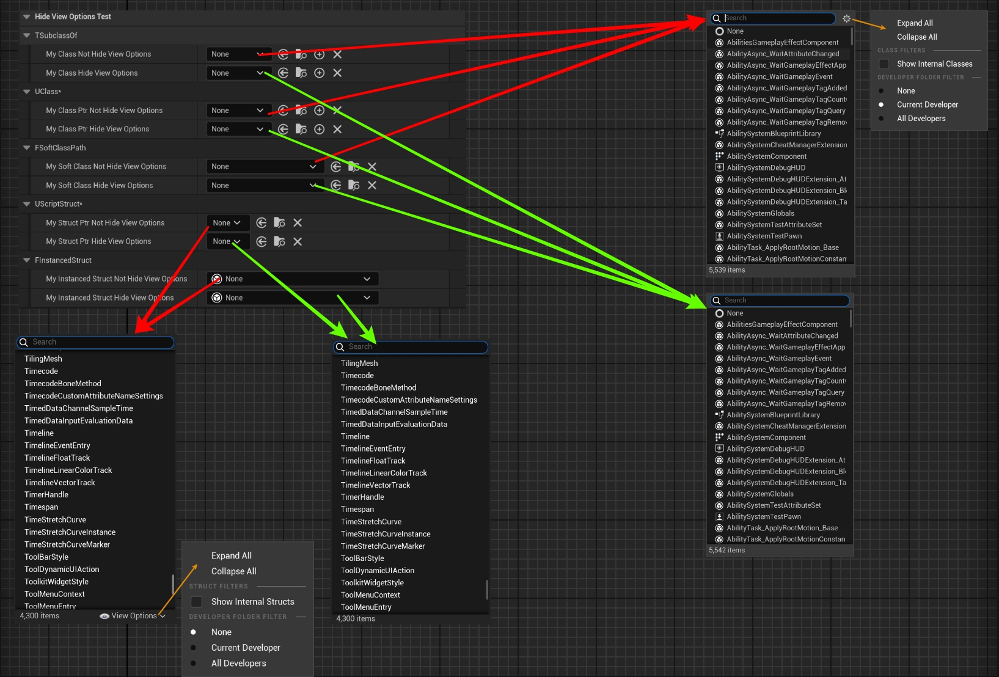

# HideViewOptions

- **Function description:** Used to hide the display options modification function for Class or Struct attributes within the class selector.
- **Use location:** UPROPERTY
- **Engine module:** TypePicker
- **Metadata type:** bool
- **Limit types:** TSubClassOf, FSoftClassPath, UClass*, UScriptStruct*, FInstancedStruct
- **Frequency of use:** ★

Selects attributes of Class or Struct to hide the function for modifying display options in the class selector.

Applies to attribute types such as TSubClassOf, FSoftClassPath, UClass*, UScriptStruct*, and FInstancedStruct, which are used for type selection. It does not work for TSoftObjectPtr or FSoftObjectPath, which are used for object selection.

## Test Code:

```cpp
	UPROPERTY(EditAnywhere, BlueprintReadWrite, Category = "HideViewOptionsTest|TSubclassOf")
	TSubclassOf<UObject> MyClass_NotHideViewOptions;

	UPROPERTY(EditAnywhere, BlueprintReadWrite, Category = "HideViewOptionsTest|TSubclassOf", meta = (HideViewOptions))
	TSubclassOf<UObject> MyClass_HideViewOptions;

	UPROPERTY(EditAnywhere, BlueprintReadWrite, Category = "HideViewOptionsTest|UClass*")
	UClass* MyClassPtr_NotHideViewOptions;

	UPROPERTY(EditAnywhere, BlueprintReadWrite, Category = "HideViewOptionsTest|UClass*", meta = (HideViewOptions))
	UClass* MyClassPtr_HideViewOptions;

	UPROPERTY(EditAnywhere, BlueprintReadWrite, Category = "HideViewOptionsTest|FSoftClassPath")
	FSoftClassPath MySoftClass_NotHideViewOptions;

	UPROPERTY(EditAnywhere, BlueprintReadWrite, Category = "HideViewOptionsTest|FSoftClassPath", meta = (HideViewOptions))
	FSoftClassPath MySoftClass_HideViewOptions;

	UPROPERTY(EditAnywhere, BlueprintReadWrite, Category = "HideViewOptionsTest|UScriptStruct*")
	UScriptStruct* MyStructPtr_NotHideViewOptions;

	UPROPERTY(EditAnywhere, BlueprintReadWrite, Category = "HideViewOptionsTest|UScriptStruct*", meta = (HideViewOptions))
	UScriptStruct* MyStructPtr_HideViewOptions;

	UPROPERTY(EditAnywhere, BlueprintReadWrite, Category = "HideViewOptionsTest|FInstancedStruct")
	FInstancedStruct MyInstancedStruct_NotHideViewOptions;

	UPROPERTY(EditAnywhere, BlueprintReadWrite, Category = "HideViewOptionsTest|FInstancedStruct", meta = (HideViewOptions))
	FInstancedStruct MyInstancedStruct_HideViewOptions;
```

## Test Code:

It is visible that without HideViewOptions, there is a gear or eye icon in the corner of the pop-up window to modify the display options.



## 测试效果:

In the source code, SPropertyEditorClass is used for TSubClassOf and UClass*, FSoftClassPathCustomization for FSoftClassPath, SPropertyEditorStruct for UScriptStruct*, and FInstancedStructDetails for FInstancedStruct to customize the UI.

```cpp
void FSoftClassPathCustomization::CustomizeHeader(TSharedRef<IPropertyHandle> InPropertyHandle, FDetailWidgetRow& HeaderRow, IPropertyTypeCustomizationUtils& StructCustomizationUtils)
{
		const bool bShowTreeView = PropertyHandle->HasMetaData("ShowTreeView");
		const bool bHideViewOptions = PropertyHandle->HasMetaData("HideViewOptions");

	SNew(SClassPropertyEntryBox)
		.ShowTreeView(bShowTreeView)
		.HideViewOptions(bHideViewOptions)
		.ShowDisplayNames(bShowDisplayNames)
}

void SPropertyEditorClass::Construct(const FArguments& InArgs, const TSharedPtr< FPropertyEditor >& InPropertyEditor)
{
		bShowViewOptions = Property->GetOwnerProperty()->HasMetaData(TEXT("HideViewOptions")) ? false : true;
		bShowTree = Property->GetOwnerProperty()->HasMetaData(TEXT("ShowTreeView"));
		bShowDisplayNames = Property->GetOwnerProperty()->HasMetaData(TEXT("ShowDisplayNames"));
}
void SPropertyEditorStruct::Construct(const FArguments& InArgs, const TSharedPtr< class FPropertyEditor >& InPropertyEditor)
{
		bShowViewOptions = Property->GetOwnerProperty()->HasMetaData(TEXT("HideViewOptions")) ? false : true;
		bShowTree = Property->GetOwnerProperty()->HasMetaData(TEXT("ShowTreeView"));
		bShowDisplayNames = Property->GetOwnerProperty()->HasMetaData(TEXT("ShowDisplayNames"));
}
TSharedRef<SWidget> FInstancedStructDetails::GenerateStructPicker()
{
		const bool bExcludeBaseStruct = StructProperty->HasMetaData(NAME_ExcludeBaseStruct);
		const bool bAllowNone = !(StructProperty->GetMetaDataProperty()->PropertyFlags & CPF_NoClear);
		const bool bHideViewOptions = StructProperty->HasMetaData(NAME_HideViewOptions);
		const bool bShowTreeView = StructProperty->HasMetaData(NAME_ShowTreeView);
}
```