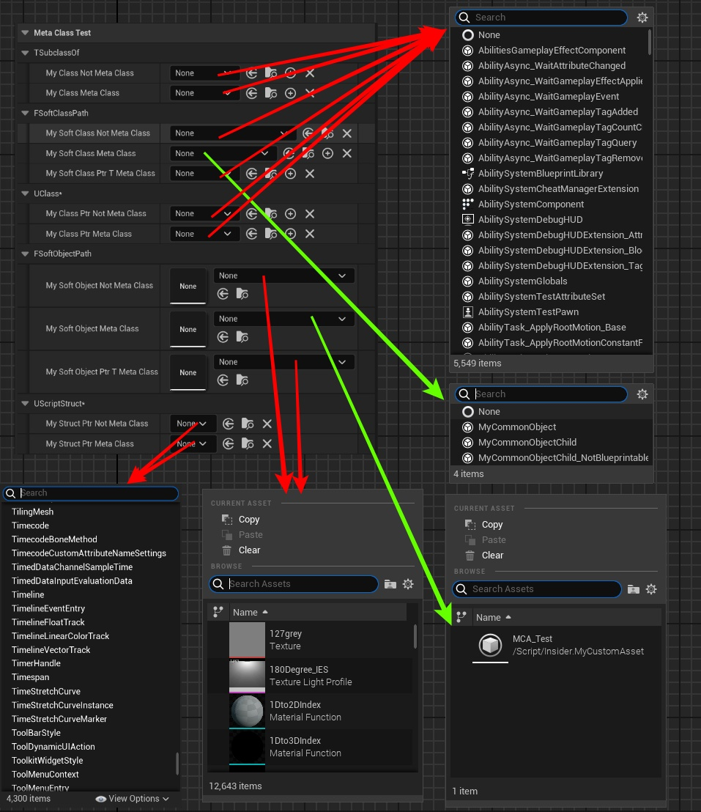

# MetaClass

- **Function Description:** Used on soft reference attributes to specify the base class of the objects that can be selected
- **Usage Location:** UPROPERTY
- **Engine Module:** TypePicker
- **Metadata Type:** string = "abc"
- **Restricted Types:** FSoftClassPath, FSoftObjectPath
- **Commonality:** ★★

Applied to soft reference attributes to specify the base class of the resources to be selected.

Soft reference attributes refer to FSoftClassPath and FSoftObjectPath, which do not inherently impose type restrictions like TSubClassOf; hence, an additional MetaClass can be used to limit the base class of the objects to be selected.

The value in MetaClass can also be an ObjectPath, such as "/Script/Engine.Actor".

## Test Code:

```cpp
UPROPERTY(EditAnywhere, BlueprintReadWrite, Category = "MetaClassTest|TSubclassOf")
TSubclassOf<UObject> MyClass_NotMetaClass;

UPROPERTY(EditAnywhere, BlueprintReadWrite, Category = "MetaClassTest|TSubclassOf", meta = (MetaClass = "MyCommonObject"))
TSubclassOf<UObject> MyClass_MetaClass;

UPROPERTY(EditAnywhere, BlueprintReadWrite, Category = "MetaClassTest|FSoftClassPath")
FSoftClassPath MySoftClass_NotMetaClass;

UPROPERTY(EditAnywhere, BlueprintReadWrite, Category = "MetaClassTest|FSoftClassPath", meta = (MetaClass = "MyCommonObject"))
FSoftClassPath MySoftClass_MetaClass;

UPROPERTY(EditAnywhere, BlueprintReadWrite, Category = "MetaClassTest|FSoftClassPath", meta = (MetaClass = "MyCommonObject"))
TSoftClassPtr<UObject> MySoftClassPtrT_MetaClass;

UPROPERTY(EditAnywhere, BlueprintReadWrite, Category = "MetaClassTest|UClass*")
UClass* MyClassPtr_NotMetaClass;

UPROPERTY(EditAnywhere, BlueprintReadWrite, Category = "MetaClassTest|UClass*", meta = (MetaClass = "MyCommonObject"))
UClass* MyClassPtr_MetaClass;

UPROPERTY(EditAnywhere, BlueprintReadWrite, Category = "MetaClassTest|FSoftObjectPath")
FSoftObjectPath MySoftObject_NotMetaClass;

UPROPERTY(EditAnywhere, BlueprintReadWrite, Category = "MetaClassTest|FSoftObjectPath", meta = (MetaClass = "MyCustomAsset"))
FSoftObjectPath MySoftObject_MetaClass;

UPROPERTY(EditAnywhere, BlueprintReadWrite, Category = "MetaClassTest|FSoftObjectPath", meta = (MetaClass = "MyCustomAsset"))
TSoftObjectPtr<UObject> MySoftObjectPtrT_MetaClass;

UPROPERTY(EditAnywhere, BlueprintReadWrite, Category = "MetaClassTest|UScriptStruct*")
UScriptStruct* MyStructPtr_NotMetaClass;

UPROPERTY(EditAnywhere, BlueprintReadWrite, Category = "MetaClassTest|UScriptStruct*", meta = (MetaClass="MyCommonStruct"))
UScriptStruct* MyStructPtr_MetaClass;
```

## Test Results:

The test results show that only the selection lists for MySoftClass_MetaClass and MySoftObject_MetaClass have been filtered.



## Principle:

Investigating the source code reveals that both FSoftClassPath and FSoftObjectPath have been customized for type, with their MetaClass and AllowedClass set to SClassPropertyEntryBox and SObjectPropertyEntryBox respectively, based on the MetaClass.

It has been observed that TSoftObjectPtr and TSoftClassPtr have not been customized, thus they do not support this feature. Similarly, UScriptStruct* does not support this feature, despite also being a selection type.

```cpp
void FSoftClassPathCustomization::CustomizeHeader(TSharedRef<IPropertyHandle> InPropertyHandle, FDetailWidgetRow& HeaderRow, IPropertyTypeCustomizationUtils& StructCustomizationUtils)
{
	const FString& MetaClassName = PropertyHandle->GetMetaData("MetaClass");
	const FString& RequiredInterfaceName = PropertyHandle->GetMetaData("RequiredInterface"); // This was the old name, switch to MustImplement to synchronize with class property
	const FString& MustImplementName = PropertyHandle->GetMetaData("MustImplement");
	TArray<const UClass*> AllowedClasses = PropertyCustomizationHelpers::GetClassesFromMetadataString(PropertyHandle->GetMetaData("AllowedClasses"));
	TArray<const UClass*> DisallowedClasses = PropertyCustomizationHelpers::GetClassesFromMetadataString(PropertyHandle->GetMetaData("DisallowedClasses"));
	const bool bAllowAbstract = PropertyHandle->HasMetaData("AllowAbstract");
	const bool bIsBlueprintBaseOnly = PropertyHandle->HasMetaData("IsBlueprintBaseOnly") || PropertyHandle->HasMetaData("BlueprintBaseOnly");
	const bool bAllowNone = !(PropertyHandle->GetMetaDataProperty()->PropertyFlags & CPF_NoClear);
	const bool bShowTreeView = PropertyHandle->HasMetaData("ShowTreeView");
	const bool bHideViewOptions = PropertyHandle->HasMetaData("HideViewOptions");
	const bool bShowDisplayNames = PropertyHandle->HasMetaData("ShowDisplayNames");

	const UClass* const MetaClass = !MetaClassName.IsEmpty()
	? FEditorClassUtils::GetClassFromString(MetaClassName)
	: UObject::StaticClass();

	SNew(SClassPropertyEntryBox)
	.MetaClass(MetaClass)

	}

void FSoftObjectPathCustomization::CustomizeHeader( TSharedRef<IPropertyHandle> InStructPropertyHandle, FDetailWidgetRow& HeaderRow, IPropertyTypeCustomizationUtils& StructCustomizationUtils )
{
	const FString& MetaClassName = InStructPropertyHandle->GetMetaData("MetaClass");
	UClass* MetaClass = !MetaClassName.IsEmpty()
		? FEditorClassUtils::GetClassFromString(MetaClassName)
		: UObject::StaticClass();
	TSharedRef<SObjectPropertyEntryBox> ObjectPropertyEntryBox = SNew(SObjectPropertyEntryBox)
		.AllowedClass(MetaClass)
		.PropertyHandle(InStructPropertyHandle)
		.ThumbnailPool(StructCustomizationUtils.GetThumbnailPool());
}
```