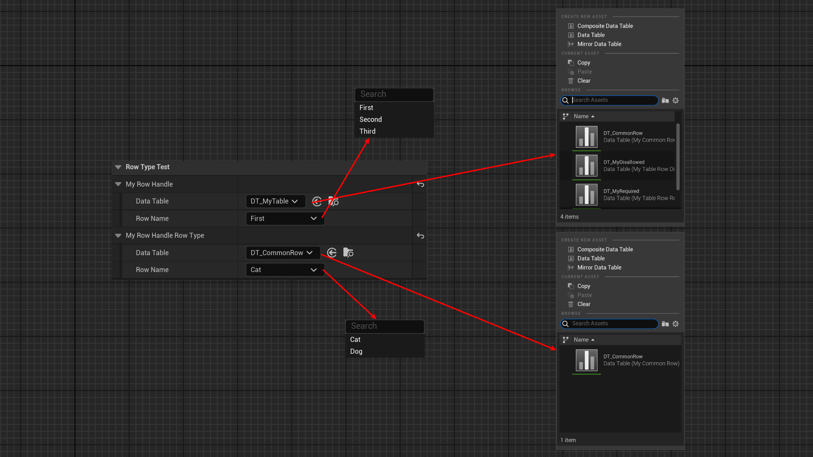

# RowType

- **Function Description:** Specifies the base class for optional row types associated with the FDataTableRowHandle attribute.
- **Usage Location:** UPROPERTY
- **Engine Module:** TypePicker
- **Metadata Type:** string="abc"
- **Restricted Type:** FDataTableRowHandle
- **Commonality:** ★★★

Specifies the base class for the optional row types of the FDataTableRowHandle attribute.

## Test Code:

```cpp
USTRUCT(BlueprintType)
struct FMyCommonRow : public FTableRowBase
{
	GENERATED_BODY()

	UPROPERTY(EditAnywhere, BlueprintReadWrite)
	FString MyString;
	UPROPERTY(EditAnywhere, BlueprintReadWrite)
	FVector MyVector;
};

UCLASS(BlueprintType)
class INSIDER_API UMyProperty_RowType :public UObject
{
	GENERATED_BODY()
public:
	UPROPERTY(EditAnywhere, BlueprintReadWrite, Category = "RowTypeTest")
	FDataTableRowHandle MyRowHandle;
	UPROPERTY(EditAnywhere, BlueprintReadWrite, Category = "RowTypeTest", meta = (RowType = "/Script/Insider.MyCommonRow"))
	FDataTableRowHandle MyRowHandle_RowType;
};

```

## Test Results:

Create a DataTable based on FMyCommonRow in the editor, referred to as DT_MyCommonRow. Of course, there are other DataTables with different RowStructs in the project.

You can observe that the options for MyRowHandle_RowType are restricted to DT_MyCommonRow, and the RowName is also displayed correctly.



## Principle:

The UI customization is targeted at the FDataTableRowHandle type. If RowType data is present, it is assigned to RowFilterStruct, thereby facilitating the filtering process.

```cpp
void FDataTableCustomizationLayout::CustomizeHeader(TSharedRef<class IPropertyHandle> InStructPropertyHandle, class FDetailWidgetRow& HeaderRow, IPropertyTypeCustomizationUtils& StructCustomizationUtils)
{
		if (StructPropertyHandle->HasMetaData(TEXT("RowType")))
		{
			const FString& RowType = StructPropertyHandle->GetMetaData(TEXT("RowType"));
			RowTypeFilter = FName(*RowType);
			RowFilterStruct = UClass::TryFindTypeSlow<UScriptStruct>(RowType);
		}

}

bool FDataTableCustomizationLayout::ShouldFilterAsset(const struct FAssetData& AssetData)
{
	if (!RowTypeFilter.IsNone())
	{
		static const FName RowStructureTagName("RowStructure");
		FString RowStructure;
		if (AssetData.GetTagValue<FString>(RowStructureTagName, RowStructure))
		{
			if (RowStructure == RowTypeFilter.ToString())
			{
				return false;
			}

			// This is slow, but at the moment we don't have an alternative to the short struct name search
			UScriptStruct* RowStruct = UClass::TryFindTypeSlow<UScriptStruct>(RowStructure);
			if (RowStruct && RowFilterStruct && RowStruct->IsChildOf(RowFilterStruct))
			{
				return false;
			}
		}
		return true;
	}
	return false;
}

RegisterCustomPropertyTypeLayout("DataTableRowHandle", FOnGetPropertyTypeCustomizationInstance::CreateStatic(&FDataTableCustomizationLayout::MakeInstance));

```