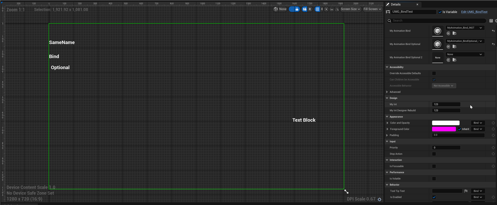

# DesignerRebuild

- **Function description:** Specifies that the UMG preview interface should be refreshed when a certain attribute within a Widget is modified.
- **Use location:** UPROPERTY
- **Engine module:** Widget Property
- **Metadata type:** bool
- **Restriction type:** Attributes in UWidget subclasses
- **Frequency of use:** ★

Specifies that the UMG preview interface should be refreshed after a certain attribute value in the Widget is changed.

The first question that comes to mind is, which attributes require the use of the DesignerRebuild tag?

This attribute is seldom needed. Typically, when a Widget's attribute is updated, it only needs to refresh its own display, not the entire interface, such as font size. There are likely two scenarios where its use is necessary:

1. Changes to some attributes significantly alter the control's style. While it's possible to refine the update to only redraw the control itself, it's often simpler to refresh the entire preview interface, especially within the editor environment. For instance, the bSimpleTextMode of UTextBlock and EntryWidgetClass under UListViewBase result in substantial changes.
2. When certain attributes impact other elements across the entire interface, it's also practical to refresh everything. Although I can't provide a specific example, if a user's custom control requires this, the tag can be applied.

## Source code examples include:

```cpp

UCLASS(meta=(DisplayName="Text"), MinimalAPI)
class UTextBlock : public UTextLayoutWidget
{
	/**
	 * If this is enabled, text shaping, wrapping, justification are disabled in favor of much faster text layout and measurement.
	 * This feature is only suitable for "simple" text (ie, text containing only numbers or basic ASCII) as it disables the complex text rendering support required for certain languages (such as Arabic and Thai).
	 * It is significantly faster for text that can take advantage of it (particularly if that text changes frequently), but shouldn't be used for localized user-facing text.
	 */
	UPROPERTY(EditAnywhere, BlueprintReadOnly, Category=Performance, AdvancedDisplay, meta=(AllowPrivateAccess = "true", DesignerRebuild))
	bool bSimpleTextMode;
}

UCLASS(Abstract, NotBlueprintable, hidedropdown, meta = (EntryInterface = UserListEntry), MinimalAPI)
class UListViewBase : public UWidget
{
	UPROPERTY(EditAnywhere, BlueprintReadOnly, Category = ListEntries, meta = (DesignerRebuild, AllowPrivateAccess = true, MustImplement = "/Script/UMG.UserListEntry"))
	TSubclassOf<UUserWidget> EntryWidgetClass;
}
```

## The test effect for UTextBlock:

You can observe that when bSimpleTextMode is changed, the left-hand preview interface flickers and refreshes. This does not happen when other buttons are clicked.


## Test code:

```cpp
UCLASS(BlueprintType)
class INSIDER_API UMyProperty_BindWidget :public UUserWidget
{
public:
	UPROPERTY(EditAnywhere, Category = Design)
	int32 MyInt = 123;

	UPROPERTY(EditAnywhere, Category = Design, meta = (DesignerRebuild))
	int32 MyInt_DesignerRebuild = 123;
}
```

## Test effect:

It is evident that when the ordinary attribute MyInt is changed, the interface does not refresh. However, when MyInt_DesignerRebuild is altered, the number in the upper left corner of the interface flickers (though the interface itself undergoes no substantial change).



## Principle:

When a property with the DesignerRebuild tag in a Widget is modified, InvalidatePreview is notified to update the preview window within the editor.

```cpp

void SWidgetDetailsView::NotifyPostChange(const FPropertyChangedEvent& PropertyChangedEvent, FEditPropertyChain* PropertyThatChanged)
{
	const static FName DesignerRebuildName("DesignerRebuild");

	//...
	// If the property that changed is marked as "DesignerRebuild" we invalidate
	// the preview.
	if ( PropertyChangedEvent.Property->HasMetaData(DesignerRebuildName) || PropertyThatChanged->GetActiveMemberNode()->GetValue()->HasMetaData(DesignerRebuildName) )
	{
		const bool bViewOnly = true;
		BlueprintEditor.Pin()->InvalidatePreview(bViewOnly);
	}
}
```