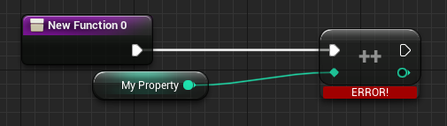
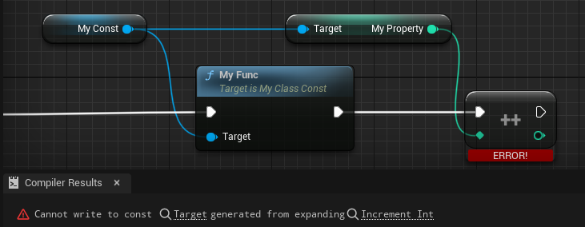

# Const

- **Function Description:** Indicates that the internal attributes of this class are immutable in Blueprints, making them read-only and non-writable.
- **Engine Module:** Blueprint
- **Metadata Type:** bool
- **Action Mechanism:** Add [CLASS_Abstract](../../../../Flags/EClassFlags/CLASS_Const.md) to ClassFlags
- **Common Usage:** ★★★

Indicates that the internal attributes of this class cannot be modified in Blueprints, and are only readable and non-writable.

The same applies to Blueprint subclasses. Essentially, this automatically applies a const attribute to both the class and its subclasses. Note that this is only enforced within Blueprints; C++ can still modify these attributes freely, adhering to C++ rules. Therefore, this const is exclusive to Blueprints and is enforced within them. Functions can still be called as usual, but the Set methods for attributes are unavailable, and changes are not permitted.

## Sample Code:

```cpp
/*
	ClassFlags:	CLASS_MatchedSerializers | CLASS_Native | CLASS_Const | CLASS_RequiredAPI | CLASS_TokenStreamAssembled | CLASS_Intrinsic | CLASS_Constructed
*/
UCLASS(Blueprintable, Const)
class INSIDER_API UMyClass_Const :public UObject
{
	GENERATED_BODY()
public:
	UPROPERTY(EditAnywhere, BlueprintReadWrite)
	int32 MyProperty = 123;
	UFUNCTION(BlueprintCallable)
	void MyFunc() { ++MyProperty; }
};
```

## Example Effect:

Attempting to modify an attribute in a Blueprint subclass will result in an error.



It is equivalent to enabling this option in the Blueprint Class Settings




## Principle:

Const class instances have attributes marked with const, which prevents modification of their own properties.

```cpp
void FKCHandler_VariableSet::InnerAssignment(FKismetFunctionContext& Context, UEdGraphNode* Node, UEdGraphPin* VariablePin, UEdGraphPin* ValuePin)
{
	if (!(*VariableTerm)->IsTermWritable())
	{
		CompilerContext.MessageLog.Error(*LOCTEXT("WriteConst_Error", "Cannot write to const @@").ToString(), VariablePin);
	}
}

bool FBPTerminal::IsTermWritable() const
{
	return !bIsLiteral && !bIsConst;
}
```