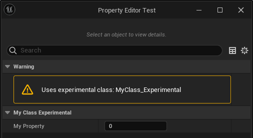

# Experimental

- **Function Description:** Indicates that this class is a trial version, currently without documentation, and may be deprecated in the future.
- **Engine Module:** Development
- **Metadata Type:** bool
- **Functionality Mechanism:** Add [DevelopmentStatus](../../../../Meta/Development/DevelopmentStatus.md) to Meta, marking the class as Experimental
- **Usage Frequency:** ★★★

Indicates that this class is a trial version, currently without documentation, and may be deprecated in the future.

The example in the source code is the Paper2D class. This tag adds { "DevelopmentStatus", "Experimental" } to the class's metadata.

## Example Code:

```cpp
/*
(BlueprintType = true, DevelopmentStatus = Experimental, IncludePath = Class/Display/MyClass_Deprecated.h, IsBlueprintBase = true, ModuleRelativePath = Class/Display/MyClass_Deprecated.h)
*/
UCLASS(Blueprintable, Experimental)
class INSIDER_API UMyClass_Experimental :public UObject
{
	GENERATED_BODY()
public:
	UPROPERTY(EditAnywhere, BlueprintReadWrite)
		int32 MyProperty;
	UFUNCTION(BlueprintCallable)
		void MyFunc() {}
};
```

## Example Effect:

