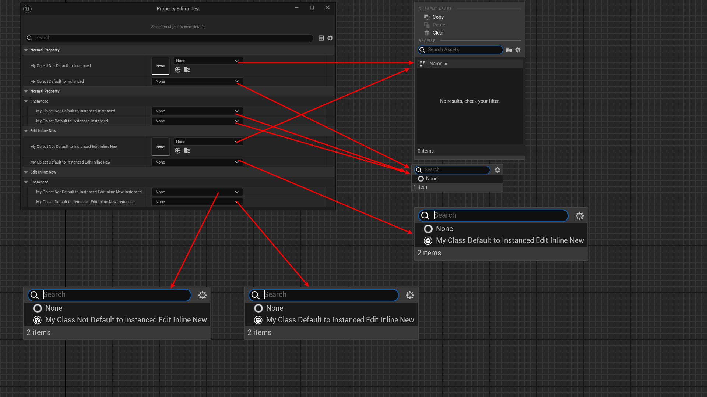

# DefaultToInstanced

- **Function Description:** Specifies that all instance attributes of this class are set to UPROPERTY(instanced) by default, meaning that new instances are created rather than references to existing objects.
- **Engine Module:** Instance
- **Metadata Type:** bool
- **Functionality Mechanism:** Add [CLASS_DefaultToInstanced](../../../../Flags/EClassFlags/CLASS_DefaultToInstanced.md) to ClassFlags
- **Common Usage:** ★★★★

Specifies that all instance properties of this class are set to UPROPERTY(instanced) by default, meaning that new instances are created rather than references to existing objects.

UPROPERTY(instanced) signifies that the property will have the CPF_InstancedReference attribute, meaning an object instance is created for this property.

An instance refers to creating an object for the UObject pointer, rather than defaulting to referencing an existing object within the engine.

It is often used in conjunction with EditInlineNew to allow object instances to be created within the details panel.

UActorComponent inherently has the DefaultToInstanced attribute.

## Sample Code:

```cpp
UCLASS(Blueprintable)
class INSIDER_API UMyClass_NotDefaultToInstanced :public UObject
{
	GENERATED_BODY()
public:
	UPROPERTY(EditAnywhere, BlueprintReadWrite)
	int32 MyProperty;
};

//	ClassFlags:	CLASS_MatchedSerializers | CLASS_Native | CLASS_RequiredAPI | CLASS_DefaultToInstanced | CLASS_TokenStreamAssembled | CLASS_Intrinsic | CLASS_Constructed
UCLASS(Blueprintable, DefaultToInstanced)
class INSIDER_API UMyClass_DefaultToInstanced :public UObject
{
	GENERATED_BODY()
public:
	UPROPERTY(EditAnywhere, BlueprintReadWrite)
	int32 MyProperty;
};

//	ClassFlags:	CLASS_MatchedSerializers | CLASS_Native | CLASS_EditInlineNew | CLASS_RequiredAPI | CLASS_DefaultToInstanced | CLASS_TokenStreamAssembled | CLASS_Intrinsic | CLASS_Constructed
UCLASS(Blueprintable, DefaultToInstanced, EditInlineNew)
class INSIDER_API UMyClass_DefaultToInstanced_EditInlineNew :public UObject
{
	GENERATED_BODY()
public:
	UPROPERTY(EditAnywhere, BlueprintReadWrite)
	int32 MyProperty;
};

UCLASS(Blueprintable, EditInlineNew)
class INSIDER_API UMyClass_NotDefaultToInstanced_EditInlineNew :public UObject
{
	GENERATED_BODY()
public:
	UPROPERTY(EditAnywhere, BlueprintReadWrite)
	int32 MyProperty;
};

UCLASS(Blueprintable, BlueprintType)
class INSIDER_API UMyClass_DefaultToInstanced_Test :public UObject
{
	GENERATED_BODY()

public:
	UPROPERTY(EditAnywhere, BlueprintReadWrite, Category = "NormalProperty")
	UMyClass_NotDefaultToInstanced* MyObject_NotDefaultToInstanced;

	UPROPERTY(EditAnywhere, BlueprintReadWrite, Category = "NormalProperty")
	UMyClass_DefaultToInstanced* MyObject_DefaultToInstanced;

	UPROPERTY(EditAnywhere, BlueprintReadWrite, Instanced, Category = "NormalProperty | Instanced")
	UMyClass_NotDefaultToInstanced* MyObject_NotDefaultToInstanced_Instanced;

	UPROPERTY(EditAnywhere, BlueprintReadWrite, Instanced, Category = "NormalProperty | Instanced")
	UMyClass_DefaultToInstanced* MyObject_DefaultToInstanced_Instanced;

public:
	UPROPERTY(EditAnywhere, BlueprintReadWrite, Category = "EditInlineNew")
	UMyClass_NotDefaultToInstanced_EditInlineNew* MyObject_NotDefaultToInstanced_EditInlineNew;

	UPROPERTY(EditAnywhere, BlueprintReadWrite, Category = "EditInlineNew")
	UMyClass_DefaultToInstanced_EditInlineNew* MyObject_DefaultToInstanced_EditInlineNew;

	UPROPERTY(EditAnywhere, BlueprintReadWrite, Instanced, Category = "EditInlineNew | Instanced")
	UMyClass_NotDefaultToInstanced_EditInlineNew* MyObject_NotDefaultToInstanced_EditInlineNew_Instanced;

	UPROPERTY(EditAnywhere, BlueprintReadWrite, Instanced, Category = "EditInlineNew | Instanced")
	UMyClass_DefaultToInstanced_EditInlineNew* MyObject_DefaultToInstanced_EditInlineNew_Instanced;
};

```

## Example Effect:

- MyObject_NotDefaultToInstanced and MyObject_NotDefaultToInstanced_EditInlineNew lack the instanced mark on their attributes, so they present a list of object references when opened.
- MyObject_DefaultToInstanced has the DefaultToInstanced attribute on the class, making the property instanced. Of course, the instanced mark can also be added manually to attributes, as seen with MyObject_NotDefaultToInstanced_Instanced and MyObject_DefaultToInstanced_Instanced. A window for creating instances appears, but instances cannot yet be created directly within the details panel.
- MyObject_DefaultToInstanced_EditInlineNew, MyObject_NotDefaultToInstanced_EditInlineNew_Instanced, and MyObject_DefaultToInstanced_EditInlineNew_Instanced can all create object instances directly in the details panel. This is because the class itself must have EditInlineNew, and the attribute must also have the Instanced mark (either by setting DefaultToInstanced on the class, making all attributes of the class automatically instanced, or by setting Instanced individually on the attribute)



## Principle:

```cpp
UObject* FObjectInstancingGraph::InstancePropertyValue(UObject* SubObjectTemplate, UObject* CurrentValue, UObject* Owner, EInstancePropertyValueFlags Flags)
{
	if (CurrentValue->GetClass()->HasAnyClassFlags(CLASS_DefaultToInstanced))
{
	bCausesInstancing = true; // these are always instanced no matter what
}
}
```