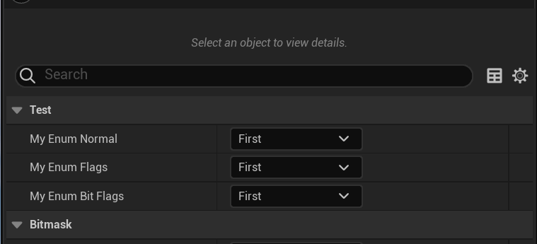
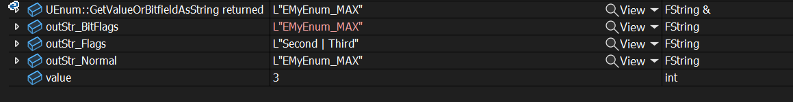

# Flags

- **Function description:** Concatenate strings for output by using the value of this enumeration as a flag.
- **Metadata type:** bool
- **Engine module:** Trait
- **Mechanism of action:** Add [Flags](../../../Flags/EEnumFlags/Flags.md) to EnumFlags
- **Commonly used:** ★★★★★

Concatenate strings for output by using the value of this enumeration as a flag.

Specifies the context where this is applied: when a value is output as a string. The methods of conversion to a string include: one is to search directly for an exact match, then find the specific enumeration value; the second is to treat it as a flag, outputting values in the format "A...C" that correspond to the flags | B | Flags indicate the use of the second method.

However, note that the enumeration value itself does not affect any changes. This is different from directly defining enumeration values as markers.

Be careful to distinguish it from meta(bitflags), which indicates that the enumeration can be used as a flag and can be filtered as a bitmask.

## Sample Code:

```cpp
UENUM(BlueprintType)
enum class EMyEnum_Normal:uint8
{
	First,
	Second,
	Third,
};

/*
[EMyEnum_Flags	Enum->Field->Object	/Script/Insider.EMyEnum_Flags]
(BlueprintType = true, First.Name = EMyEnum_Flags::First, ModuleRelativePath = Enum/MyEnum_Flags.h, Second.Name = EMyEnum_Flags::Second, Third.Name = EMyEnum_Flags::Third)
	ObjectFlags:	RF_Public | RF_Transient
	Outer:	Package /Script/Insider
	EnumFlags:	EEnumFlags::Flags
	EnumDisplayNameFn:	0
	CppType:	EMyEnum_Flags
	CppForm:	EnumClass
{
	First = 0,
	Second = 1,
	Third = 2,
	EMyEnum_MAX = 3
};
*/
UENUM(BlueprintType,Flags)
enum class EMyEnum_Flags:uint8
{
	First,
	Second,
	Third,
};

void UMyActor_EnumBitFlags_Test::TestFlags()
{
	int value = 3;

	FString outStr_Normal = StaticEnum<EMyEnum_Normal>()->GetValueOrBitfieldAsString(value);
	FString outStr_Flags = StaticEnum<EMyEnum_Flags>()->GetValueOrBitfieldAsString(value);
	FString outStr_BitFlags = StaticEnum<EMyEnum_BitFlags>()->GetValueOrBitfieldAsString(value);

}
```

## Example Effect:

In the blueprint representation, only a single item can still be selected.



And the string printed in the test code:

It can be seen that the printing of outStr_Flags is string concatenation.



## Principle:

It only takes effect in the GetValueOrBitfieldAsString function, so it must be tested with this method to take effect.

```cpp
FString UEnum::GetValueOrBitfieldAsString(int64 InValue) const
{
	if (!HasAnyEnumFlags(EEnumFlags::Flags) || InValue == 0)
	{
		return GetNameStringByValue(InValue);
	}
	else
	{
		FString BitfieldString;
		bool WroteFirstFlag = false;
		while (InValue != 0)
		{
			int64 NextValue = 1ll << FMath::CountTrailingZeros64(InValue);
			InValue = InValue & ~NextValue;
			if (WroteFirstFlag)
			{
				// We don't just want to use the NameValuePair.Key because we want to strip enum class prefixes
				BitfieldString.Appendf(TEXT(" | %s"), *GetNameStringByValue(NextValue));
			}
			else
			{
				// We don't just want to use the NameValuePair.Key because we want to strip enum class prefixes
				BitfieldString.Appendf(TEXT("%s"), *GetNameStringByValue(NextValue));
				WroteFirstFlag = true;
			}
		}
		return BitfieldString;
	}
}
```