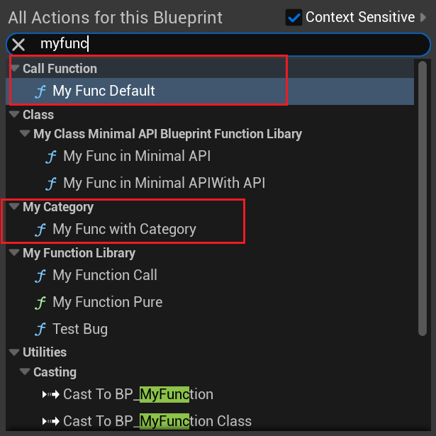

# Category

- **Function Description:** In the right-click menu of the blueprint, assign a category group to the function, allowing for multi-level nesting

- **Metadata Type:** strings = "a|b|c"
- **Engine Module:** Editor
- **Action Mechanism:** Include [Category](../../../Meta/DetailsPanel/Category.md) in the Meta
- **Common Usage:** ★★★★★

Assign a category group to the function in the blueprint's right-click menu.

## Testing Code:

```cpp
UCLASS(Blueprintable, BlueprintType)
class INSIDER_API AMyFunction_Default :public AActor
{
public:
	GENERATED_BODY()
public:
	UFUNCTION(BlueprintCallable, Category = MyCategory)
	void MyFunc_WithCategory(){}
	UFUNCTION(BlueprintCallable)
	void MyFunc_Default(){}
};
```

## Display in the Blueprint:

