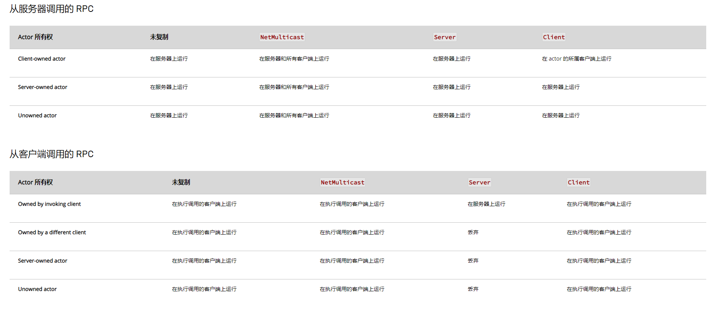

# Client

- **Function Description:** Executes an RPC function on a Client-owned Actor (PlayerController or Pawn), which runs exclusively on the client side. The corresponding implementation function will have the _Implementation suffix appended.
- **Metadata Type:** bool
- **Engine Module:** Network
- **Functionality Mechanism:** Adds [FUNC_Net](../../../../Flags/EFunctionFlags/FUNC_Net.md) and [FUNC_NetClient](../../../../Flags/EFunctionFlags/FUNC_NetClient.md) to the Function Flags
- **Usage Frequency:** ★★★★★

Executes an RPC function on a Client-owned Actor (PlayerController or Pawn), which runs exclusively on the client side. The corresponding implementation function will have the _Implementation suffix appended.

Usually used to send an RPC from the Server to the Client, similar to the RunOnClient event in Blueprints.

For the definition of Client-owned, refer to the documentation: [https://docs.unrealengine.com/4.27/zh-CN/InteractiveExperiences/Networking/Actors/RPCs/](https://docs.unrealengine.com/4.27/zh-CN/InteractiveExperiences/Networking/Actors/RPCs/)



## Test Code:

```cpp
UCLASS(Blueprintable, BlueprintType)
class INSIDER_API AMyFunction_PlayerController :public APlayerController
{
	GENERATED_BODY()
public:
	UFUNCTION(BlueprintCallable, Client, Reliable)
	void MyFunc_RunOnClient();
};

void AMyFunction_PlayerController::MyFunc_RunOnClient_Implementation()
{
	UInsiderLibrary::PrintFuncStatus(this, TEXT("MyFunc_RunOnClient_Implementation"));
}
```

Test setup: PIE mode, one ListenServer and two Clients


## Test Output Results:

```cpp
MyFunc_Client_Implementation    BP_NetworkPC_C_0    NM_Client   Local:ROLE_AutonomousProxy  Remote:ROLE_Authority
OtherClientFunc BP_NetworkPC_C_0    NM_Client   Local:ROLE_AutonomousProxy  Remote:ROLE_Authority
```

It can be observed that the test code selects the second PC and initiates a Run on Client RPC call, which is successfully triggered on the Client. The function defined in C++ and the custom RunOnClient event added in the Blueprint have equivalent effects.

If this function is executed on a Server-owned Actor, it will only run on the Server and will not be propagated to the Client.