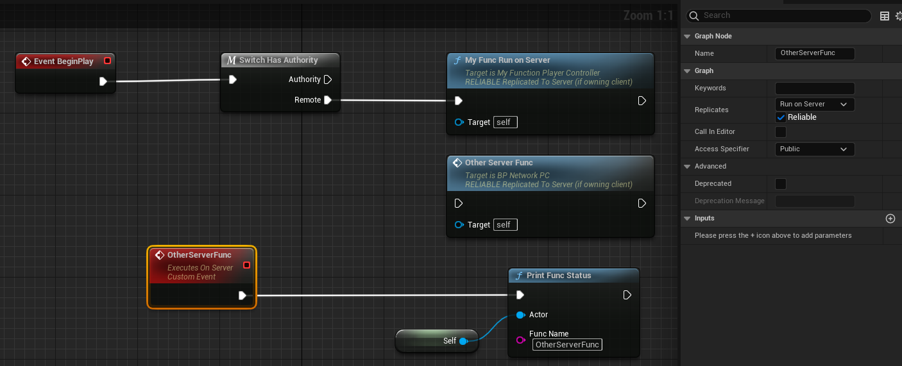

# Server

- **Function description:** Execute a RPC function on a client-owned Actor (PlayerController or Pawn). The function will only be executed on the server. The corresponding implementation function will be suffixed with "_Implementation"

- **Metadata Type:** bool
- **Engine Module:** Network
- **Action Mechanism:** Add [FUNC_Net](../../../../Flags/EFunctionFlags/FUNC_Net.md) and [FUNC_NetServer](../../../../Flags/EFunctionFlags/FUNC_NetServer.md) to the Function Flags
- **Commonly Used:** ★★★★★

Executes a RPC function on an Actor owned by the client (PlayerController or Pawn), which runs exclusively on the server. The corresponding implementation function will have the _Implementation suffix appended.

Has the same effect as RunOnServer.

For the definition of Client-owned, refer to the documentation: [https://docs.unrealengine.com/4.27/zh-CN/InteractiveExperiences/Networking/Actors/RPCs/](https://docs.unrealengine.com/4.27/zh-CN/InteractiveExperiences/Networking/Actors/RPCs/)



## Test Code:

```cpp
UCLASS(Blueprintable, BlueprintType)
class INSIDER_API AMyFunction_PlayerController :public APlayerController
{
	GENERATED_BODY()
public:
UFUNCTION(BlueprintCallable, Server, Reliable)
	void MyFunc_RunOnServer();
};

void AMyFunction_PlayerController::MyFunc_RunOnServer_Implementation()
{
	UInsiderLibrary::PrintFuncStatus(this, TEXT("MyFunc_RunOnServer_Implementation"));
}
```

Test Blueprint: PIE mode, with one ListenServer and two Clients


## Test Output Results:

```cpp
LogInsider: Display: 5118b400    MyFunc_RunOnServer_Implementation   BP_NetworkPC_C_1    NM_ListenServer Local:ROLE_Authority    Remote:ROLE_AutonomousProxy
LogInsider: Display: 44ec3c00    MyFunc_RunOnServer_Implementation   BP_NetworkPC_C_2    NM_ListenServer Local:ROLE_Authority    Remote:ROLE_AutonomousProxy

LogInsider: Display: 49999000    OtherServerFunc BP_NetworkPC_C_1    NM_ListenServer Local:ROLE_Authority    Remote:ROLE_AutonomousProxy
LogInsider: Display: 4bcbd800    OtherServerFunc BP_NetworkPC_C_2    NM_ListenServer Local:ROLE_Authority    Remote:ROLE_AutonomousProxy
```

It can be observed that the test code takes the second PlayerController and initiates a Run on Server RPC call, which is successfully triggered on the Server. The function defined in C++ is equivalent in effect to the custom RunOnServer event added in the blueprint.

If this function is executed on a Server-owned Actor, it will only run on the server and will not be propagated to the clients.