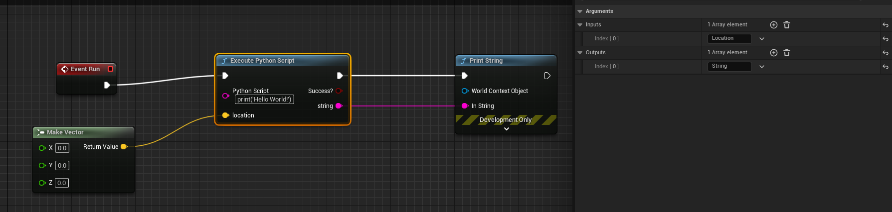

# Variadic

- **Function description:** Indicates that a function can accept multiple parameters of any type (including input/output)

- **Metadata type:** bool
- **Engine module:** Blueprint, UHT
- **Action mechanism:** Include [Variadic](../../../../Meta/Blueprint/Variadic.md) in the Meta
- **Commonly used:** ★★★

Indicates that a function can accept multiple parameters of any type (including input/output)

Search for application in the source code: then coordinate with UK2Node_ExecutePythonScript

```cpp
UFUNCTION(BlueprintCallable, CustomThunk, Category = "Python|Execution", meta=(Variadic, BlueprintInternalUseOnly="true"))
    static bool ExecutePythonScript(UPARAM(meta=(MultiLine=True)) const FString& PythonScript, const TArray<FString>& PythonInputs, const TArray<FString>& PythonOutputs);
	DECLARE_FUNCTION(execExecutePythonScript);
```

Blueprint effect:



## Example code:

```cpp
UCLASS(Blueprintable, BlueprintType)
class INSIDER_API UMyFunction_Variadic : public UBlueprintFunctionLibrary
{
public:
	GENERATED_BODY()
public:
	/*
			[PrintVariadicFields	Function->Struct->Field->Object	/Script/Insider.MyFunction_Variadic:PrintVariadicFields]
			(BlueprintInternalUseOnly = true, BlueprintType = true, CustomThunk = true, ModuleRelativePath = Function/Variadic/MyFunction_Variadic.h, Variadic = )
	*/
	UFUNCTION(BlueprintCallable, CustomThunk, BlueprintInternalUseOnly, meta = (Variadic))
	static FString PrintVariadicFields(const TArray<FString>& Inputs, const TArray<FString>& Outputs);
	DECLARE_FUNCTION(execPrintVariadicFields);
};

FString UMyFunction_Variadic::PrintVariadicFields(const TArray<FString>& Inputs, const TArray<FString>& Outputs)
{
	check(0);
	return TEXT("");
}

DEFINE_FUNCTION(UMyFunction_Variadic::execPrintVariadicFields)
{
	FString str;

	P_GET_TARRAY_REF(FString, Inputs);
	P_GET_TARRAY_REF(FString, Outputs);

	for (const FString& PythonInput : Inputs)
	{
		Stack.MostRecentPropertyAddress = nullptr;
		Stack.MostRecentProperty = nullptr;
		Stack.StepCompiledIn<FProperty>(nullptr);
		check(Stack.MostRecentProperty && Stack.MostRecentPropertyAddress);

		FProperty* p = CastField<FProperty>(Stack.MostRecentProperty);

		FString propertyValueString;
		const void* propertyValuePtr = p->ContainerPtrToValuePtr<const void*>(Stack.MostRecentPropertyContainer);

		p->ExportTextItem_Direct(propertyValueString, propertyValuePtr, nullptr, nullptr, PPF_None);

		str += FString::Printf(TEXT("%s:%s\n"), *p->GetFName().ToString(), *propertyValueString);

	}
	P_FINISH;

	*(FString*)RESULT_PARAM = str;
}
```

## Example effect:


Print:

CallFunc_MakeVector_ReturnValue:(X=1.000000,Y=2.000000,Z=3.000000)
CallFunc_MakeLiteralDouble_ReturnValue:456.000000

## Principle:

Standard CustomThunk functions have limitations; parameter names and counts are fixed in the UFuntion and do not support dynamic counts.

Currently, to use the **Variadic** feature, it is necessary to create a custom blueprint node using C++ to add pins to **K2Node_CallFunction**.

presumably to develop simultaneously to achieve **K2Node** and the corresponding **CustomThunk** + **Variadic** methods, ensuring safe usage.

BlueprintInternalUseOnly must also be included; otherwise, an ordinary blueprint function will be automatically generated, and the desired variadic effect will not be realized.

The following is the version automatically generated without the inclusion of BlueprintInternalUseOnly:


Actually, it should be: Then manually add the parameters.


Distinct from Wildcard, which allows parameters of any type but with a fixed number, BlueprintInternalUseOnly ensures that the number of parameters is variable


Officially added feature for interaction with **Python**: [Added a Blueprint node for calling Python with arguments](https://link.zhihu.com/?target=https%3A//github.com/EpicGames/UnrealEngine/commit/61d0f65e1cded45ed94f0422eb931f446888e972)

Official submission:

[https://github.com/EpicGames/UnrealEngine/commit/61d0f65e1cded45ed94f0422eb931f446888e972](https://github.com/EpicGames/UnrealEngine/commit/61d0f65e1cded45ed94f0422eb931f446888e972)

## Notes:

Implemented variadic function support for Blueprints

`Variadic functions are required to be a CustomThunk marked with the "Variadic" meta-data. They can then be used from a custom Blueprint node to accept arbitrary arguments at the end of their parameter list (any extra pins added to the node that aren't part of the main function definition will become the variadic payload).

Variadic arguments aren't type checked, so you need other function input to tell you how many to expect, and for a nativizied function, also what type of arguments you're dealing with.

#jira UE-84932
#rb Dan.OConnor

[CL 10421401 by Jamie Dale in Dev-Editor branch]`