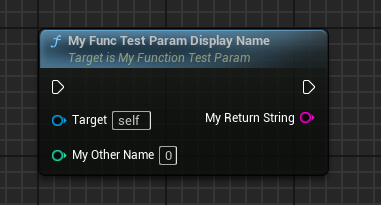

# DisplayName

- **Function Description:** Change the display name of function parameters on blueprint nodes

- **Metadata Type:** string = "abc"
- **Engine Module:** Blueprint, Parameter
- **Action Mechanism:** Include [DisplayName](../../../../Meta/Blueprint/DisplayName.md) in the Meta data
- **Common Usage:** ★★★★★

Note: The UPARAM can also be employed for return values, with the default being the ReturnValue.

## Test Code:

```cpp
//(DisplayName = My Other Name)
	UFUNCTION(BlueprintCallable)
	UPARAM(DisplayName = "My Return String") FString MyFuncTestParam_DisplayName(UPARAM(DisplayName = "My Other Name") int value);
```

## Blueprint Node:

