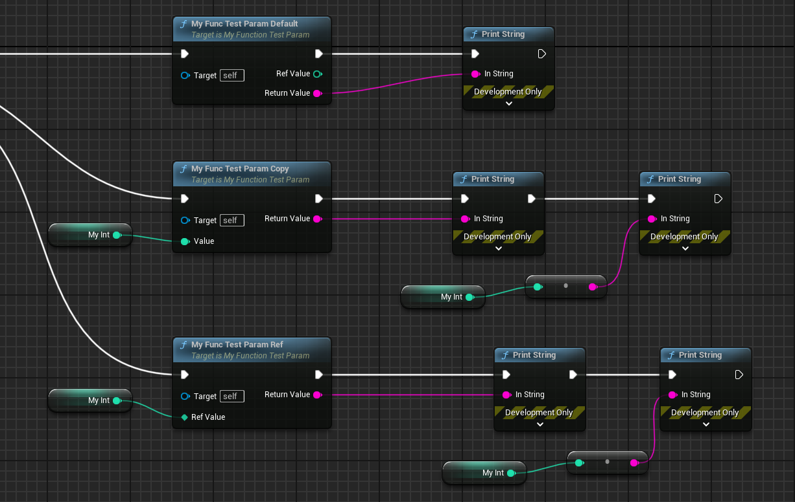

# ref

- **Function Description:** Allows function parameters to be passed by reference

- **Metadata Type:** bool
- **Engine Module:** Blueprint, Parameter
- **Action Mechanism:** Add [CPF_ReferenceParm](../../../../Flags/EPropertyFlags/CPF_ReferenceParm.md) to PropertyFlags
- **Common Usage:** ★★★★★

The distinction between regular parameters and reference parameters is that, when accessing parameters, the Ref type directly obtains a reference to the actual argument rather than a copy. This avoids the need for copying and allows modifications to be preserved.

A simple & parameter will be interpreted as an output return parameter; therefore, it must be further designated with ref.

## Test Code:

```cpp
//PropertyFlags:	CPF_Parm | CPF_OutParm | CPF_ZeroConstructor | CPF_IsPlainOldData | CPF_NoDestructor | CPF_HasGetValueTypeHash | CPF_NativeAccessSpecifierPublic
	UFUNCTION(BlueprintCallable)
	FString MyFuncTestParam_Default(int& refValue);

	//PropertyFlags:	CPF_Parm | CPF_OutParm | CPF_ZeroConstructor | CPF_ReferenceParm | CPF_IsPlainOldData | CPF_NoDestructor | CPF_HasGetValueTypeHash | CPF_NativeAccessSpecifierPublic
	UFUNCTION(BlueprintCallable)
	FString MyFuncTestParam_Ref(UPARAM(ref) int& refValue);

	UFUNCTION(BlueprintCallable)
	FString MyFuncTestParam_Copy(int value);
```

## Blueprint Code:



## Principle:

Reference parameters will be retrieved using P_GET_PROPERTY_REF during UHT generation

```cpp
#define P_GET_PROPERTY(PropertyType, ParamName)													\
	PropertyType::TCppType ParamName = PropertyType::GetDefaultPropertyValue();					\
	Stack.StepCompiledIn<PropertyType>(&ParamName);

#define P_GET_PROPERTY_REF(PropertyType, ParamName)												\
	PropertyType::TCppType ParamName##Temp = PropertyType::GetDefaultPropertyValue();			\
	PropertyType::TCppType& ParamName = Stack.StepCompiledInRef<PropertyType, PropertyType::TCppType>(&ParamName##Temp);
```