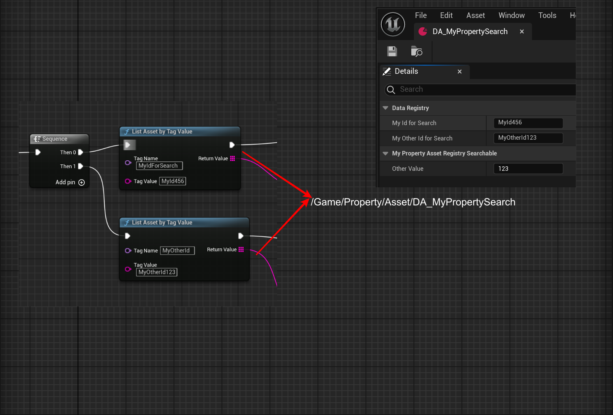

# AssetRegistrySearchable

- **Function description:** Indicates that this attribute can be used as a Tag and Value in the AssetRegistry for filtering and searching assets
- **Metadata type:** bool
- **Engine module:** Asset
- **Action mechanism:** Include [CPF_AssetRegistrySearchable](../../../../Flags/EPropertyFlags/CPF_AssetRegistrySearchable.md) in PropertyFlags and [RequiredAssetDataTags](../../../../Meta/Asset/RequiredAssetDataTags/RequiredAssetDataTags.md), [DisallowedAssetDataTags](../../../../Meta/Asset/DisallowedAssetDataTags.md) in Meta
- **Commonly used:** ★★★

Cannot be used on struct properties.

Subclasses can also override GetAssetRegistryTags to provide custom Tags.

## Test Code:

```cpp
UCLASS(Blueprintable, BlueprintType)
class INSIDER_API UMyProperty_AssetRegistrySearchable :public UDataAsset
{
public:
	GENERATED_BODY()
public:
	UPROPERTY(EditAnywhere, BlueprintReadWrite, AssetRegistrySearchable, Category = DataRegistry)
		FString MyIdForSearch;
	UPROPERTY(EditAnywhere, BlueprintReadWrite)
		int32 OtherValue = 123;
	UPROPERTY(EditAnywhere, BlueprintReadWrite, Category = DataRegistry)
		FString MyOtherIdForSearch;
public:
	virtual void GetAssetRegistryTags(FAssetRegistryTagsContext Context) const override
	{
		//called on CDO and instances
		Super::GetAssetRegistryTags(Context);
		Context.AddTag(FAssetRegistryTag(TEXT("MyOtherId"),MyOtherIdForSearch, UObject::FAssetRegistryTag::TT_Alphabetical));
	}
};

```

## Test Results:

When tested in EditorUtilityWidget, it is visible that ListAssetByTagValue can successfully search and find the Asset.



The test blueprint code can also use IAssetRegistry::Get()->GetAssetsByTagValues(tagValues, outAssets); for searching, but note that the search should occur after the AssetRegistry has been loaded. If AssetRegistry is Runtime, remember to serialize it to disk

```cpp
//DefaultEngine.ini
[AssetRegistry]
bSerializeAssetRegistry=true
```

## Principle:

You can refer to the implementation and invocation of the GetAssetRegistryTags function. It is called and used in UObject::GetAssetRegistryTags, where the value of this property is provided to the AssetRegistry as the Tag for AssetData