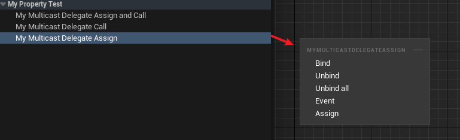

# BlueprintAssignable

- **Function Description:** This feature allows for binding events to the multicast delegate within a blueprint

- **Metadata Type:** bool
- **Engine Module:** Blueprint
- **Restriction Type:** Multicast Delegates
- **Action Mechanism:** Include [CPF_BlueprintAssignable](../../../../Flags/EPropertyFlags/CPF_BlueprintAssignable.md) in the PropertyFlags
- **Common Usage:** ★★★

## C++ Test Code:

```cpp
DECLARE_DYNAMIC_MULTICAST_DELEGATE_OneParam(FMyDynamicMulticastDelegate_One, int32, Value);

UPROPERTY(EditAnywhere, BlueprintReadWrite, BlueprintAssignable, BlueprintCallable)
	FMyDynamicMulticastDelegate_One MyMulticastDelegateAssignAndCall;

UPROPERTY(EditAnywhere, BlueprintReadWrite, BlueprintCallable)
	FMyDynamicMulticastDelegate_One MyMulticastDelegateCall;

UPROPERTY(EditAnywhere, BlueprintReadWrite, BlueprintAssignable)
	FMyDynamicMulticastDelegate_One MyMulticastDelegateAssign;

UPROPERTY(EditAnywhere, BlueprintReadWrite)
	FMyDynamicMulticastDelegate_One MyMulticastDelegate;

```

## Blueprint Implementation:



Therefore, it is generally advised to add both tags accordingly

