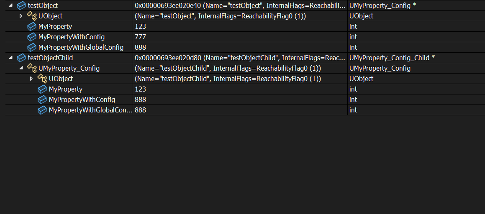

# GlobalConfig

- **Function Description:** Similar to Config, this attribute can be designated for reading and writing as a configuration in INI files, but only the values of the base class specified in the configuration file will be read and written, not those of the subclass.
- **Metadata Type:** bool
- **Engine Module:** Config
- **Action Mechanism:** Include [CPF_GlobalConfig](../../../../Flags/EPropertyFlags/CPF_GlobalConfig.md) in PropertyFlags
- **Common Usage:** ★★★

Like Config, this property can be specified for reading and writing as a configuration in INI files, but only the values of the base class specified in the configuration file will be read, not those of the subclass.

However, the difference lies in the fact that during LoadConfig, this attribute will only read the base class's INI, not the subclass's INI. Since only the INI settings of the base class take effect, it is as if there is only one global configuration in effect, hence the name GlobalConfig.

## Sample Code:

```cpp
UCLASS(Config = MyOtherGame)
class INSIDER_API UMyProperty_Config :public UObject
{
	GENERATED_BODY()
public:
	UPROPERTY(EditAnywhere, BlueprintReadWrite)
	int32 MyProperty = 123;
	UPROPERTY(EditAnywhere, BlueprintReadWrite, Config)
	int32 MyPropertyWithConfig = 123;
	UPROPERTY(EditAnywhere, BlueprintReadWrite, GlobalConfig)
	int32 MyPropertyWithGlobalConfig = 123;
};

UCLASS(Config = MyOtherGame)
class INSIDER_API UMyProperty_Config_Child :public UMyProperty_Config
{
	GENERATED_BODY()
public:
};

void UMyProperty_Config_Test::TestConfigSave()
{
	FString fileName = FPaths::ProjectConfigDir() / TEXT("MyOtherGame.ini");
	fileName = FConfigCacheIni::NormalizeConfigIniPath(fileName);

	{
		UMyProperty_Config* testObject = NewObject<UMyProperty_Config>(GetTransientPackage(), TEXT("testObject"));

		testObject->MyProperty = 777;
		testObject->MyPropertyWithConfig = 777;
		testObject->MyPropertyWithGlobalConfig = 777;

		testObject->SaveConfig(CPF_Config, *fileName);
	}

	{
		UMyProperty_Config_Child* testObject = NewObject<UMyProperty_Config_Child>(GetTransientPackage(), TEXT("testObjectChild"));

		testObject->MyProperty = 888;
		testObject->MyPropertyWithConfig = 888;
		testObject->MyPropertyWithGlobalConfig = 888;

		testObject->SaveConfig(CPF_Config, *fileName);
	}
}

void UMyProperty_Config_Test::TestConfigLoad()
{
	FString fileName = FPaths::ProjectConfigDir() / TEXT("MyOtherGame.ini");
	fileName = FConfigCacheIni::NormalizeConfigIniPath(fileName);

	UMyProperty_Config* testObject = NewObject<UMyProperty_Config>(GetTransientPackage(), TEXT("testObject"));
	testObject->LoadConfig(nullptr, *fileName);

	UMyProperty_Config_Child* testObjectChild = NewObject<UMyProperty_Config_Child>(GetTransientPackage(), TEXT("testObjectChild"));
	testObjectChild->LoadConfig(nullptr, *fileName);
}
```

## Example Effect:

After TestConfigSave, MyPropertyWithGlobalConfig=888, indicating that the value is saved only on the base class.

```cpp
[/Script/Insider.MyProperty_Config]
MyPropertyWithConfig=777
MyPropertyWithGlobalConfig=888

[/Script/Insider.MyProperty_Config_Child]
MyPropertyWithConfig=888
```

For testing purposes, if the value in the configuration is manually changed to:, then the TestConfigLoad test is performed

```cpp
[/Script/Insider.MyProperty_Config]
MyPropertyWithConfig=777
MyPropertyWithGlobalConfig=888

[/Script/Insider.MyProperty_Config_Child]
MyPropertyWithConfig=888
MyPropertyWithGlobalConfig=999
```

Display Result:

It can be observed that the value of testObjectChild does not use the value of 999 under MyProperty_Config_Child in the INI file, but remains 888.



## Working Principle:

If bGlobalConfig is set, the base class's settings will be adopted.

```cpp
void UObject::LoadConfig( UClass* ConfigClass/*=NULL*/, const TCHAR* InFilename/*=NULL*/, uint32 PropagationFlags/*=LCPF_None*/, FProperty* PropertyToLoad/*=NULL*/ )
{
		const bool bGlobalConfig = (Property->PropertyFlags&CPF_GlobalConfig) != 0;
		UClass* OwnerClass = Property->GetOwnerClass();

		UClass* BaseClass = bGlobalConfig ? OwnerClass : ConfigClass;
		if ( !bPerObject )
		{
			ClassSection = BaseClass->GetPathName();
			LongCommitName = BaseClass->GetOutermost()->GetFName();

			// allow the class to override the expected section name
			OverrideConfigSection(ClassSection);
		}

		// globalconfig properties should always use the owning class's config file
		// specifying a value for InFilename will override this behavior (as it does with normal properties)
		const FString& PropFileName = (bGlobalConfig && InFilename == NULL) ? OwnerClass->GetConfigName() : Filename;
}
```