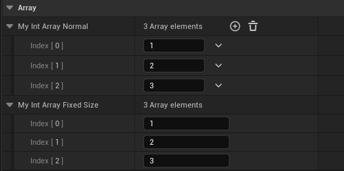

# EditFixedSize

- **Function Description:** The number of elements in this container cannot be changed within the details panel.

- **Metadata Type:** bool
- **Engine Modules:** DetailsPanel, Editor
- **Restriction Types:** TArray<T>, TSet<T>, TMap<T>
- **Action Mechanism:** Add [CPF_EditFixedSize](../../../../Flags/EPropertyFlags/CPF_EditFixedSize.md) to PropertyFlags
- **Commonly Used:** ★★★

Changing the number of elements in this container is not allowed in the details panel.

Only applicable to containers. This prevents users from altering the number of elements in the container through the Unreal Editor's property window.

However, it can still be modified in C++ code and blueprints.

## Example Code:

Consider TArray as an example; the same principle applies to others.

```cpp
UPROPERTY(EditAnywhere, Category = Array)
		TArray<int32> MyIntArray_Normal{1,2,3};

	UPROPERTY(EditAnywhere, EditFixedSize,Category = Array)
		TArray<int32> MyIntArray_FixedSize{1,2,3};
```

## Example Effect:

In blueprints, the former allows for dynamic addition of elements, whereas the latter does not.



## Principle:

If there is CPF_EditFixedSize , + and empty buttons will not be added.

```cpp
void PropertyEditorHelpers::GetRequiredPropertyButtons( TSharedRef<FPropertyNode> PropertyNode, TArray<EPropertyButton::Type>& OutRequiredButtons, bool bUsingAssetPicker )
{
	// Handle a container property.
	if( NodeProperty->IsA(FArrayProperty::StaticClass()) || NodeProperty->IsA(FSetProperty::StaticClass()) || NodeProperty->IsA(FMapProperty::StaticClass()) )
	{
		if( !(NodeProperty->PropertyFlags & CPF_EditFixedSize) )
		{
			OutRequiredButtons.Add( EPropertyButton::Add );
			OutRequiredButtons.Add( EPropertyButton::Empty );
		}
	}
}
```