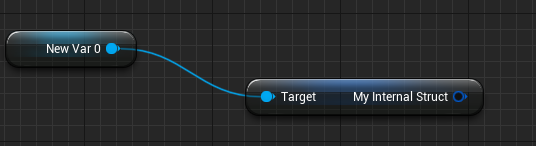

# BlueprintInternalUseOnly

- **Function description:** No new BP variables can be defined, but they can be exposed as member variables of other classes or passed as variables
- **Metadata type:** bool
- **Engine module:** Blueprint
- **Mechanism of action:** Include [BlueprintInternalUseOnly](../../../../Meta/Blueprint/BlueprintInternalUseOnly.md) and [BlueprintType](../../../../Meta/Blueprint/BlueprintType.md) in the Meta
- **Commonly used:** ★★

Indicates that this STRUCT is a BlueprintType, yet it cannot declare new variables in the Blueprint editor; however, it can be exposed as a member variable of other classes within Blueprints.

What is the difference if BlueprintType is not specified?

Without BlueprintType, it cannot be used as a member variable of other classes at all. BlueprintInternalUseOnly inhibits the ability to define new variables but allows them to be passed as variables. For instance, defining variables in C++ and then passing them in Blueprints.

For example, FTableRowBase itself cannot define new variables, but its subclasses (when marked with BlueprintType) can define new variables and are used normally.

## Sample Code:

```cpp
//(BlueprintInternalUseOnly = true, BlueprintType = true, ModuleRelativePath = Struct/MyStruct_BlueprintInternalUseOnly.h)
USTRUCT(BlueprintInternalUseOnly)
struct INSIDER_API FMyStruct_BlueprintInternalUseOnly
{
	GENERATED_BODY()

	UPROPERTY(BlueprintReadWrite,EditAnywhere)
	float Score=0.f;
};

USTRUCT()
struct INSIDER_API FMyStruct_NoBlueprintInternalUseOnly
{
	GENERATED_BODY()

	UPROPERTY(EditAnywhere)
	float Score=0.f;
};

UCLASS(Blueprintable,BlueprintType)
class INSIDER_API UMyClass_BlueprintInternalUseOnlyTest :public UObject
{
	GENERATED_BODY()
public:
	UPROPERTY(BlueprintReadWrite,EditAnywhere)
	FMyStruct_BlueprintInternalUseOnly MyInternalStruct;

	/*UPROPERTY(BlueprintReadWrite,EditAnywhere)	//no supported by BP
	FMyStruct_NoBlueprintInternalUseOnly MyStruct;*/
};

```

## Example Effect:

NewVar is of type UMyClass_BlueprintInternalUseOnlyTest and still has access to the internal MyInternalStruct variable.



The source code is available at:

```cpp
USTRUCT(BlueprintInternalUseOnly)
struct FLatentActionInfo
{}

USTRUCT(BlueprintInternalUseOnly)
struct FTableRowBase
{}
```

## Principle:

```cpp
bool UEdGraphSchema_K2::IsAllowableBlueprintVariableType(const UScriptStruct* InStruct, const bool bForInternalUse)
{
	if (const UUserDefinedStruct* UDStruct = Cast<const UUserDefinedStruct>(InStruct))
	{
		if (EUserDefinedStructureStatus::UDSS_UpToDate != UDStruct->Status.GetValue())
		{
			return false;
		}

		// User-defined structs are always allowed as BP variable types.
		return true;
	}

	// struct needs to be marked as BP type
	if (InStruct && InStruct->GetBoolMetaDataHierarchical(FBlueprintMetadata::MD_AllowableBlueprintVariableType))
	{
		// for internal use, all BP types are allowed
		if (bForInternalUse)
		{
			return true;
		}

		// for user-facing use case, only allow structs that don't have the internal-use-only tag
		// struct itself should not be tagged
		if (!InStruct->GetBoolMetaData(FBlueprintMetadata::MD_BlueprintInternalUseOnly))
		{
			// struct's base structs should not be tagged
			if (!InStruct->GetBoolMetaDataHierarchical(FBlueprintMetadata::MD_BlueprintInternalUseOnlyHierarchical))
			{
				return true;
			}
		}
	}

	return false;
}

//If Node->IsIntermediateNode() returns true, it is used as an intermediate node, and this sets bForInternalUse to true
if (!UK2Node_MakeStruct::CanBeMade(Node->StructType, Node->IsIntermediateNode()))
```