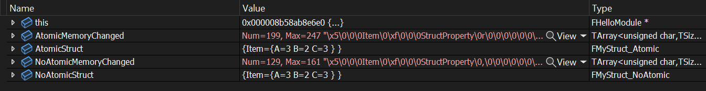

# Atomic

- **Function description:** Specifies that the entire structure will always be serialized with all its properties, rather than just the changed ones.
- **Metadata type:** bool
- **Engine module:** UHT
- **Mechanism of action:** Include [STRUCT_Atomic](../../../../Flags/EStructFlags/STRUCT_Atomic.md) in StructFlags
- **Commonly used:** ★

Specifies that the entire structure will always be serialized with all its properties, not just the altered ones.

Atomic serialization refers to the process where, if any field attribute of the structure differs from the default value, even if the rest of the fields are the same, the entire structure is serialized at once rather than being split. Note that this is only effective under the standard SerializeVersionedTaggedProperties, as it is compared against the default values. It does not work under Bin serialization. The actual mechanism is that when atomic serialization is employed, the default values of internal attributes are not checked, thus the entire attribute is serialized in all cases.

UE's noexporttype.h contains a large number of atomic base structures, such as FVector, because Immutable also sets STRUCT_Atomic simultaneously, but no instances of setting Atomic alone were found.

## Sample Code:

```cpp
USTRUCT(BlueprintType)
struct INSIDER_API FMyStruct_InnerItem
{
	GENERATED_BODY()

		UPROPERTY(BlueprintReadWrite, EditAnywhere)
		int32 A = 1;

	UPROPERTY(BlueprintReadWrite, EditAnywhere)
		int32 B = 2;

	UPROPERTY(BlueprintReadWrite, EditAnywhere)
		int32 C = 3;

	bool operator==(const FMyStruct_InnerItem& other)const
	{
		return A == other.A;
	}
};

USTRUCT(BlueprintType)
struct INSIDER_API FMyStruct_NoAtomic
{
	GENERATED_BODY()

		UPROPERTY(BlueprintReadWrite, EditAnywhere)
		FMyStruct_InnerItem Item;
};

USTRUCT(Atomic, BlueprintType)
struct INSIDER_API FMyStruct_Atomic
{
	GENERATED_BODY()

		UPROPERTY(BlueprintReadWrite, EditAnywhere)
		FMyStruct_InnerItem Item;
};

template<>
struct TStructOpsTypeTraits<FMyStruct_InnerItem> : public TStructOpsTypeTraitsBase2<FMyStruct_InnerItem>
{
	enum
	{
		WithIdenticalViaEquality = true,
	};
};

void USerializationLibrary::SaveStructToMemory(UScriptStruct* structClass, void* structObject, const void* structDefaults, TArray<uint8>& outSaveData, EInsiderSerializationFlags flags/*=EInsiderSerializationFlags::None*/)
{
	FMemoryWriter MemoryWriter(outSaveData, false);
	MemoryWriter.SetWantBinaryPropertySerialization(EnumHasAnyFlags(flags, EInsiderSerializationFlags::UseBinary));
	if (!EnumHasAnyFlags(flags, EInsiderSerializationFlags::CheckDefaults))
	{
		structDefaults=nullptr;
	}
	structClass->SerializeItem(MemoryWriter, structObject, structDefaults);
}

测试代码：
FMyStruct_NoAtomic NoAtomicStruct;
NoAtomicStruct.Item.A=3;

FMyStruct_Atomic AtomicStruct;
AtomicStruct.Item.A=3;

TArray<uint8> NoAtomicMemoryChanged;
USerializationLibrary::SaveStructToMemory(NoAtomicStruct,NoAtomicMemoryChanged,EInsiderSerializationFlags::CheckDefaults);

TArray<uint8> AtomicMemoryChanged;
USerializationLibrary::SaveStructToMemory(AtomicStruct,AtomicMemoryChanged,EInsiderSerializationFlags::CheckDefaults);
```

## Example Effect:

It is evident that AtomicMemoryChanged occupies more memory than NonAtomicMemoryChanged, because although the properties of both structures have changed, AtomicStruct always serializes all properties.



## Principle:

The mechanism at play is that if an external structure is marked as Atomic and its internal properties are found to have changed, these internal properties must be part of another structure. This is because if it's just an Int attribute, the default values of internal attributes are not compared. However, if it's an internal structure attribute, and one of the ID fields differs, the entire structure is deemed unequal during comparison (even though the rest of the internal structure's attributes are identical, which is why the example code only modifies A and provides an == comparison function). The default approach is to continue comparing default values within the internal structure's internal attributes, but with atomic serialization, the comparison is cut off at the default value being null, meaning the child attributes have no default values to compare against, and thus the entire internal attribute is serialized. Therefore, Atomic is used on external structures, and it's essentially meaningless to use it on structures like FVector that are not typically further disassembled.

```cpp
void UStruct::SerializeVersionedTaggedProperties(FStructuredArchive::FSlot Slot, uint8* Data, UStruct* DefaultsStruct, uint8* Defaults, const UObject* BreakRecursionIfFullyLoad) const
{
//…
/** If true, it means that we want to serialize all properties of this struct if any properties differ from defaults */
		bool bUseAtomicSerialization = false;
		if (DefaultsScriptStruct)
		{
			bUseAtomicSerialization = DefaultsScriptStruct->ShouldSerializeAtomically(UnderlyingArchive);
		}

if (bUseAtomicSerialization)
	{
		DefaultValue = NULL;
	}
}
```