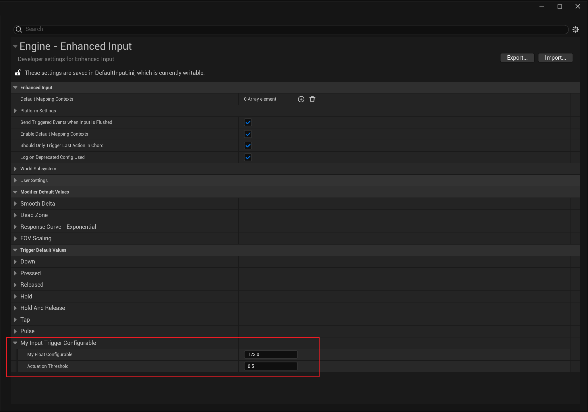

# NotInputConfigurable

- **功能描述：** 让一些UInputModifier和UInputTrigger不能在ProjectSettings里配置。
- **使用位置：** UCLASS
- **引擎模块：** Blueprint
- **元数据类型：** bool
- **限制类型：** UInputModifier和UInputTrigger的子类
- **常用程度：** ★

让一些UInputModifier和UInputTrigger不能在ProjectSettings里配置。

## 源码例子：

```cpp
UCLASS(NotBlueprintable, meta = (DisplayName = "Chorded Action", NotInputConfigurable = "true"))
class ENHANCEDINPUT_API UInputTriggerChordAction : public UInputTrigger
{}

UCLASS(NotBlueprintable, meta = (DisplayName = "Combo (Beta)", NotInputConfigurable = "true"))
class ENHANCEDINPUT_API UInputTriggerCombo : public UInputTrigger
{}
```

## 测试代码：

```cpp
UCLASS( meta = (NotInputConfigurable = "true"))
class INSIDER_API UMyInputTrigger_NotInputConfigurable :public UInputTrigger
{
	GENERATED_BODY()
public:
	UPROPERTY(EditAnywhere)
	float MyFloat = 123;
};

UCLASS( meta = ())
class INSIDER_API UMyInputTrigger_Configurable :public UInputTrigger
{
	GENERATED_BODY()
public:
	UPROPERTY(EditAnywhere)
	float MyFloatConfigurable = 123;
};

```

## 测试效果：

可见只有UMyInputTrigger_Configurable 可以编辑默认值。



## 原理：

UEnhancedInputDeveloperSettings的UI定制化会收集UInputModifier和UInputTrigger的CDO对象，然后根据NotInputConfigurable过滤掉一些不能配置的。

```cpp

	GatherNativeClassDetailsCDOs(UInputModifier::StaticClass(), ModifierCDOs);
	GatherNativeClassDetailsCDOs(UInputTrigger::StaticClass(), TriggerCDOs);


void FEnhancedInputDeveloperSettingsCustomization::GatherNativeClassDetailsCDOs(UClass* Class, TArray<UObject*>& CDOs)
{
			// Strip objects with no config stored properties
		CDOs.RemoveAll([Class](UObject* Object) {
			UClass* ObjectClass = Object->GetClass();
			if (ObjectClass->GetMetaData(TEXT("NotInputConfigurable")).ToBool())
			{
				return true;
			}
			while (ObjectClass)
			{
				for (FProperty* Property : TFieldRange<FProperty>(ObjectClass, EFieldIteratorFlags::ExcludeSuper, EFieldIteratorFlags::ExcludeDeprecated))
				{
					if (Property->HasAnyPropertyFlags(CPF_Config))
					{
						return false;
					}
				}

				// Stop searching at the base type. We don't care about configurable properties lower than that.
				ObjectClass = ObjectClass != Class ? ObjectClass->GetSuperClass() : nullptr;
			}
			return true;
		});
}
```

## 行为

UE5.8 Blueprint/input metadata；用于 input/configurable 相关 Blueprint 暴露限制。

## UE5.8 审计结论

- 状态：`verified_UE5.8`。
- 结论：已按 UE5.8 源码验证。
- 证据：
  - UE5.8 `ObjectMacros.h` metadata declaration/comment
  - UE5.8 `BlueprintGraph` metadata constants or node usage

## 常见误用

参数名、属性名或目标宏写错导致 metadata 被保留但没有对应编辑器/Blueprint 行为。
