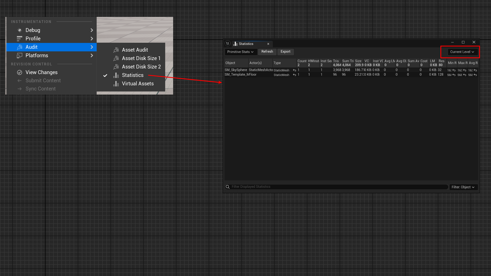

# ObjectSetType

- **功能描述：** 指定统计页面的对象集合类型。
- **使用位置：** UCLASS
- **引擎模块：** Blueprint
- **元数据类型：** string="abc"
- **常用程度：** ★

指定统计页面的对象集合类型。

属于StatViewer模块，只在固定的内部几个类上使用。

## 源码例子：

```cpp

/** Enum defining the object sets for this stats object */
UENUM()
enum EPrimitiveObjectSets : int
{
	PrimitiveObjectSets_AllObjects			UMETA( DisplayName = "All Objects" , ToolTip = "View primitive statistics for all objects in all levels" ),
	PrimitiveObjectSets_CurrentLevel		UMETA( DisplayName = "Current Level" , ToolTip = "View primitive statistics for objects in the current level" ),
	PrimitiveObjectSets_SelectedObjects		UMETA( DisplayName = "Selected Objects" , ToolTip = "View primitive statistics for selected objects" ),
};

/** Statistics page for primitives.  */
UCLASS(Transient, MinimalAPI, meta=( DisplayName = "Primitive Stats", ObjectSetType = "EPrimitiveObjectSets" ) )
class UPrimitiveStats : public UObject
{}
```

## 相应效果：

在统计页面，可见右上角的类型。



## 原理：

```cpp
template <typename Entry>
class FStatsPage : public IStatsPage
{
public:
	FStatsPage()
	{
		FString EnumName = Entry::StaticClass()->GetName();
		EnumName += TEXT(".");
		EnumName += Entry::StaticClass()->GetMetaData( TEXT("ObjectSetType") );
		ObjectSetEnum = FindObject<UEnum>( nullptr, *EnumName );
		bRefresh = false;
		bShow = false;
		ObjectSetIndex = 0;
	}
};
```

## 行为

UE5.8 StatsViewer class metadata；StatsPage 读取它作为 object set enum 名称。

## UE5.8 审计结论

- 状态：`verified_UE5.8`。
- 结论：已按 UE5.8 源码验证。
- 证据：
  - UE5.8 `ObjectMacros.h` metadata declaration/comment
  - UE5.8 `BlueprintGraph` metadata constants or node usage

## 常见误用

参数名、属性名或目标宏写错导致 metadata 被保留但没有对应编辑器/Blueprint 行为。
