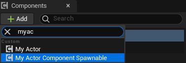

# BlueprintSpawnableComponent

- **功能描述：** 允许该组件出现在Actor蓝图里Add组件的面板里。
- **使用位置：** UCLASS
- **引擎模块：** Component Property
- **元数据类型：** bool
- **限制类型：** Component类
- **常用程度：** ★★★★

允许该组件出现在Actor蓝图里Add组件的面板里。

在蓝图节点上，不管有没有BlueprintSpawnableComponent则都是可以添加该组件的。
## UE5.8 审计结论

UE5.8 源码中仍能找到该 metadata 的声明、示例或消费路径；本轮按 UE5.8 标记为已验证。

## 测试代码：

```cpp
UCLASS(Blueprintable, meta = (BlueprintSpawnableComponent))
class INSIDER_API UMyActorComponent_Spawnable : public UActorComponent
{
	GENERATED_BODY()
public:
	UPROPERTY(BlueprintReadWrite, EditAnywhere)
	float MyFloat;
};

UCLASS(Blueprintable)
class INSIDER_API UMyActorComponent_NotSpawnable : public UActorComponent
{
	GENERATED_BODY()
public:
	UPROPERTY(BlueprintReadWrite, EditAnywhere)
	float MyFloat;
};
```

## 蓝图中效果：

可以看到，在Actor的左边Add的按钮下，UMyActorComponent_Spawnable 可以被添加进去，但是UMyActorComponent_NotSpawnable 被阻止了。但同时也要注意到如果在蓝图中AddComponent节点则是都可以的。




## 原理：

```cpp
bool FKismetEditorUtilities::IsClassABlueprintSpawnableComponent(const UClass* Class)
{
	// @fixme: Cooked packages don't have any metadata (yet; they might become available via the sidecar editor data)
	// However, all uncooked BPs that derive from ActorComponent have the BlueprintSpawnableComponent metadata set on them
	// (see FBlueprintEditorUtils::RecreateClassMetaData), so include any ActorComponent BP that comes from a cooked package
	return (!Class->HasAnyClassFlags(CLASS_Abstract) &&
			Class->IsChildOf<UActorComponent>() &&
			(Class->HasMetaData(FBlueprintMetadata::MD_BlueprintSpawnableComponent) || Class->GetPackage()->bIsCookedForEditor));
}
```