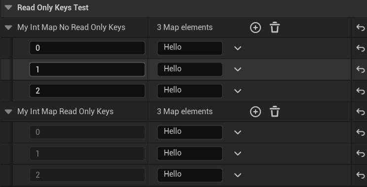

# ReadOnlyKeys

- **功能描述：** 使TMap属性的Key不能编辑。
- **使用位置：** UPROPERTY
- **引擎模块：** Container Property
- **元数据类型：** bool
- **限制类型：** TMap属性
- **常用程度：** ★★

使TMap属性的Key不能编辑。

意味着这个TMap里的元素是在这之前（构造函数里初始化等）就设置好的，但我们只希望用户更改值的内容，而不改Key的名字。这在某些情况下比较有用，比如以Platform作为Key，这样Platform的列表是固定的就不希望用户更改了。
## UE5.8 审计结论

UE5.8 源码中仍能找到该 metadata 的声明、示例或消费路径；本轮按 UE5.8 标记为已验证。

## 测试代码：

```cpp
	UPROPERTY(EditAnywhere, BlueprintReadWrite, Category = ReadOnlyKeysTest)
	TMap<int32, FString> MyIntMap_NoReadOnlyKeys;

	UPROPERTY(EditAnywhere, BlueprintReadWrite, Category = ReadOnlyKeysTest, meta = (ReadOnlyKeys))
	TMap<int32, FString> MyIntMap_ReadOnlyKeys;
```

## 测试结果：

可见MyIntMap_ReadOnlyKeys的Key是灰色的，不可编辑。



## 源码里搜到：

```cpp
void FDetailPropertyRow::MakeNameOrKeyWidget( FDetailWidgetRow& Row, const TSharedPtr<FDetailWidgetRow> InCustomRow ) const
{
	if (PropertyHandle->HasMetaData(TEXT("ReadOnlyKeys")))
	{
		PropertyKeyEditor->GetPropertyNode()->SetNodeFlags(EPropertyNodeFlags::IsReadOnly, true);
	}
}
```