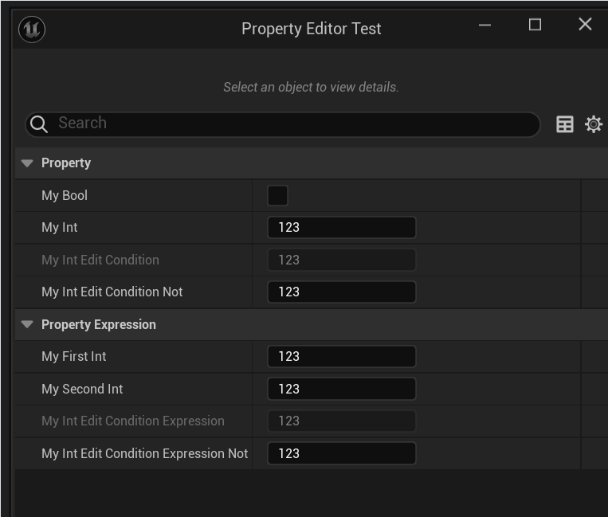

# EditCondition

- **功能描述：** 给一个属性指定另外一个属性或者表达式来作为是否可编辑的条件。
- **使用位置：** UPROPERTY
- **引擎模块：** DetailsPanel
- **元数据类型：** string="abc"
- **关联项：** [EditConditionHides](../EditConditionHides/EditConditionHides.md), [InlineEditConditionToggle](../InlineEditConditionToggle/InlineEditConditionToggle.md), [HideEditConditionToggle](../HideEditConditionToggle/HideEditConditionToggle.md)
- **常用程度：** ★★★★★

给一个属性指定另外一个属性或者表达式来作为是否可编辑的条件。

- 表达式里引用的属性必须得是同一个类或结构范围内的。

## 行为

`meta=(EditCondition="...")` 使用一个属性名或表达式控制目标属性在 Details Panel 中是否可编辑。它是编辑器 UI 约束，不是运行时数据校验；如果条件为 false，默认行为是禁用编辑而不是隐藏属性。

## UE5.8 审计结论

UE5.8 `PropertyEditor` 中的 `FEditConditionParser::Parse` 会对 metadata 字符串做词法分析和表达式编译，`FEditConditionParser::Evaluate` 再按当前属性上下文求值。引擎测试覆盖 bool、数值、枚举、分组、对象和指针表达式。Hello 样例 `Property/Editor/MyProperty_EditCondition.h` 覆盖单 bool 条件和算术表达式条件。

## 常见误用

- 引用的属性或函数必须能在当前属性上下文中解析；跨对象随意引用不会成立。
- 它只影响 Details Panel 编辑状态，不会阻止 C++、Blueprint 或序列化路径修改该值。
- 需要条件为 false 时隐藏属性，应搭配或改用 `EditConditionHides`。

## 测试代码：

```cpp
UCLASS(BlueprintType)
class INSIDER_API UMyProperty_EditCondition_Test :public UObject
{
	GENERATED_BODY()
public:
	UPROPERTY(EditAnywhere, BlueprintReadWrite, Category = Property)
	bool MyBool;

	UPROPERTY(EditAnywhere, BlueprintReadWrite, Category = Property)
	int32 MyInt = 123;

	UPROPERTY(EditAnywhere, BlueprintReadWrite, Category = Property, meta = (EditCondition = "MyBool"))
	int32 MyInt_EditCondition = 123;

	UPROPERTY(EditAnywhere, BlueprintReadWrite, Category = Property, meta = (EditCondition = "!MyBool"))
	int32 MyInt_EditCondition_Not = 123;

public:
	UPROPERTY(EditAnywhere, BlueprintReadWrite, Category = PropertyExpression)
	int32 MyFirstInt = 123;

	UPROPERTY(EditAnywhere, BlueprintReadWrite, Category = PropertyExpression)
	int32 MySecondInt = 123;

	UPROPERTY(EditAnywhere, BlueprintReadWrite, Category = PropertyExpression, meta = (EditCondition = "(MyFirstInt+MySecondInt)==500"))
	int32 MyInt_EditConditionExpression = 123;

	UPROPERTY(EditAnywhere, BlueprintReadWrite, Category = PropertyExpression, meta = (EditCondition = "!((MyFirstInt+MySecondInt)==500)"))
	int32 MyInt_EditConditionExpression_Not = 123;
};
```

## 测试结果：

- 可以通过bool单个属性来控制其他属性是否可以编辑
- 也可以通过一个表达式引入更复杂的计算机制来决定是否来编辑。



## 原理：

在细节面板的属性初始化的时候，会判断该属性EditCondition设置，如果有值，会创建FEditConditionParser来解析表达式然后求值。

```cpp
void FPropertyNode::InitNode(const FPropertyNodeInitParams& InitParams)
{
	const FString& EditConditionString = MyProperty->GetMetaData(TEXT("EditCondition"));

	// see if the property supports some kind of edit condition and this isn't the "parent" property of a static array
	const bool bIsStaticArrayParent = MyProperty->ArrayDim > 1 && GetArrayIndex() != -1;
	if (!EditConditionString.IsEmpty() && !bIsStaticArrayParent)
	{
		EditConditionExpression = EditConditionParser.Parse(EditConditionString);
		if (EditConditionExpression.IsValid())
		{
			EditConditionContext = MakeShareable(new FEditConditionContext(*this));
		}
	}

}
```
