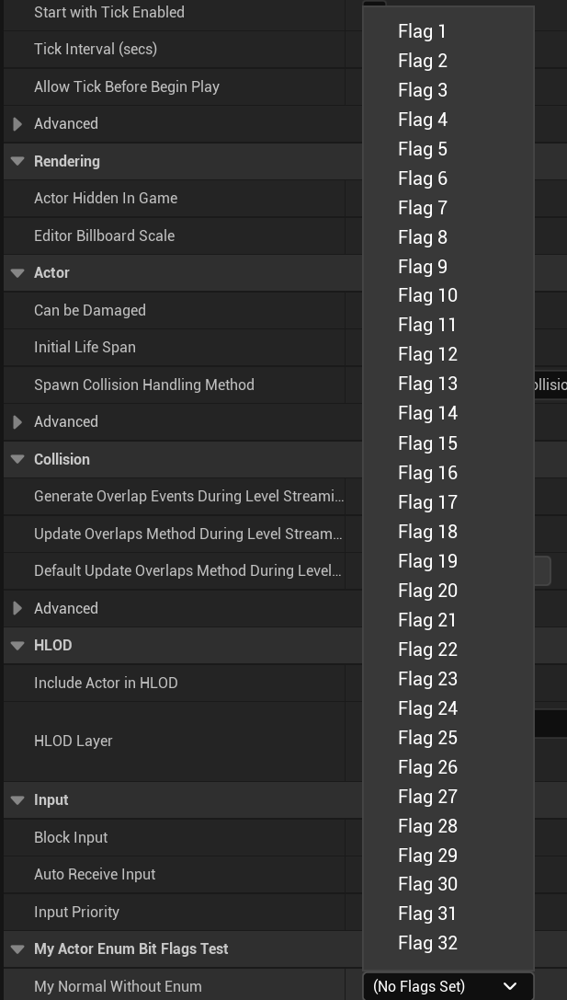

# BitmaskEnum

- **功能描述：** 使用位标记后采用的枚举名字
- **使用位置：** UPROPERTY
- **元数据类型：** string="abc"
- **限制类型：** 用来表示枚举值的int32
- **关联项：** [Bitmask](../Bitmask/Bitmask.md)
- **常用程度：** ★★★★★

如果没有标上BitmaskEnum，则无法提供标记的的名称值

```cpp
UCLASS(Blueprintable, BlueprintType)
class INSIDER_API AMyActor_EnumBitFlags_Test:public AActor
{
	GENERATED_BODY()
public:
	UPROPERTY(EditAnywhere, Meta = (Bitmask))
	int32 MyNormalWithoutEnum;
};
```

如果没有标上BitmaskEnum，则无法提供标记的的名称值


## UE5.8 审计结论

UE5.8 源码中仍能找到该 metadata 的声明、示例或消费路径；本轮按 UE5.8 标记为已验证。该条目多属于插件、编辑器或内部工作流，使用前应先确认目标模块是否启用。
