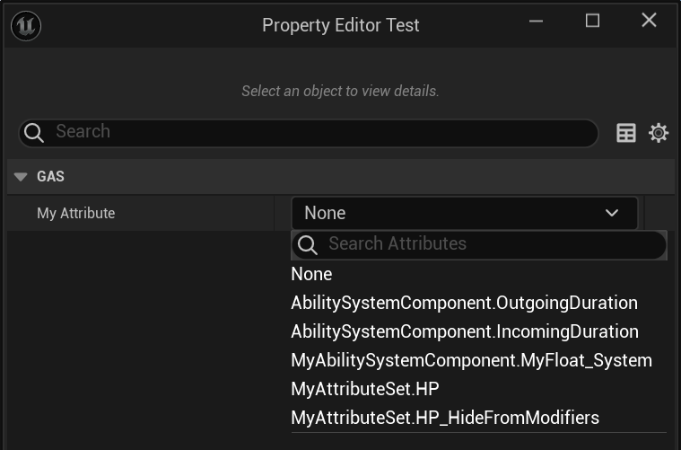

# SystemGameplayAttribute

- **功能描述：** 把UAbilitySystemComponent子类里面的属性暴露到FGameplayAttribute 选项框里。
- **使用位置：** UPROPERTY
- **引擎模块：** GAS
- **元数据类型：** bool
- **限制类型：** UAbilitySystemComponent子类里面的属性
- **关联项：** [HideInDetailsView](../HideInDetailsView/HideInDetailsView.md)
- **常用程度：** ★★★

把UAbilitySystemComponent子类里面的属性暴露到FGameplayAttribute 选项框里。
## UE5.8 审计结论

UE5.8 源码中仍能找到该 metadata 的声明、示例或消费路径；本轮按 UE5.8 标记为已验证。该条目多属于插件、编辑器或内部工作流，使用前应先确认目标模块是否启用。

## 源码例子：

```cpp
UCLASS(ClassGroup=AbilitySystem, hidecategories=(Object,LOD,Lighting,Transform,Sockets,TextureStreaming), editinlinenew, meta=(BlueprintSpawnableComponent))
class GAMEPLAYABILITIES_API UAbilitySystemComponent : public UGameplayTasksComponent, public IGameplayTagAssetInterface, public IAbilitySystemReplicationProxyInterface
{
	/** Internal Attribute that modifies the duration of gameplay effects created by this component */
	UPROPERTY(meta=(SystemGameplayAttribute="true"))
	float OutgoingDuration;

	/** Internal Attribute that modifies the duration of gameplay effects applied to this component */
	UPROPERTY(meta = (SystemGameplayAttribute = "true"))
	float IncomingDuration;
}
```

## 测试代码：

```cpp
UCLASS(Blueprintable, BlueprintType)
class UMyAbilitySystemComponent : public UAbilitySystemComponent
{
	GENERATED_BODY()
public:
	UPROPERTY(BlueprintReadWrite, EditAnywhere, Category = "GAS")
	float MyFloat;

	UPROPERTY(BlueprintReadWrite, EditAnywhere, Category = "GAS", meta = (SystemGameplayAttribute))
	float MyFloat_System;
};

UCLASS()
class UMyAttributeSetTest : public UObject
{
	GENERATED_BODY()
public:
	UPROPERTY(BlueprintReadWrite, EditAnywhere, Category = "GAS")
	FGameplayAttribute MyAttribute;
};

```

## 测试效果：

可见MyFloat_System可以暴露到选项列表里去。



## 原理：

也是在GetAllAttributeProperties判断属性上的SystemGameplayAttribute标记。

```cpp
void FGameplayAttribute::GetAllAttributeProperties(TArray<FProperty*>& OutProperties, FString FilterMetaStr, bool UseEditorOnlyData)
{
	// UAbilitySystemComponent can add 'system' attributes
	if (Class->IsChildOf(UAbilitySystemComponent::StaticClass()) && !Class->ClassGeneratedBy)
	{
		for (TFieldIterator<FProperty> PropertyIt(Class, EFieldIteratorFlags::ExcludeSuper); PropertyIt; ++PropertyIt)
		{
			FProperty* Property = *PropertyIt;


			// SystemAttributes have to be explicitly tagged
			if (Property->HasMetaData(TEXT("SystemGameplayAttribute")) == false)
			{
				continue;
			}
			OutProperties.Add(Property);
		}
	}
}
```